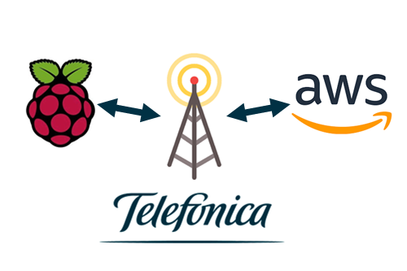
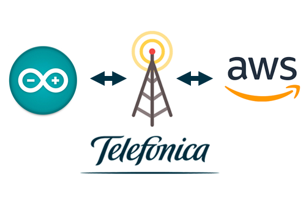
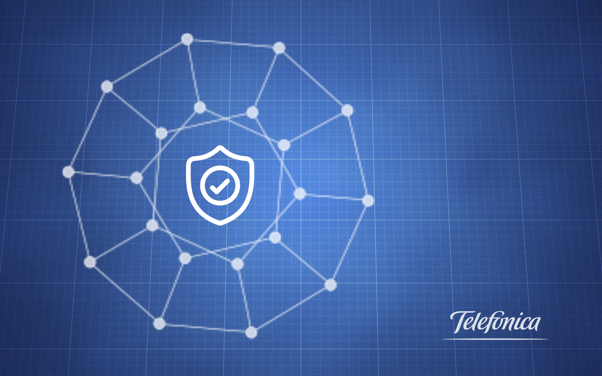

      

# Welcome to IoT-Activation of Telefonica

Welcome to The IoT World. 
With this tutorial you will not only learn how to start in the world of IoT, 
it also aims to be a guide to assist you in your beginnings and resolve any doubts that may arise.

IoT technology will make it easier for you to collect data online, control remotely and automate processes, 
allowing you to reduce costs and offer a better service, while improving quality.

Along with this guide, you will also have received a box with a lot of gadgets that that you probably don't identify. 
Don't worry,You will be playing with it in no time !

We will also teach you different technologies so you can decide which one works for your business.

At the kit you will find different devices, Those are the first step to achive your bussiness goal. 
The Raspberry and Arduino are very versatile devices that will offer you endless possibilities, 
but take it easy... You'll never walk alone!

They may seem small, but the possibilities are immense!!

[Everything you need to know about IoT](tutorials/README.md)

[Why are we different? Kite Platform](tutorials/Kite_Platform.md)

# Your first workbench

<table style="width:10%" align="center">
  <tr>
	<th>
		<a href="tutorials/RaspberryPi_StarterKit.md" align="center" >
			Raspberry Pi Starter-Kit
		</a>
	</th>
	<th>
		
	</th>
	<th>
		<a href="tutorials/Arduino_StarterKit.md" align="center">
			Arduino Starter-Kit
		</a>
	</th>
  </tr>
  <tr>
	<th>
		
	</th>
	<th></th>
	<th>
		
	</th>
  </tr>
  <tr></tr>
  <tr>
	<th>
		<a href="tutorials/RaspberryPi_StarterKit.md" align="center">
			Raspberry Pi Hat to AWS
		</a>
	</th>
	<th></th>
	<th>
		<a href="tutorials/Arduino_AWS.md" align="center">
			Arduino to AWS
		</a>
	</th>
  </tr>
  <tr>
	<th>		
		
	</th>
	<th></th>
	<th>
		
	</th>
  </tr>
</table>

# Blueprints

From Iot-Activation we want to make your way easier.

For this reason we don't just want to show you how to develop applications for your devices or how to connect to the cloud.
We put at your disposal a powerful tool that will facilitate and improve the performance of your things connected to the Internet.

We also solve some of the most common problems you may encounter.

**It is safe to use UPD on the internet?**

**I can use a private network to connect my device to the cloud?**

**I can easily configure several devices without investing time and effort?**

**Can I locate my devices without using a GPS module?**

<table style="width:10%" align="center">
  <tr>
	<th>
		<a href="tutorials/BP_DataBridge.md" align="center" >
			Data Bridge
		</a>
	</th>
	<th>
		
	</th>
	<th>
		<a href="tutorials/BP_IPsec.md" align="center">
			 Virtual Private Network (IPsec)
		</a>
	</th>
  </tr>
  	<th>
		
	</th>
	<th></th>
	<th>
		
	</th>
  </tr>
  <tr>
	<th>
		<a href="tutorials/BP_Asset_Tracking.md" align="center" >
			Asset Tracking
		</a>
	</th>
	<th>
	</th>
	<th>
		<a href="tutorials/BP_Bootstraping.md" align="center">
			 Bootstraping
		</a>
	</th>
  </tr>
  	<th>
		
	</th>
	<th></th>
	<th>
		
	</th>
  </tr>
</table>
