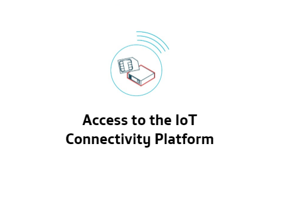

      

# Welcome to IoT Activation of Telefónica

We welcome you to The IoT World.
These tutorials are designed to assist you in your beginnings and resolve any doubts that may arise you.
With this guide you will discover the advantages of IoT devices.
You'll learn how to collect data online, remotely control your devices and automate deployment processes.
IoT will allow you to reduce costs and offer a better service, while improving quality.

Along with this guide, you will also have received a box with a lot of gadgets that that you probably don't identify. 
Don't worry, you will be playing with it in no time!

To start you can choose between several kits, those are the first step to achieve your business goal.
The Raspberry and Arduino are very versatile devices that will offer you endless possibilities, 
but take it easy... You'll never walk alone!

They may seem small, but the possibilities are immense!!

We will also teach you different technologies so you can decide which one works best for your business.

[Everything you need to know about IoT](tutorials/README.md)

[Why are we different? Kite Platform](tutorials/Kite_Platform.md)

# Your first workbench

    <h4>Activate your SIM</h4>

    

<table style="width:10%" align="center">
  <tr>
	<th>
		<a href="tutorials/RaspberryPi_StarterKit.md" align="center" >
			Raspberry Pi Starter-Kit
		</a>
	</th>
	<th>
		
	</th>
	<th>
		<a href="tutorials/Arduino_StarterKit.md" align="center">
			Arduino Starter-Kit
		</a>
	</th>
  </tr>
  <tr>
	<th>
		
	</th>
	<th></th>
	<th>
		
	</th>
  </tr>
  <tr></tr>
  <tr>
	<th>
		<a href="tutorials/RaspberryPi_StarterKit.md" align="center">
			Raspberry Pi Hat to AWS
		</a>
	</th>
	<th></th>
	<th>
		<a href="tutorials/Arduino_AWS.md" align="center">
			Arduino to AWS
		</a>
	</th>
  </tr>
  <tr>
	<th>		
		
	</th>
	<th></th>
	<th>
		
	</th>
  </tr>
    <tr></tr>
  <tr>
	<th>
		<a href="tutorials/Kite_Platform.md" align="center">
			Kite Platform
		</a>
	</th>
	<th></th>
	<th>
		<a href="tutorials/Arduino_GCP.md" align="center">
			Arduino to Google Cloud
		</a>
	</th>
  </tr>
  <tr>
	<th>		
		
	</th>
	<th></th>
	<th>
		
	</th>
  </tr>
</table>

# Blueprints

During your development you will find stones in the road. Don't worry.
Iot Activation want to make your way easier. We will remove them.

Learn about the most common problems you can find.
We are developing a set of tools to do the hard work.

<table>
  <tr>
	<th>
		

			Low power devices are awesome with off-the-grid situations:
		

		

			The device integration in public clouds is a challenge.
		

	</th>
	<th>
		
	</th>
	<th>
		

			Due to devices hardware limitations, sometimes security is fade into the background:
		

		

			It is necessary to guarantee a secure end to end.
		

	</th>
  </tr>
  	<th>
		
	</th>
	<th></th>
	<th>
		
	</th>
  </tr>
  <tr>
	<th>
		

			Device location can be a key point in your business model:
		

		

			Save on energy and avoid expensive sensors.
		

	</th>
	<th>
	</th>
	<th>
		

			Customize devices one by one can be expensive or impossible to manage:
		

		

			Deploy a common layout and tailor it later.
		

	</th>
  </tr>
  	<th>
		
	</th>
	<th></th>
	<th>
		
	</th>
  </tr>
</table>
