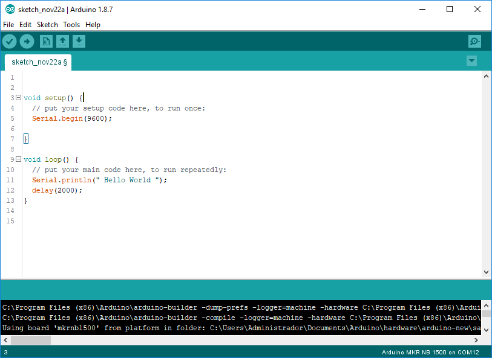
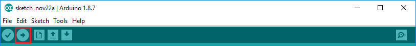

## Table of Contents

- [Arduino StarterKit for IoT-Activation](#arduino-starterkit-for-iot-activation)
  * [What is Arduino?](#what-is-arduino)
    + [Arduino MKR NB-1500](#arduino-mkr-nb-1500)
- [Getting started with your Arduino](#getting-started-with-your-arduino)


# Arduino StarterKit for IoT-Activation

## What is Arduino?
Arduino is an open-source electronics platform based on easy-to-use hardware, 
the Arduino software is easy for beginners an flexible enough for advanced users


### Arduino MKR NB-1500
The MKR branch of the Arduino board family is dedicated to the IoT and as such tries to provide 
solutions for devices in remote locations without an Internet connection,or in situations in which power isn't available. 

Arduino MKR NB 1500 is an IoT Development Board with wireless connectivity, based on the narrowband NB-IoT standard,
it is designed for global use.

<p align="center">
      
</p>


[](#table-of-contents)


# Getting started with your Arduino

## Configure Arduino IDE

Arduino platform provides a Integrated Development Environment (IDE). 
The first step to get started with the kit is download the Arduino IDE from his web https://www.arduino.cc/en/Main/Software


This environment provides not only an interface to develop your scripts. 
It is also your tool to download your files to the device.

This development environment provides support for the different Arduino boards.
For this reason, before loading your software, you must select your board type.
Select the entry in the **Tools > Board menu** that corresponds to **Arduino MKR NB-1500**.


The first time you connect your board, your computer will recognize it as a new device. 
However, you must configure the environment to indicate the port to which it has been connected.

Connect your board to your computer you need a micro USB cable, and wait a moment until your computer recognizes it.
Select the serial device of the board from the **Tools > Serial Port menu**. 
This is likely to be **COMx** (COM1 and COM2 are usually reserved). 
if you can't find the port used, you can disconnect your board and re-open the menu.
The entry that disappears should be the Arduino board. Reconnect the board and select that serial port.


Now everything is ready to run your first script

## Hello World: Create your first Arduino program

The Arduino programming language is based on Wiring, creating a simplified version of the C++ language.

here you can see the typical structure of a program. This structure is created automatically when you open a new file

```c
void setup() {
  // Put your setup code here:
  // This part of the software will run only once when the program is started
  // Use this code to initialize your device
}

void loop() {
  // Put your main code here:
  // This part of the code is repeated constantly
}
```

To run your first program, copy the following code into your Arduino IDE

```c
void setup() {
  // put your setup code here, to run once:
  Serial.begin(9600);
  
}

void loop() {
  // put your main code here, to run repeatedly:
  Serial.println(" Hello World ");
  delay(2000);
}
```
Great, now you should have something like that.



Now all that's left is the ultimate test. Compile and upload your code to the board.
But you're lucky, the IDE will do all this for you. Any error that happens will show you on the console below

To do this press the **Upload** button that you will find below the menu. 



If everything goes well, your software is already running on the board, and will restart every time you turn it on.

But what the hell, your Arduino doesn't have a screen on which to display text!
This is not a problem, as you have previously set up a serial connection to send the message.
So your board is sending this message through the usb that connects to your pc.

Effectively! again your Arduino IDE does this for you.
You can open a terminal to display all messages sent from the Arduino via serial communication.
Click on the lens icon to open it.


Now you can see that the message **"Hello world"** is sent every 2 seconds. 


[](#table-of-contents)


## NB-IoT: Connecting to Internet

[](#table-of-contents)
