### Table of Contents
- [Deploying a dashboard on AWS by using CloudFormation](#deploying-a-dashboard-on-aws-by-using-cloudformation)
	- [Before launching the application](#before-launching-the-application)
	- [AWS CloudFormation](#aws-cloudformation)
	- [How does it work?](#how-does-it-work)
	- [Grafana dashboard](#grafana-dashboard)
		- [Add database](#add-database)
		- [Create Dashboard](#create-dashboard)

# Deploying a dashboard on AWS by using CloudFormation

AWS CloudFormation is a service that helps you model and set up your Amazon Web Services resources so that you can spend less time managing those resources and more time focusing on your applications that run in AWS. A template describes all the AWS resources to deploy and AWS CloudFormation takes care of provisioning and configuring those resources for you. You don't need to individually create and configure AWS resources and figure out what's dependent on what; AWS CloudFormation handles all of that.

In this tutorial we are going to deploy the following resources in less than 15 minutes with a few 'clicks' using a CloudFormation template.

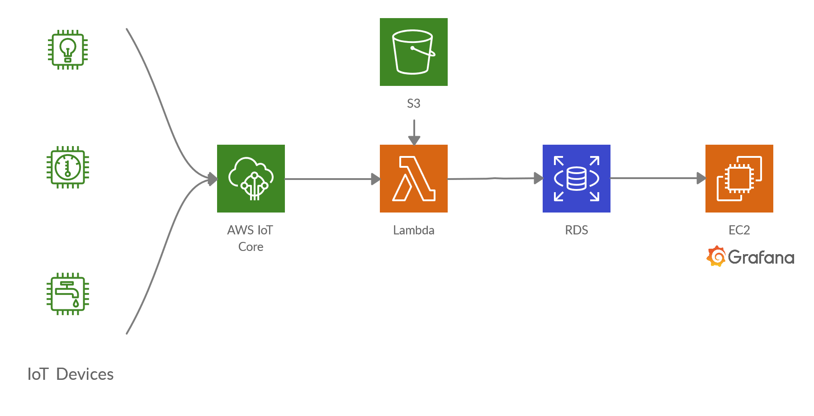

This application is similar to the deployed in the [Deploying a dashboard on AWS by using Lambda functions, RDS and Grafana tutorial](https://telefonicaid.github.io/iot-activation/#/AWS_iot_lambda_grafana.md) but using a CloudFormation template instead of deploying each resource step by step.


[](#table-of-contents)
## Before launching the application

Before starting, you need create an Key Pair for secure access to the EC2 machine. It's not necessary to access the machine in this tutorial but it may be useful in the future.

1. Go to the **Network & Security** section in the EC2 Console and click **Key Pairs**.

2. Create a new key pair.

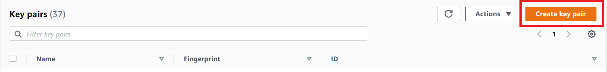

3. Type a Key Pair name, select the .pem file format and click **Create key pair**.

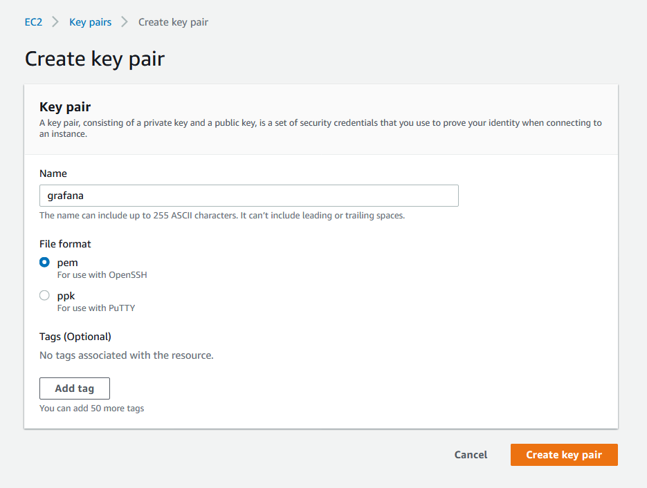

4. Save the file. It will be needed to access the EC2 machine using a SSH client.


[](#table-of-contents)
## AWS CloudFormation

1. Download the CloudFormation template developed for that application from [Github](https://github.com/telefonicaid/iot-activation/tree/master/scripts/AWS_CloudFormation_Dashboard/thing2grafana_template.yaml).

&#x1F4CD; Make sure that you are in the Ireland region (eu-west-1). The Instance Image Id is in this region. Otherwise, please replace the **ImageId** field in the CloudFormation template with the one corresponding to the Ubuntu 18.04 machine in your region.

2. Go to the CloudFormation Console and create a stack with new resources.

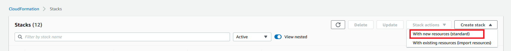

3. Select **Upload a template file** and choose the .yaml file downloaded in the first step.

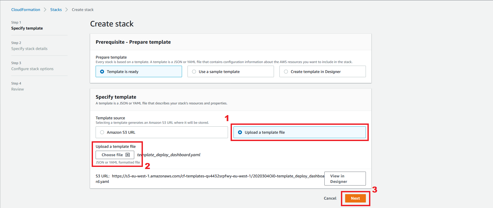

4. The CloudFormation stack will create a new MySQL database to store sensor data. Configure the database name, user and password you want. Finally, choose the key pair created in the previous section to allow SSH access.

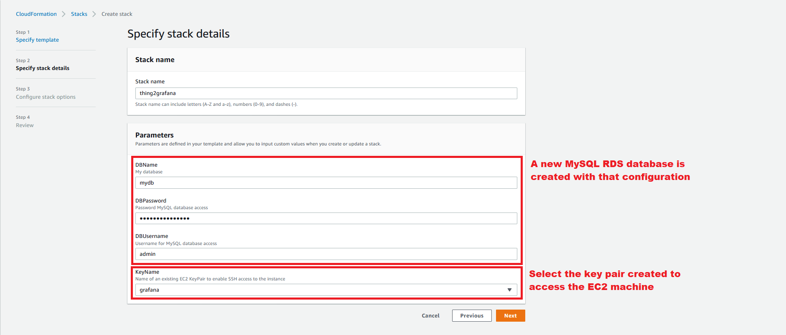

5. Click **Next** until the last step.

6. Check the capabilities box and click **Create Stack**.

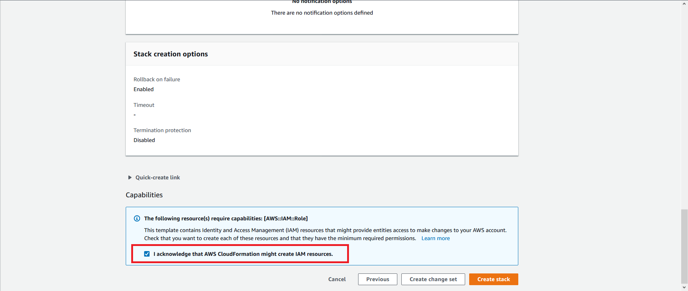

7. Wait until all resources are created. It takes about 12 minutes.

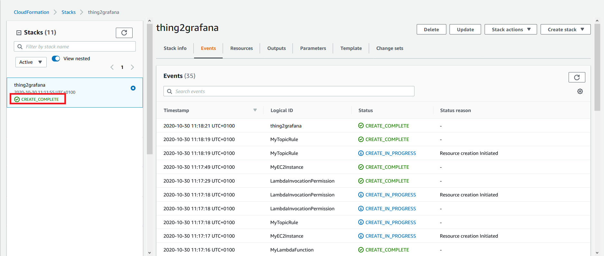

8. The output section shows the EC2 instance host, the database endpoint and the topic and message format needed to store data received to the database.

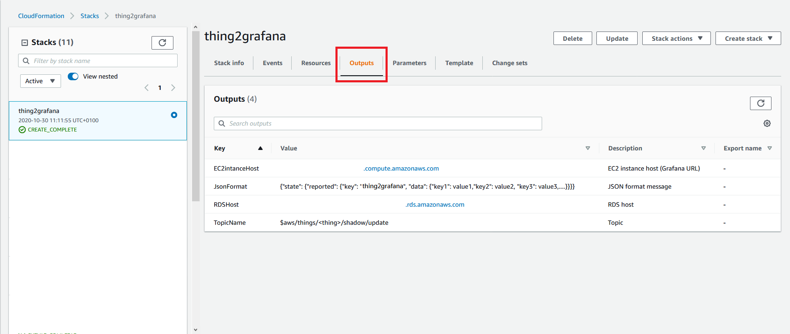


[](#table-of-contents)
## How does it work?
If the message received in the shadows topics follows a certain format, the data is stored in a MySQL database. Then data can be visualized by Grafana dashboards.

* Topic: `$aws/things/<thing>/shadow/update`
* Message format:
```json
{
  "state": {
    "reported": {
      "key": "thing2grafana",
      "data": {
        "sensorKey1": value1,
        "sensorKey2": value2,
        "sensorKey3": value3,
        ...
      }
    }
  }
}
```

For example:
  * Topic: `$aws/things/room1/shadow/update`
  * Message:
```json
{
    "state": {
      "reported": {
        "key": "thing2grafana",
        "data": {
          "temp": 25.5,
          "hum": 40.2
        }
      }
    }
}
```

* Topic: `$aws/things/garden/shadow/update`
* Message:
```json
{
    "state": {
      "reported": {
        "key": "thing2grafana",
        "data": {
          "luminosity": 9500,
          "temp": 27.5,
          "hum": 38.5
        }
      }
    }
}
```

No matter how much data is reported and the name of them. Data from each sensor is stored in a new row containing the thing name, sensor key, value and timestamp.

| id | thingName | sensorKey | value | timestamp |
| --- | --- | --- | --- | --- |
| 1 | room1 | temp | 25.5 | 2020-11-03 11:59:30 |
| 2 | room1 | hum | 40.2 | 2020-11-03 11:59:30 |
| 4 | garden | luminosity | 9500 | 2020-11-03 12:01:32 |
| 5 | garden | temp | 27.5 | 2020-11-03 12:01:32 |
| 6 | garden | hum | 38.5 | 2020-11-03 11:01:32 |

The key `thing2grafana` is used to identify the sensors belonging this application.


[](#table-of-contents)
## Grafana dashboard

### Add database
1. Open your browser and access Grafana 'http://< EC2instanceHost >:3000'.

2. Click **Configuration** icon and then **Data Sources**.

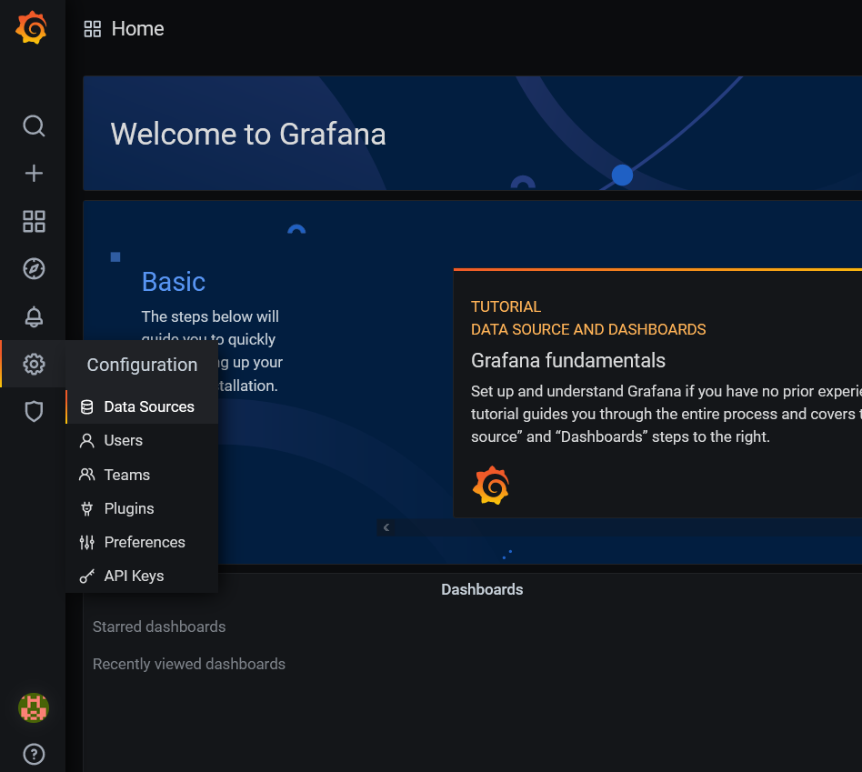

3. Choose MySQL.

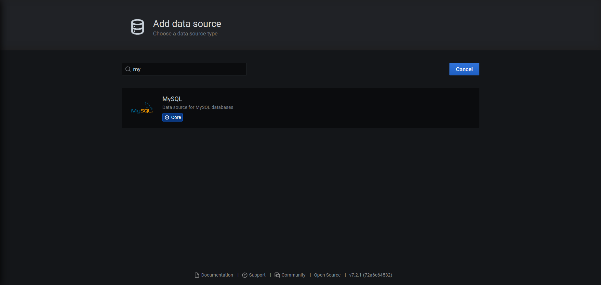

4. Configure your database credentials using the RDSHost output and the configuration set in the step 4 of the CloudFormation. Then click **Save & Test**.

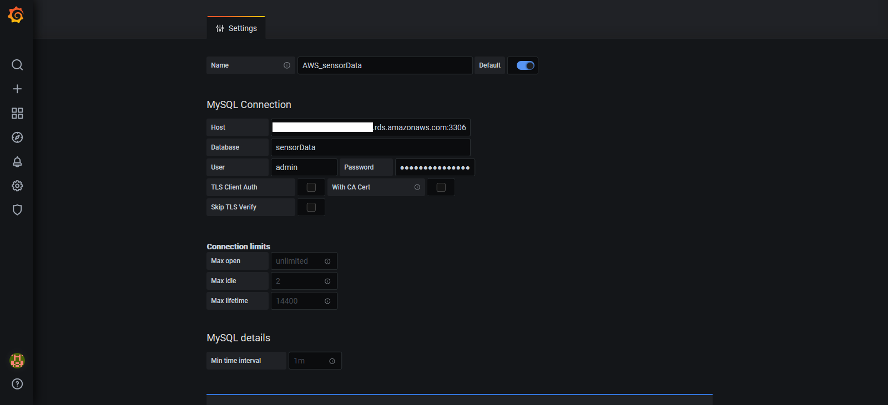


[](#table-of-contents)
### Create Dashboard

1. Click **Create** icon and select **Dashboard**.

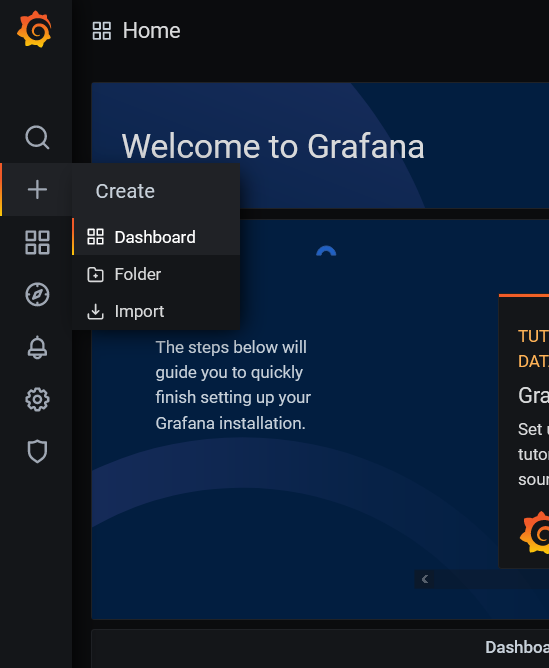

2. Click **Add new panel** to create a graph.

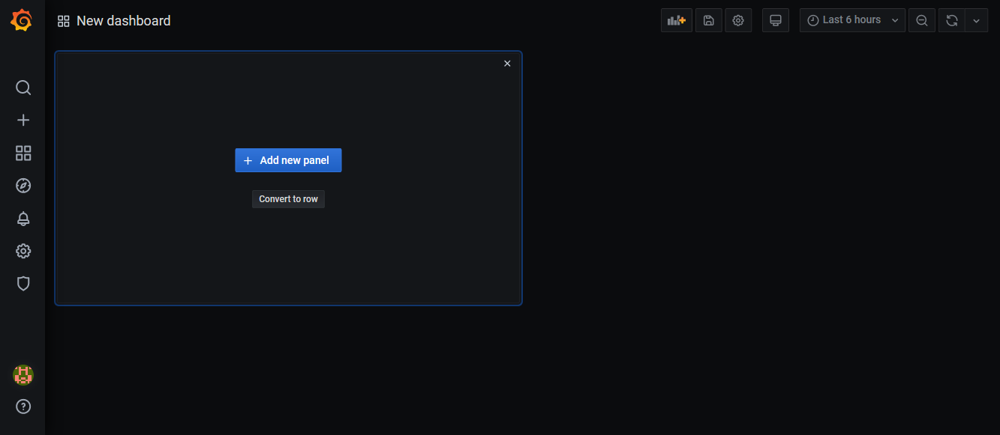

3. Create a query to select the temperature values. Click **Toggle text edit mode** to create the query manually.

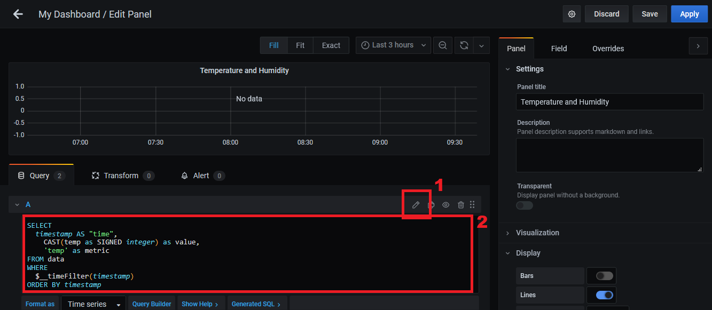

4. Copy the following SQL query.
```sql
SELECT
  timestamp AS "time",
  CAST(value as SIGNED integer) as value,
  sensorKey as metric
FROM sensorData
WHERE
  $__timeFilter(timestamp) AND
  sensorKey = 'temp' AND
  thingName = 'room1'
ORDER BY timestamp
```

5. Add a new **Query** to visualize the humidity values in the same graph.

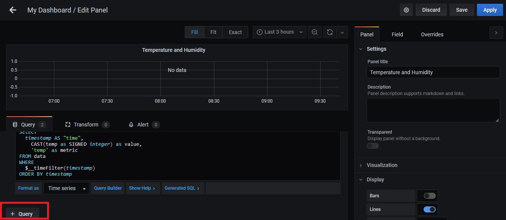

6. Add the mysql query.
```sql
SELECT
  timestamp AS "time",
  CAST(value as SIGNED integer) as value,
  sensorKey as metric
FROM sensorData
WHERE
  $__timeFilter(timestamp) AND
  sensorKey = 'hum' AND
  thingName = 'room1'
ORDER BY timestamp
```

7. Click **Apply** to close the edit mode.

8. The dashboard is showed like this.

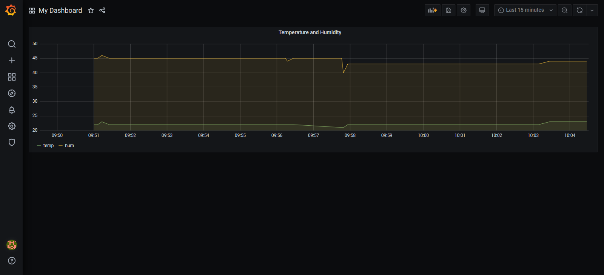

9. Save dashboard.

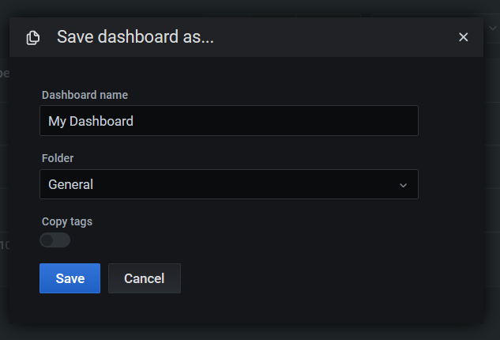

You can find more information about Grafana capabilities on their [website](https://grafana.com/docs/grafana/latest/).

[](#table-of-contents)
