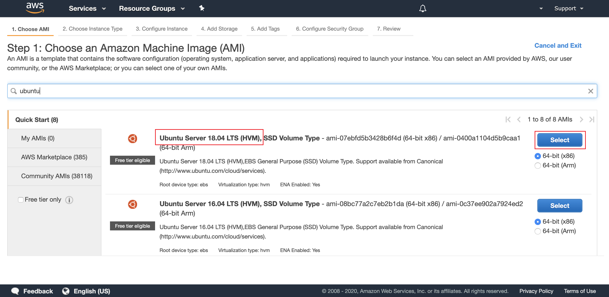
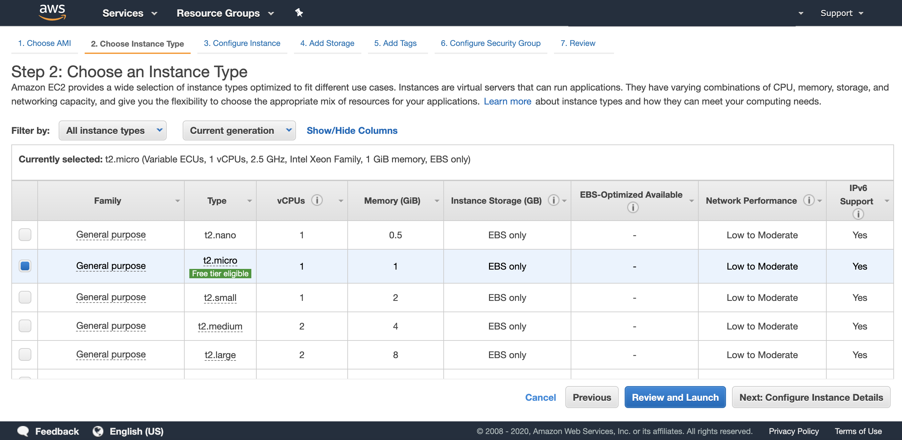
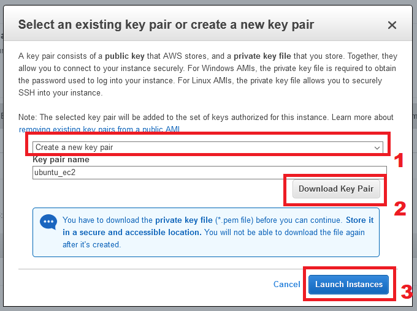

# Launch an Ubuntu EC2 Instance

This topic describes the steps of launching a new Ubuntu EC2 instance.

1. Open the Amazon EC2 console by choosing EC2 under Compute.

2. From the Amazon EC2 dashboard, choose Launch Instance.

3. Choose the image by using the filter with the value “ubuntu”. Select the Ubuntu Server 18.04 LTS x86.

4. Select the t2.micro instance type.

5. Click Review and Launch.

6. Launch the EC2 instance. Select **Create a new key pair**, set a name and download it in order to connect to the Amazon EC2 instance later on. Then click **Launch Instances**.

