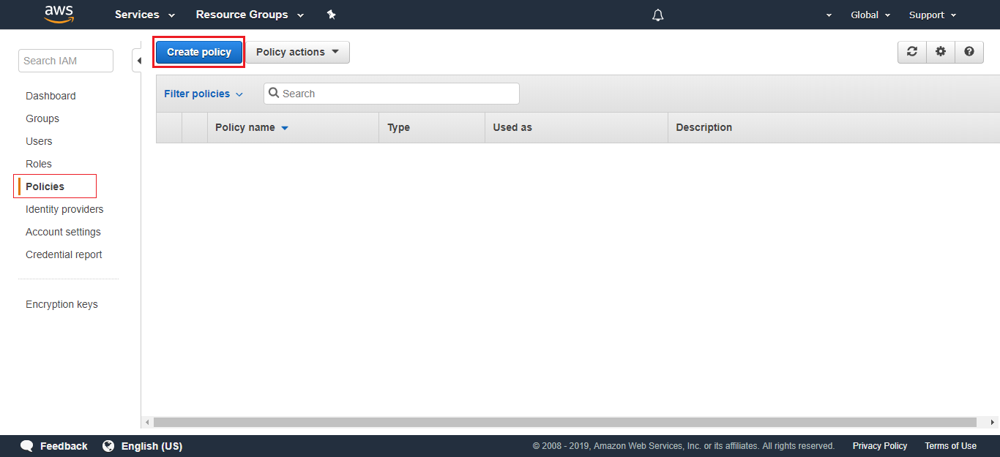
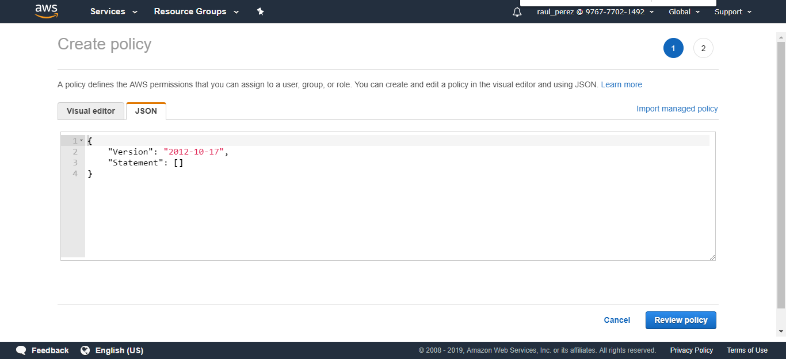
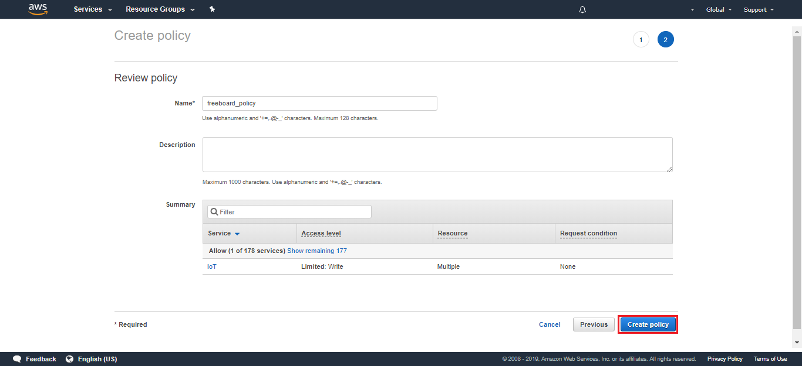
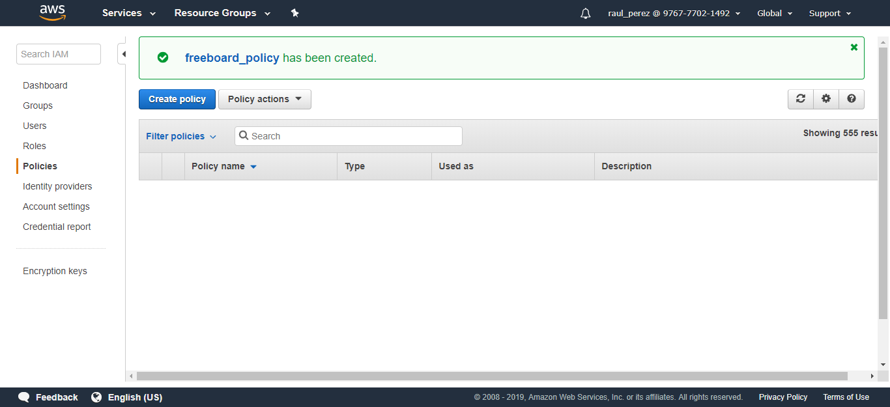
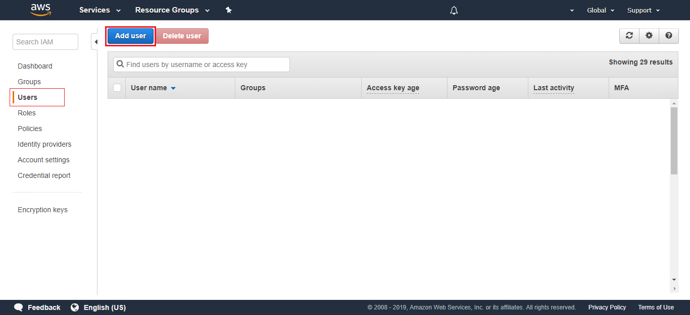
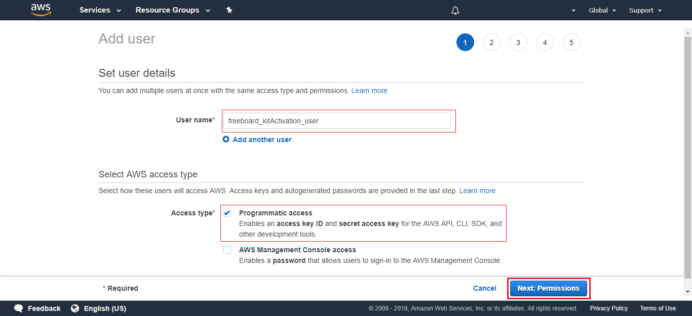
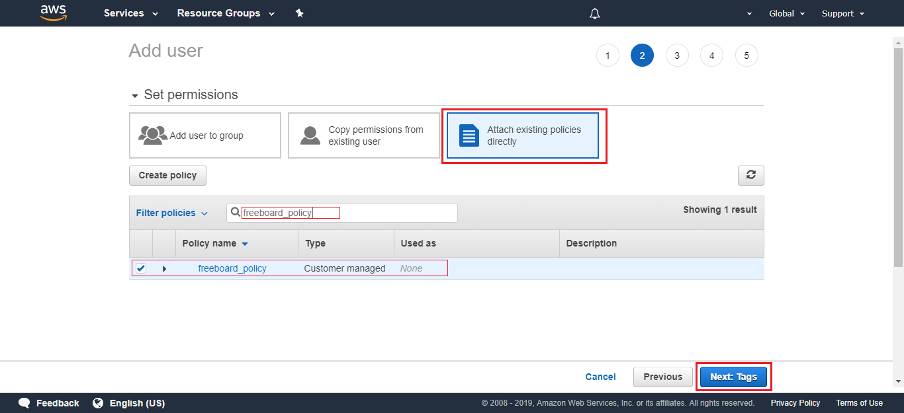
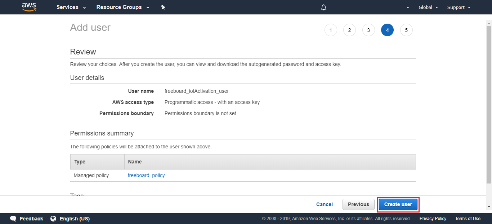

### Table of Contents
- [Display your dashboard](#display-your-dashboard-in-less-than-3-minutes-one-click-away)
  * [AWS CloudFormation](#aws-cloudformation)
  * [Freeboard](#freeboard)
    + [load a freeboard](#load-a-freeboard)
  * [Protect you account](#protect-you-account)


# Display your dashboard in less than 3 minutes. One click away!!

Storing your values in the shadow is a great solution, but sometimes your clients will become more demanding.
In these cases, you will need to develop a custom dashboard.

We've been thinking about this. We have this one click solution for you!!


[](#table-of-contents)


## AWS CloudFormation

CloudFormation provides a common language to describe and provision 
all the infrastructure resources in your cloud environment.

Its allows you to use a simple text file to build and rebuild your infrastructure.

To begin with it, go to CloudFormation Console:

&#x1F4CD; 
Make sure that you are in Ireland region (eu-west-1) some elements are deployed in this region.

Click on **Create Stack** button


In the new window that opens, fill the form with the link below:

```
https://s3-eu-west-1.amazonaws.com/lambda-for-deploy/cloud_formartion_freeboard.txt
```

In the link you can see a public s3 bucket with our CloudFormation template.


Click **Next**.

Select a name for your Stack and use the same for name your s3 bucket:

```
iotactivationdashboard
```


Click **Next**.

In the next window, you don't need to configure any options


Click **Next**.

Now the wizard will warn you about the capabilities. Just tick the boxes.

Finally, click on **Create Change Set**.


Click on the **Execute** button.

It can take several minutes for deploy all the services.


As a result, when it's finishes you will get a new link for display your dashboard.

Go to **Output** tab and click on the Website URL


You'll already have your freeboard created.


[](#table-of-contents)


## Freeboard

Freeboard is a simple dashboard for your devices.
Its allows you build a real-time dashboards and interactives visualizations using the intuitive interface in a few minutes.


To add a new source, you must select and set up an AWS account and fill the fields with your broker and thing topic.


All you have to do is add new panes. Let your imagination fly!!!

[](#table-of-contents)


### load a freeboard

One simple example is the dashboard designed for this shadow.

```json
{
	"reported": {
		"raw": {
			"sensor1": 3,
			"text1": "TZEUXBZPZN",
			"sensor2": 76,
			"location": {
				"latitude": 40.431948,
				"longitude": -3.666315
			},
			"time": "Thu Mar 21 12:39:24 2019"
		}
	}
}
```


You can load it from this [file](https://github.com/telefonicaid/iot-activation/tree/master/scripts/AWS_Dashboard/freeboard.json)


In the same way, you can export your freeboard. It is an important step to recover your configuration. 
It is lost every time you refresh the web.

&#x1F4CD;
Be careful, you don't share this file. It contains your account access key.

[](#table-of-contents)


### Protect you account

If you need share your dashboard configuration file, the best way to protect your account 
is generate a new user whit a specific policy. This is possible through IAM console.

Go to AWS IAM console / **Policy** / **Create Policy**



You can define permissions using a json structure.
Design a specific rule for your user, in which it is only allowed:
- connect as a client
- Subscribe to a specific topic

Use the following template by completing the information with your **AWS_account**, **region** and **Name_topic** 

```json
{
    "Version": "2012-10-17",
    "Statement": [
        {
            "Effect": "Allow",
            "Action": "iot:Connect",
            "Resource": "arn:aws:iot:region:AWS_account:client/*"
        },
        {
            "Effect": "Allow",
            "Action": ["iot:Receive"],
            "Resource": [
                "arn:aws:iot:region:AWS_account:topic/Name_topic"
            ]
        },
        {
            "Effect": "Allow",
            "Action": "iot:Subscribe",
            "Resource": [
                "arn:aws:iot:region:AWS_account:topicfilter/Name_topic"
            ]
        }
    ]
}
```

Click on **Review policy**



And click on **Create policy**



Now, you have a restricted access



The next step is to link this policy to your new user

Go to AWS IAM console / **Users** / **Add User**



Select your user name and choose a user for programmatic access. 
This option generates a new user with access to the account using a password.



Attach the policy created in the previous step.



Review it



And click on **Create user**

Download de file with the credential and use these keys for access from de freeboard.

[](#table-of-contents)


