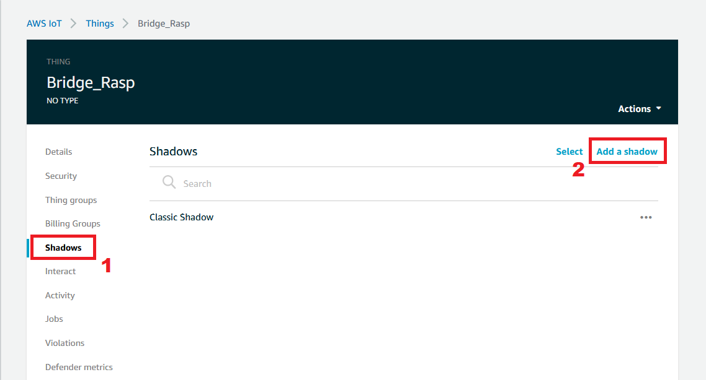
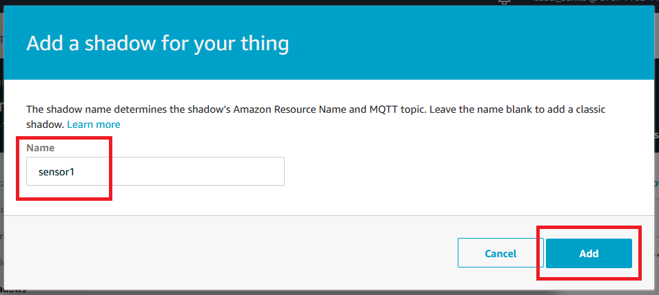
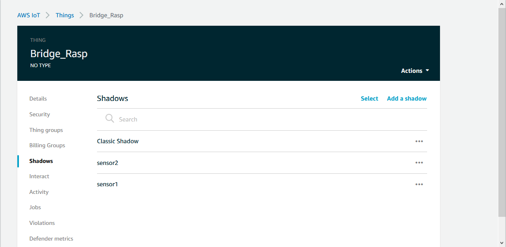
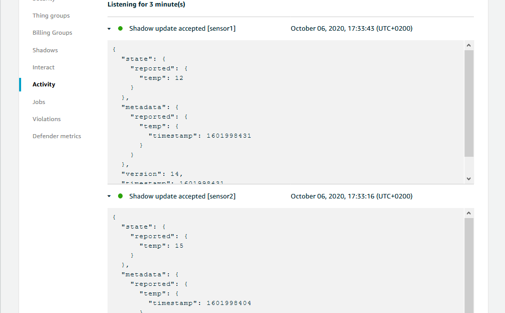

### Table of Contents

- [Adding multiple shadows to an AWS thing](#adding-multiple-shadows-to-an-aws-thing)
  - [First steps](#first-steps)
  - [Adding a shadow](#adding-a-shadow)
  - [Using shadows](#using-shadows)
  - [Configuring the Mosquitto MQTT broker as a bridge to AWS-IoT](#configuring-the-mosquitto-mqtt-broker-as-a-bridge-to-aws-iot)
  - [Testing how it works](#testing-how-it-works)


# Adding multiple shadows to an AWS thing

The feature called named shadow allows you to create multiple shadows for a single IoT device. When a thing is created, a classic shadow is associated with that device but, additionally, multiple "named" shadows can be added to a single thing.

You can store different device state data into different shadows, and as a result access only the required state data when needed and reduce individual shadow size.

Named shadow is metered and charged the same way as the classic shadow are used.


[](#table-of-contents)


## First steps

This tutorial shows an example of how to use the named shadow by integrating it with the Mosquitto MQTT broker. Data received in the broker from different sensors will be stored in different named shadows.

Before continuing with this tutorial, you must create a 'thing' and configure the MQTT broker according to the documentation in the following tutorials.

* [Create device thing in AWS-IoT](https://telefonicaid.github.io/iot-activation/#/AWS_create_new_thing?id=create-device-thing-in-aws-iot)

* [How to Bridge Mosquitto MQTT Broker to AWS IoT](https://telefonicaid.github.io/iot-activation/#/BP_Bridge_MosquittoToAWS.md)


[](#table-of-contents)


## Adding a shadow

1. Go to the 'thing' created and choose Shadows in the left navigation panel. Then click on Add a shadow.


2. Enter the name and click on the Add button.


3. We are going to create two new shadows, 'sensor1' and 'sensor2'.



[](#table-of-contents)


## Using shadows

Shadows can be named (the created in this tutorial) or unnamed (classic). The topics used by each differ only in the topic prefix. This table shows the topic prefix used by each shadow type.

| ShadowTopicPrefix value | Shadow type
| ---- | --- |
| $aws/things/**thingName**/shadow | Unnamed (classic) shadow
| $aws/things/**thingName**/shadow/name/**shadowName** | Named shadow


[](#table-of-contents)


## Configuring the Mosquitto MQTT broker as a bridge to AWS-IoT

1. Copy the Amazon CA certificate, device certificate and private key to the */etc/mosquitto/certs/* folder.

2. Add read permissions to the device certificate and private key.
```
sudo chmod 644 xxxxxxx-certificate.crt
sudo chmod 644 xxxxxxx-private.key
```

3. Create or modify the configuration file.
```
sudo nano /etc/mosquitto/conf.d/bridge.conf
```

4. First, edit the following by replacing the value of the 'address' with the value of your AWS IoT Core ATS endpoint, set the thing name in the 'topic' variable and fill the name of the certificate and private key. Second, copy the content and paste it in the nano editor. Finally, save the file by using the following key combinations 'ctrl + o', 'enter', then 'ctrl + x'.
```
# ============================================================
# Bridge to AWS IOT
# ============================================================

connection awsiot

#<Paste your AWS IoT Core ATS endpoint retrieved from the AWS CLI in the form of xxxxxxxxxxxxxxx-ats.iot.<region>.amazonaws.com:8883

address xxxxxxxxxxxxxxx-ats.iot.<region>.amazonaws.com:8883

# Specifying which topics are bridged and in what fashion
topic # out 0 "" $aws/things/<thing>/shadow/name/

# Setting protocol version explicitly
bridge_protocol_version mqttv311
bridge_insecure false

# Bridge connection name and MQTT client Id, enabling the connection automatically when the broker starts.
cleansession true
clientid bridgeawsiot
start_type automatic
notifications false
log_type all

# ============================================================
# Certificate based SSL/TLS support
# ============================================================

#Path to the rootCA
bridge_cafile /etc/mosquitto/certs/AmazonRootCA1.pem

# Path to the PEM encoded client certificate
bridge_certfile /etc/mosquitto/certs/xxxxx-certificate.pem.crt

# Path to the PEM encoded client private key
bridge_keyfile /etc/mosquitto/certs/xxxxx-private.pem.key

#END of bridge.conf

```

5. Now you can restart the Mosquitto broker to load this new configuration.
```
sudo service mosquitto restart
```

[](#table-of-contents)


## Testing how it works

In order to receive data in the named shadows created in [Adding a shadow](#adding-a-shadow) section, data must be published on the following topic:
* $aws/things/**thingName**/shadow/name/**shadowName**/update

In the case of our example:
* $aws/things/Bridge_Rasp/shadow/name/sensor1/update
* $aws/things/Bridge_Rasp/shadow/name/sensor2/update

According to the topic configuration in the bridge.conf file (`topic # out 0 "" $aws/things/<thing>/shadow/name/`), data published to the MQTT broker bridged will be remapped to `$aws/things/Bridge_Rasp/shadow/name/<topic publish on the bridge>`. This allows a topic tree from the local broker to be inserted into the topic tree of the remote broker at an appropriate place.

For example, data published on the topic `sensor1/update` will be bridged to `$aws/things/Bridge_Rasp/shadow/name/sensor1/update`.

You can find more information related to the topic pattern in the [Mosquitto website](https://mosquitto.org/man/mosquitto-conf-5.html), Configuring Bridges section.

[](#table-of-contents)


### Example

We are going to simulate two sensors that send data to the MQTT broker and are bridged to the AWS-IoT instance. Then, thanks to the bridge configuration, data is saved in the two different shadows.

```
mosquitto_pub -h <MQTT broker host/IP> -p 1883 -q 0 -d -t sensor1/update  -i localClientID -m '{"state":{"reported":{"temp":12}}}'
```

```
mosquitto_pub -h <MQTT broker host/IP> -p 1883 -q 0 -d -t sensor2/update  -i localClientID -m '{"state":{"reported":{"temp":15}}}'
```


[](#table-of-contents)


