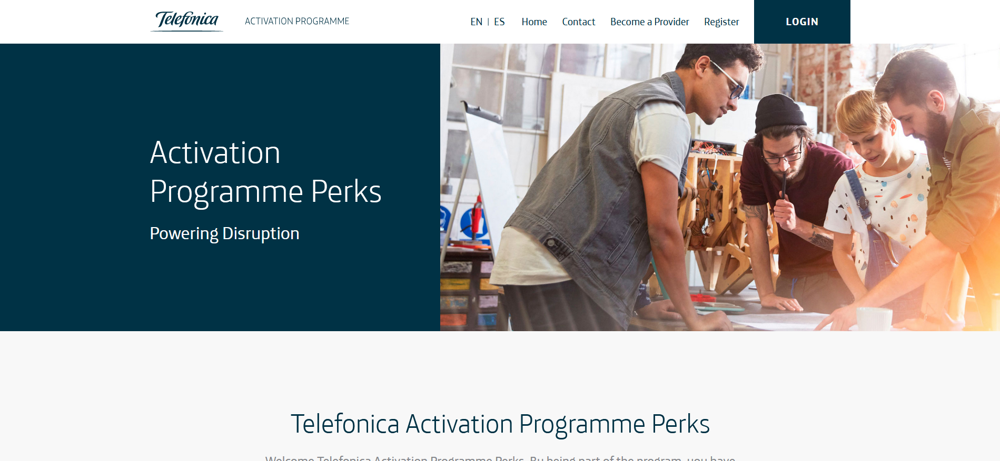
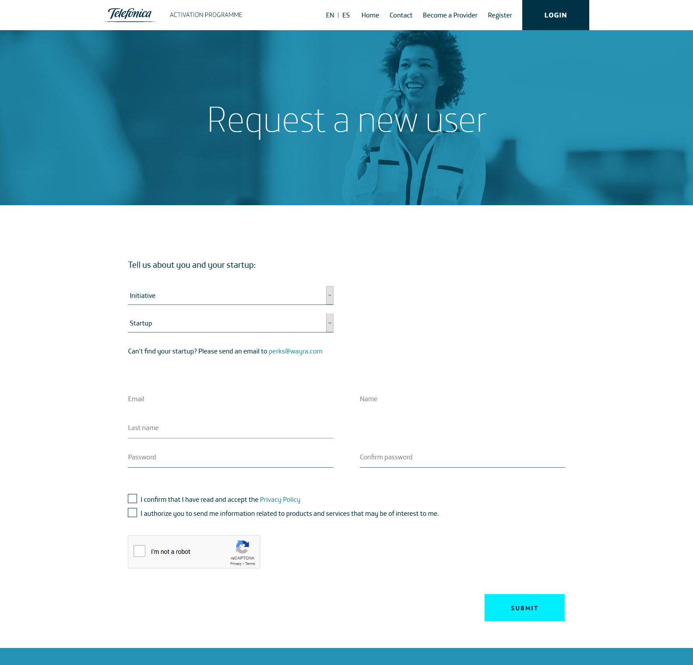
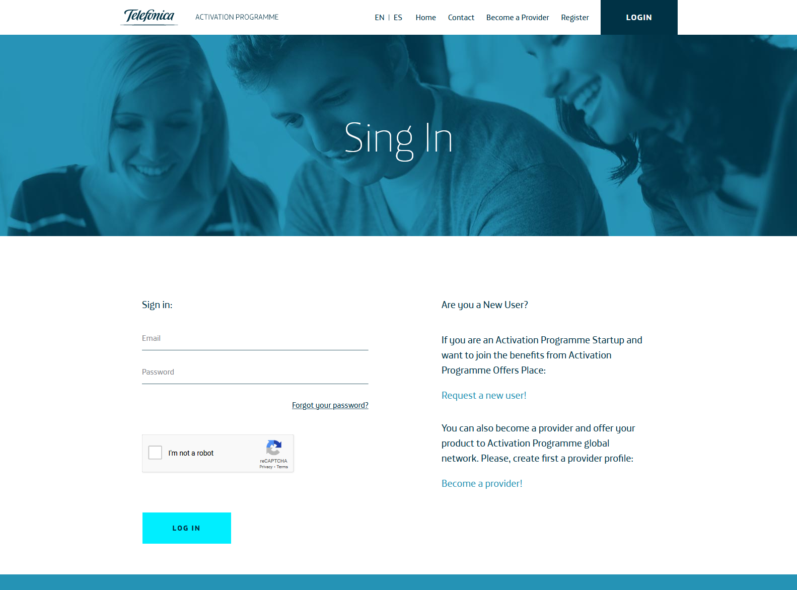
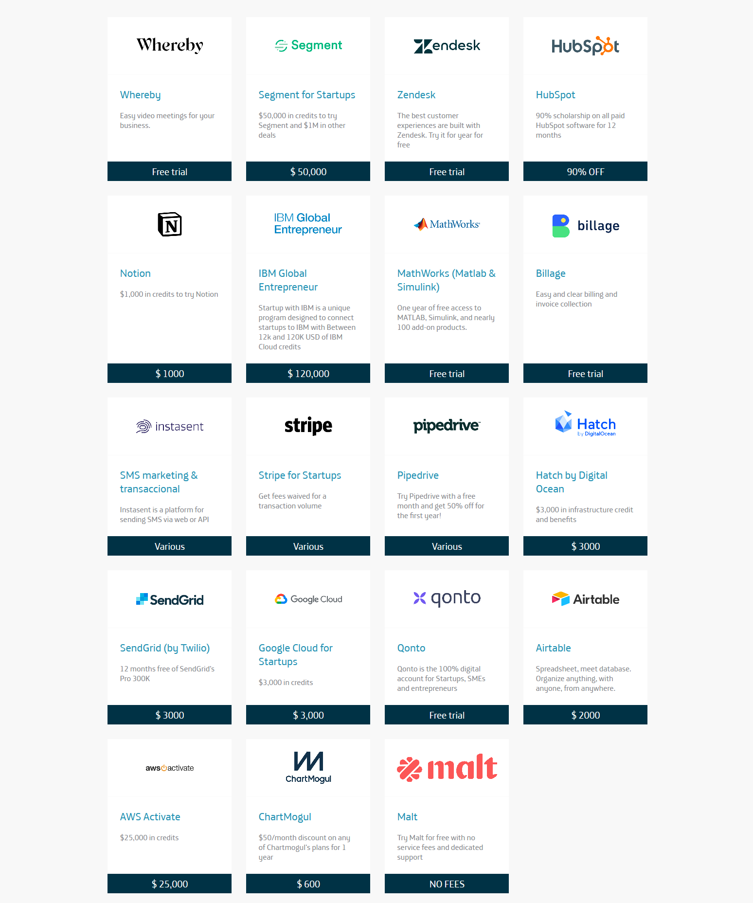
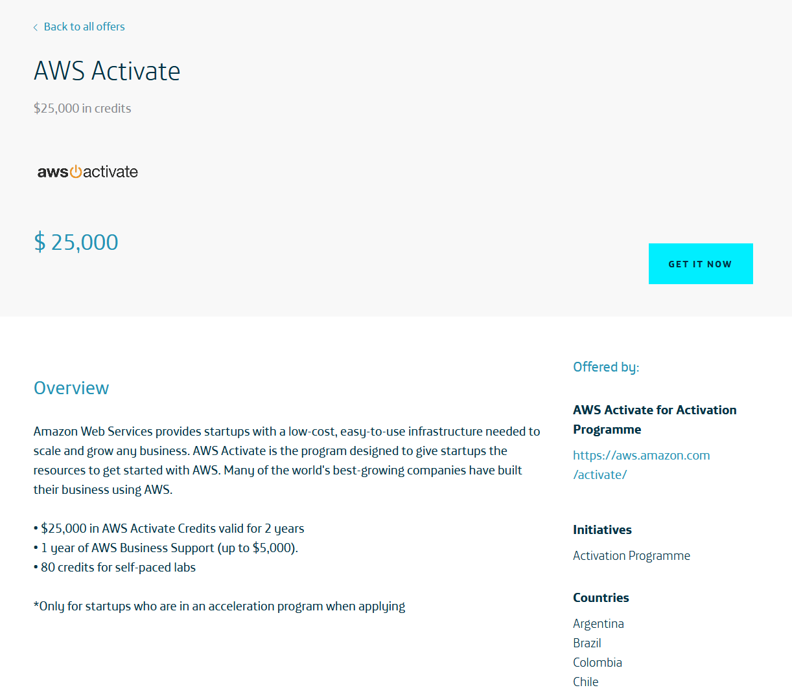
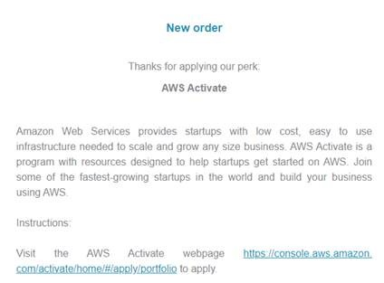

# Activation Programme Perks: how to access?

1. Go to https://perks-activationprogramme.telefonica.com/

2. Click on Register

3. Fill out the form:
   - **a)** Initiative: Activation Programme #IoT #BlockChain #AI
   - **b)** Your startup: select your startup from the dropdown
   - **c)** Email, username, password, etc.
   - **d)** Click on Submit

4. Once you submit it, your account will have to be validated.

5. When your account is validated, you will receive an email.

6. You can now log in the [website](https://perks-activationprogramme.telefonica.com/login), with the credentials you used when you signed up.

7. Once you are logged into the website, you can check out the offers you need and redeem them.

8. To redeem an offer, click **Get it now**

9. Depending on the perk/offer, you will you be either: redirected to the provider webpage, send an email with instructions or be shown a promotional code.

**E.g.:** Sample email when directed to the provider webpage.

