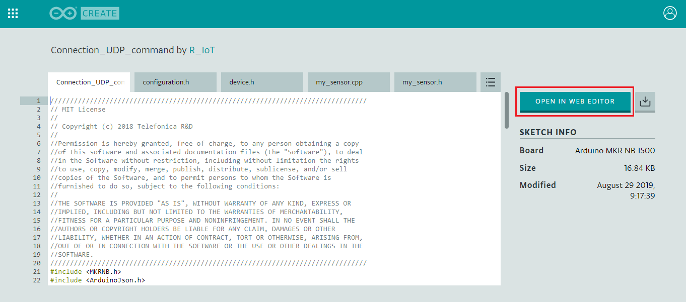
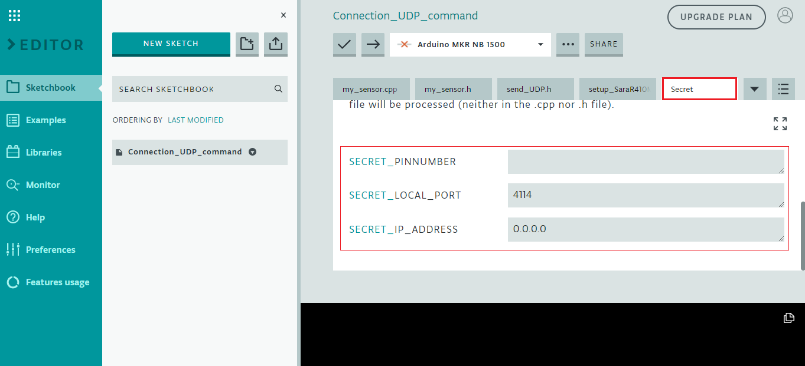
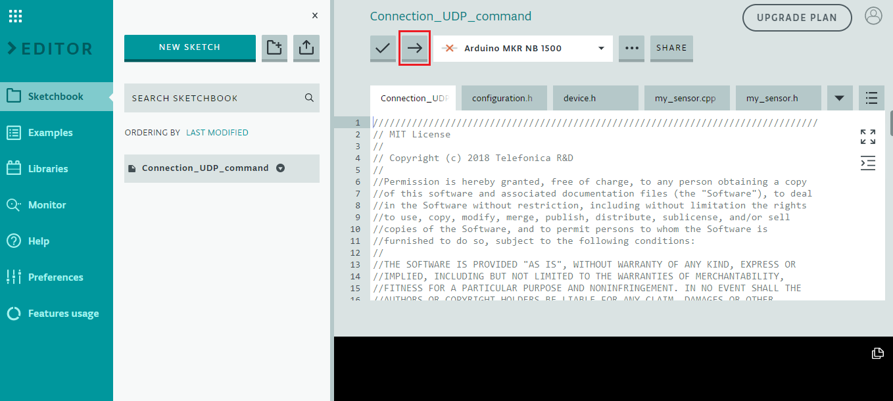

## Table of Contents
- [Publish in the Cloud in two Steps](#publish-in-the-cloud-in-two-steps)
  * [Step 1: Upload the code](#step-1-upload-the-code)
    + [Open the Arduino web editor](#open-the-arduino-web-editor)
  * [Step 2: Deploy your IPsec](#step-2-deploy-your-ipsec)
  

# Publish in the Cloud in two Steps

## Step 1: Upload the code

### Open the Arduino web editor

The easiest and most comfortable way to develop code for your Arduino is to use the web editor.

This editor allows you to download a project directly to your board without any installation. 
In addition to allowing you to easily share any of your projects.

In this way we can share our example with you using the following
[link](https://create.arduino.cc/editor/R_IoT/ee18efaa-460d-4b69-90fd-ec11de63b86b/preview)

Complete the information about the destination server in the **Secret** tab

Just connect your Arduino MKR NB 1500 and click on **upload**.

## Step 2: Deploy your IPsec

- [Configure IPsec in AWS one click](AWS_CF_IPsec.md)

