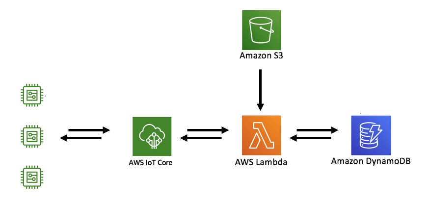

## Table of Contents

- [Blueprints: Bootstrapping](#blueprints-bootstrapping)
- [How to get started](#how-to-get-started)
  * [Device Table](#device-table)
  * [Bootstrapping registration](#bootstrapping-registration)
  * [Device manager update](#device-manager-update)


# Blueprints: Bootstrapping

If we told you that your device could be anything you wanted, we wouldn't be telling you anything you didn't already know. 

But if we tell you now that your device may be a different device even after its manufacture
Would it change anything?

This could be very helpful, if you control a wide variety of different devices.

IoT-Activation offers you this possibility!!

[](#table-of-contents)


## What is Bootstrapping?

When a device is manufactured, it is quite common, to take this time to store both the credentials and the SW that it will run.
Since doing this step later can be very expensive.

One of the advantages of a bootstrapping system is to store a SW and generic credentials that allow automatic update when the device is connected.

Imagine making all your devices completely equal and configuring its operation after its first connection.

Easy, isn't it?

[](#table-of-contents)


### What will you need?

In this project, we have designed a bootstrapping system using the AWS IoT Core and others AWS services.

- A device
- AWS account (IoT Core, DynamoDB, lambda ...)
- Generic credentials

[](#table-of-contents)


### How it works?

When a device is manufactured, the SW and AWS access credentials are stored in its memory.
This SW has the main function of notifying the device activation to the IoT Core and triggering the process
of provisioning and updating the device.

When a device wakes up for first time, the new device publish in a specific topic **"bs/device/DEVICE_ID/register/request"**, 
in this moment, the cloud checks the **DEVICE_ID** in DynamoDB. If the device is in the table and everything is OK the IoT Core 
generate a new own credentials for the device.

For this reason, the device must be subscribed to different topics to receive the new resources.

**"bs/device/DEVICE_ID/credentials/#"**, Use these topics to receive new credentials.
**"bs/device/DEVICE_ID/parameters/#"**, Use these topics to receive the configuration parameters.

If the data transfer is successful, the device must confirm to the cloud. It has to publish in the topic **"bs/device/DEVICE_ID/register/ok"**
to confirm.

The second step is too similar, but with the intention of updating the software version.

The device publishes in the topic **"dm/device/DEVICE_ID/version/request "**, and the cloud checks the device in the database again, 
if the device is registered OK then send the latest version of the software

For this reason, the device must be subscribed to different topics to receive the new resources.

**"dm/device/DEVICE_ID/update/"**, Use these topics to receive the new software code.
**"dm/device/DEVICE_ID/update/parameters/#"**, Use these topics to receive the configuration parameters of the new software.

[](#table-of-contents)


# How to get started

We will start with a brief explanation of the architecture of AWS.


This architecture is similar to both the provisioning process and the software update process

<p align="center"> 
     
</p>

[](#table-of-contents)

## Device Table 

The first step to build the bootstrapping system, is to create a table in DynamoDB with the name **Bootstrapping_table_registration**.
This table is used by the lambda to identify the new device and to authorize its provisioning at the IoT Core.

The field are the followed:

| device | registered | policy | firmware | parameters | version | connections |
| ------------- | ------------- | ------------- | ------------- | ------------- | ------------- | ------------- |
| DEVICE_ID | false | MyRaspberry_IoT_Activation | main | {"topic":"$aws/things/DEVICE_ID/shadow/update"} | 0 | 0 |


- **device:** This field contain the device id, is common use for this purpose the serial Number. When your devices will be manufacture 
write down the serial numbers in this table for identify the news devices.

- **registered:** is a flag that indicate the device status [request or ok], use the **false** state to initialize.

- **policy:** type the IoT policy name for attach it to the new device credentials.

- **firmware:** copy the fw name for download it when the device is connected.

- **parameters:** use a json to define values for parameters, the key "topic" is necessary to define where the device will publish.

 json exaple:  **{"topic":"$aws/things/DEVICE_ID/shadow/update"}**

- **version:** It displays the current firmware version that is running on the device.
Displays the current firmware version running on the device.

- **connections:** It indicate how many times the device tries to register as a new device. It can detect a possible attack!!

[](#table-of-contents)

## Bootstrapping registration 

This process is responsible for registering the new device with AWS, provisioning its credentials,
downloads all files and parameters and manages their status in AWS.

For this you will need the following services:

[](#table-of-contents)

### Lambda function

You have to create the function lambda **Bootstrapping_lambda_registration_device**

This function identifies the topic level:
**"bs/device/DEVICE_ID/update/TOPIC_LEVEL"**

- **request:** check the table **Bootstrapping_table_registration** and confirm that the device is authorized in the table and it is not yet registered.
If the device is not in the table, the registration of the device ends and if the device is authorized but already registered, add 1 to the connection counter of the table.
Otherwise, the lambda function performs the following steps:

1. Create a new thing in the IoT Core with the name: **DEVICE_ID** retrieve from the topic level.
2. Create a new credential for the device with the **policy** of the table.
3. Publish the certificate in the topic **bs/device/DEVICE_ID/credentials/certificate**
4. Publish the key in the topic **bs/device/DEVICE_ID/credentials/key**
5. Publish the field content **parameters** in the topic **bs/device/DEVICE_ID/parameters/**
6. Publish the **topic** of the **parameters** field in the topic **bs/device/DEVICE_ID/parameters/topic**
7. Finally it changes the field **registered** to state **requested** state.

- **ok:** this topic level is used to confirm the recovery of the entire device configuration, and change the field **registered** to **ok** state.

Download the code from our [repository](https://github.com/telefonicaid/iot-activation/tree/master/scripts/Bootstrapping/lambda/Bootstrapping_lambda_registration_device)

[](#table-of-contents)

### IoT Core Rule

You have to create a new IoT Core Rule **"Bootstrapping_register_device"** with the following query:

```sql
SELECT topic(3) as device, topic(5) as level FROM 'bs/device/+/register/#'
```

and associate as action the lambda **Bootstrapping_lambda_registration_device** created in the previous step

[](#table-of-contents)

## Device manager update

This process takes care of updating the SW.

For this you will need the following services:

[](#table-of-contents)


### S3 bucket

Use an S3 bucket in AWS to store the SW versions.
Make sure your devices have access to the bucket so that they can download the code

[](#table-of-contents)

### DynamoDB table

Create a new table to record the name of the software and the name of the S3 for download the code **Devicemanager_update**.

The field are the followed:

| device | bucket | file |
| ------------- | ------------- | ------------- |
| main | bootstrappingtest | software/main_test.py |

- **device:** Name to identify the software.

- **bucket:** The name of the S3 bucket where the file with the code is stored.

- **file:** The name of the file containing the code.

[](#table-of-contents)

### Lambda function

You have to create the function lambda **Devicemanager_lambda_update**

This function identifies the topic level:

**"dm/device/DEVICE_ID/update/TOPIC_LEVEL"**

- **request:** check the table **Bootstrapping_table_registration** if the device is authorized and registered in **ok** status,
it performs the following steps

1. Gets the sw name from the table **Bootstrapping_table_registration**
2. Find in the table **Devicemanager_update** the location where the file is stored.
3. Download the file code from the S3 bucket
4. Publish the contents of the file in the topic **dm/device/DEVICE_ID/update/**

- **ok:** this topic level is used to confirm the sw version that is running on the device, and change the value in the **version** field to this version.
For this action it is necessary that the device publishes in the topic its version in a json **{"version": X}**

Download the code from our [repository](https://github.com/telefonicaid/iot-activation/tree/master/scripts/Bootstrapping/lambda/Devicemanager_lambda_update)

[](#table-of-contents)

### IoT Core Rule

You have tu create a new IoT Core Rule **"Devicemanager_update_sw"** with the next query:

```sql
SELECT *, topic(3) as device, topic(5) as level FROM 'dm/device/+/update/#'
```

and associate as action the lambda **Devicemanager_lambda_update** created in the previous step

[](#table-of-contents)

