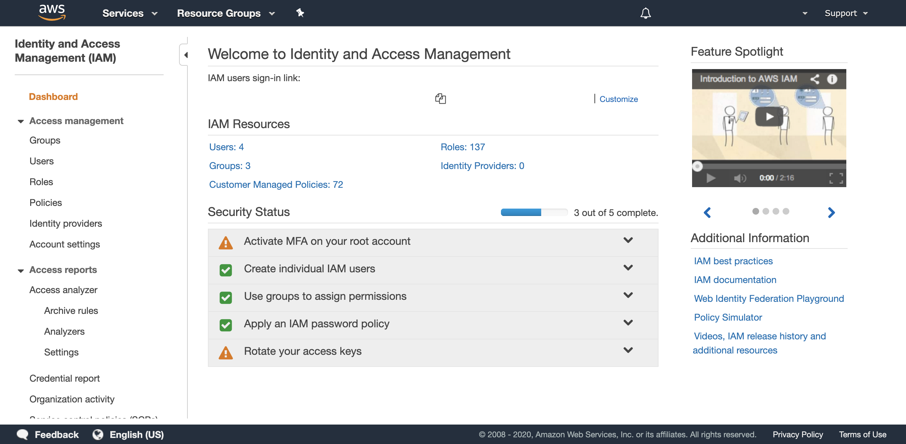
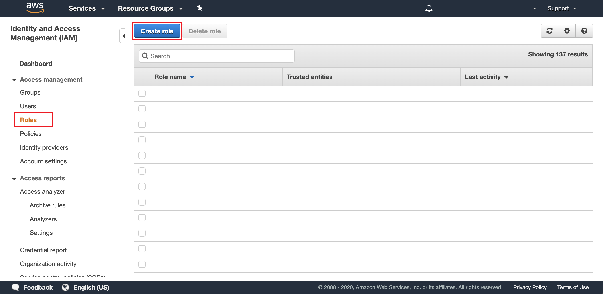
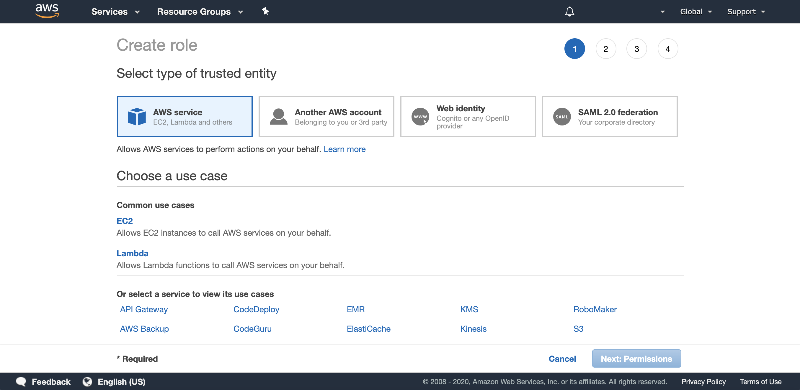
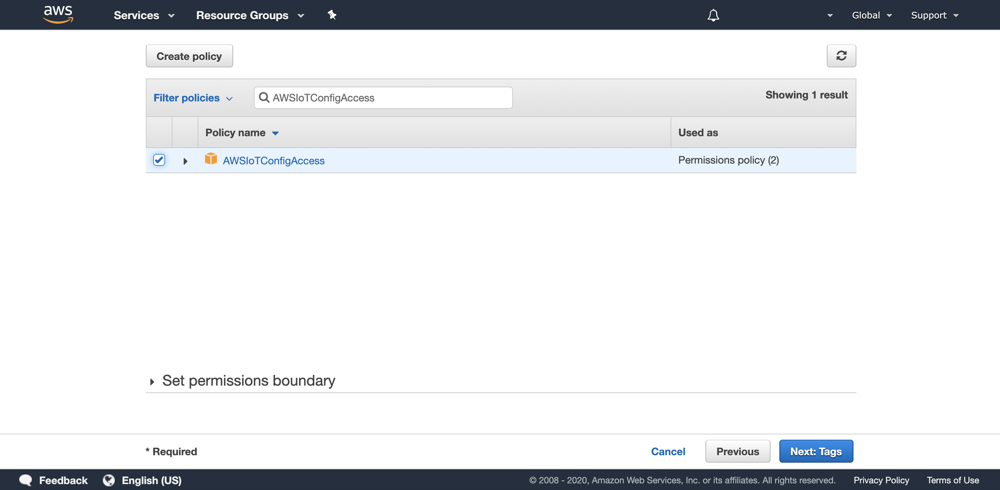
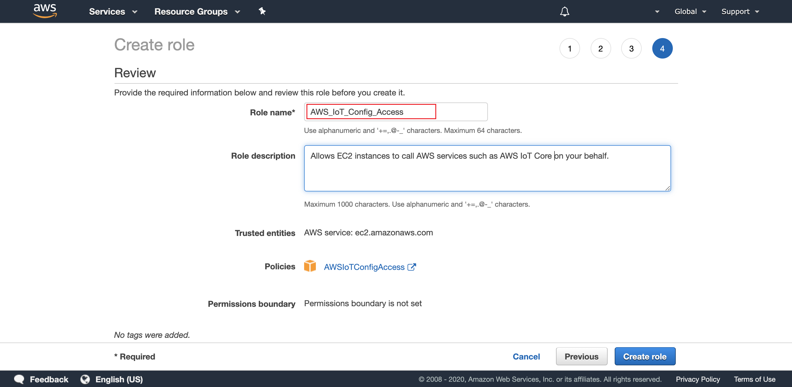
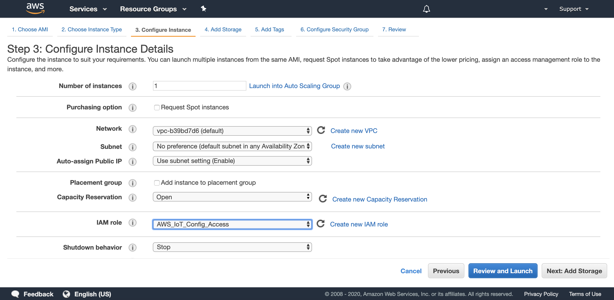
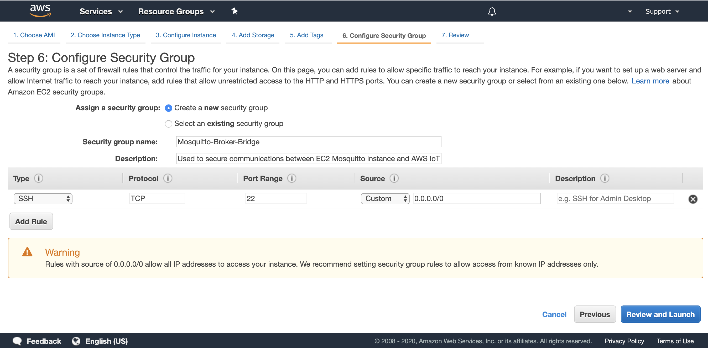
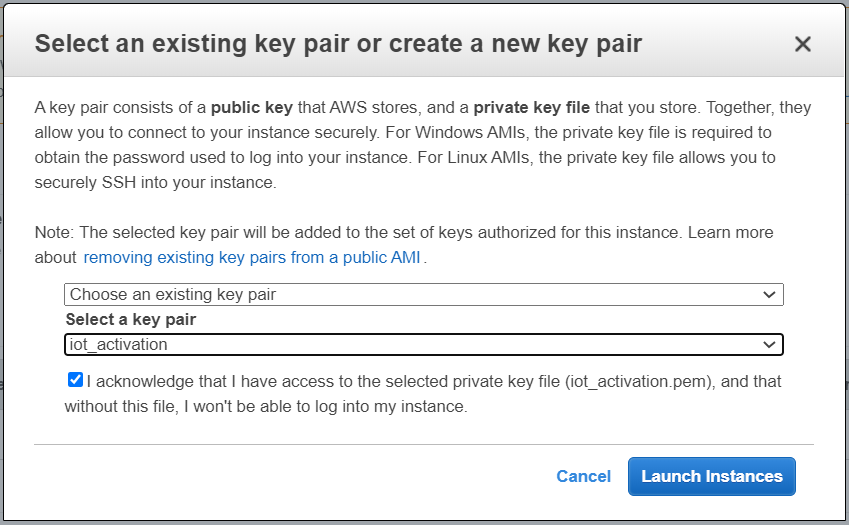
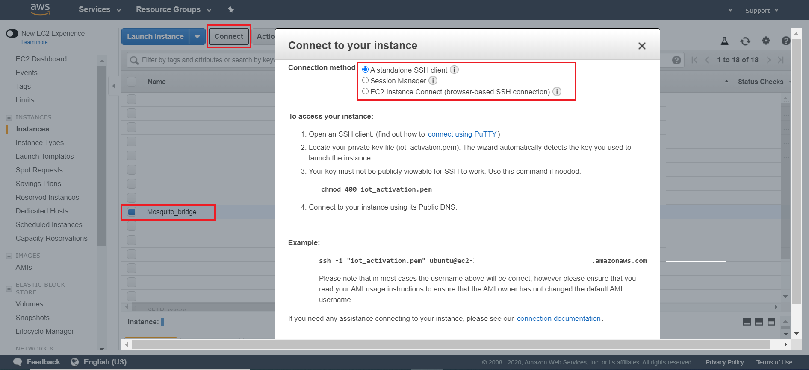

### Table of Contents
- [How to Bridge Mosquitto MQTT Broker to AWS IoT](#how-to-bridge-mosquitto-mqtt-broker-to-aws-iot)
  * [Install Mosquitto MQTT](#install-mosquitto-mqtt)
  * [Launch and Configure the EC2 Instance](#launch-and-configure-the-ec2-instance)
  * [Configure the Bridge to AWS IoT Core](#configure-the-bridge-to-aws-iot-core)
  * [Test that everything works](#test-that-everything-works)

# How to Bridge Mosquitto MQTT Broker to AWS IoT

If it's not your first time using MQTT, make sure your devices are already connected to an MQTT broker like Mosquitto.

You have probably already heard about the benefits of the Cloud: scalability, high availability, security and above all, greater agility. 
But like everything else, it is always advisable to try before having to migrate all your devices.

In this tutorial we present you a transitional solution, which will allow you to confederate a Mosquitto broker with the AWS IoT Core.
We will implement a bridge using the Mosquitto broker as illustrated in the diagram below.


[](#table-of-contents)


## Install Mosquitto MQTT 

Typically, you should install this on what you see as your local gateway which is the device that will be the link between your local devices and other local devices 
or to the AWS Cloud. Mosquitto supports a wide range of platforms including many Linux distributions. 
Therefore, you can run it on both devices and a full virtual server/machine. You can go to the [Mosquitto download page for instructions.](https://mosquitto.org/download/)

For convenience and reproducibility, in this tutorial we will install the Mosquitto broker on an Amazon EC2 instance, 
which is equivalent to having a local gateway running a Linux distribution.

If you don't plan to use an Amazon EC2 instance you can jump to the section [Configure the Bridge to AWS IoT Core](#configure-the-bridge-to-aws-iot-core)


[](#table-of-contents)

## Launch and Configure the EC2 Instance

Before launching an Amazon EC2 Ubuntu instance to host the Mosquitto broker, 
we will create an IAM role to be able to use the CLI of the Amazon EC2 instance to generate AWS IoT credentials for the bridge.

- Go to the AWS Web Console and access the IAM service.


- Click on Roles. Then, click on Create role


- Select EC2 and click on Next: Permissions


- Filter with the value AWSIoTConfigAccess. Then select the policy AWSIoTConfigAccess and click on Next: 
Tags. Skip the next screen by clicking on Next: Review.


- Enter AWS_IoT_Config_Access as the Role name and enter a Role description. Review the role and click on Create role


- Now that the Role has been created you can go to Amazon EC2. Choose a region.
Then click on Launch Instance and use the filter with the value “ubuntu”. Select the Ubuntu Server 18.04 LTS x86 (Fig. 6)


- Select the t2.micro instance type


- Click on Next: Configure Instance Details. In the IAM Role dropdown, select AWS_IoT_Config_Access.
Make sure you use the default VPC and that the Auto-assign Public IP is Enable to get a public IP automatically. 
If you wish to use another VPC, make sure the subnet you choose will enable you to remotely connect to your Amazon EC2 instance. 
Then, click on Next: Add Storage.


- Leave everything as is and click on Next: Tag Instance. You may assign a tag to your instance. 
Click on Next: Configure Security Groups. Create a new security group as described in the screenshot


Review and launch the EC2 instance. Make sure to select an existing Key Pair or to create a new one in order to connect to the Amazon EC2 instance later on.



When the Amazon EC2 instance is running, click on “Connect” and follow instructions to establish a connection through a terminal. 


Once logged into the Amazon EC2 instance type the following commands to install the software required:

```bash
#Update the list of repositories with one containing the latest version of #Mosquitto and update the package lists
sudo apt-add-repository ppa:mosquitto-dev/mosquitto-ppa
sudo apt-get update

#Install the Mosquitto broker, Mosquitto clients and the aws cli
sudo apt-get install mosquitto
sudo apt-get install mosquitto-clients
sudo apt install awscli
```


[](#table-of-contents)

## Configure the Bridge to AWS IoT Core

Now that we have installed the Mosquitto broker onto our Amazon EC2 instance (or local gateway), 
we will need to configure the bridge so that the Mosquitto broker can create a bi-directional connection to AWS IoT Core. 
We will first use the AWS CLI to create the necessary resources on AWS IoT side.

Enter the following commands in your terminal:

```bash
#Configure the AWS CLI with your AWS region, leave access/private keys blank
aws configure

#Create an IAM policy for the bridge
aws iot create-policy --policy-name bridgeMQTT --policy-document '{"Version": "2012-10-17","Statement": [{"Effect": "Allow","Action": "iot:*","Resource": "*"}]}'

#Place yourself in Mosquitto directory and download the Amazon Root CA #certificate
cd /etc/mosquitto/certs/
sudo wget https://www.amazontrust.com/repository/AmazonRootCA1.pem -O rootCA.pem

#Create certificates and keys. Make a note of the certificate ARN as it will be #needed to configure the IoT Policy.
sudo aws iot create-keys-and-certificate --set-as-active --certificate-pem-outfile cert.crt --private-key-outfile private.key --public-key-outfile public.key --region us-east-1

#Copy the ARN of the certificate returned by the command line in the form of #arn:aws:iot:us-east-1:0123456789:cert/xyzxyz and replace it in the following #command line in order to attach the IoT policy to your certificate
aws iot attach-principal-policy --policy-name bridgeMQTT --principal <certificate ARN>

#Add read permissions to the private key and the public certificate
sudo chmod 644 private.key
sudo chmod 644 cert.crt
```
We now have a client certificate for our bridge, this certificate is associated with an IoT policy. 
This IoT policy will give permissions to the bridge to connect to AWS IoT Core and publish/subscribe to any topic 
(this policy must be further restricted to match your usage appropriately). 
The last step is to create the configuration file with our specific configuration for the Mosquitto Broker bridge.

```bash
aws iot describe-endpoint --endpoint-type iot:Data-ATS

#Create the configuration file
sudo nano /etc/mosquitto/conf.d/bridge.conf
```

First, edit the following by replacing the value of the ‘address’ with the value of your AWS IoT Core ATS endpoint. Second, copy the content and paste it in the nano editor. 
Finally, save the file on the Amazon EC2 instance by using the following key combinations ‘ctrl + o’, ‘enter’, then ‘ctrl + x’.

you can download the file [bridge.conf](https://github.com/telefonicaid/iot-activation/blob/master/scripts/mosquitto_AWS/bridge.conf)
from Github.

So that you only need to update the `address xxxxxxxxxxxxxxx-ats.iot.<region>.amazonaws.com:8883` 

```
#<Paste your AWS IoT Core ATS endpoint retrieved from the AWS CLI in the form of xxxxxxxxxxxxxxx-ats.iot.<region>.amazonaws.com:8883
address xxxxxxxxxxxxxxx-ats.iot.<region>.amazonaws.com:8883
```

And only if you prefer to select your own topics edit them:

```
# Specifying which topics are bridged and in what fashion
topic iotActivation/MQTTbroquer/awsiot_to_localgateway/# in 1
topic iotActivation/MQTTbroquer/localgateway_to_awsiot/# out 1
topic iotActivation/MQTTbroquer/both_directions/# both 1
```

The rest of the editable parameters work as configured in the tutorial.

```
#Path to the rootCA
bridge_cafile /etc/mosquitto/certs/rootCA.pem

# Path to the PEM encoded client certificate
bridge_certfile /etc/mosquitto/certs/cert.crt

# Path to the PEM encoded client private key
bridge_keyfile /etc/mosquitto/certs/private.key
```

Now we can restart the Mosquitto broker to load this new configuration:

```
#Restart the Mosquitto Mosquitto broker
sudo service mosquitto restart
```

The Mosquitto broker has now restarted and has already connected to AWS IoT Core in the background.

[](#table-of-contents)

## Test that everything works

In your configuration, you have included a bridge between three topics:

topic iotActivation/MQTTbroquer/awsiot_to_localgateway/# in 1
topic iotActivation/MQTTbroquer/localgateway_to_awsiot/# out 1
topic iotActivation/MQTTbroquer/both_directions/# both 1

We will check that the **iotActivation/MQTTbroquer/awsiot_to_localgateway/#** topic works correctly. 
All messages published in this topic will be forwarded from the local Mosquitto broker to AWS IoT Core.

Go to the Test section of the AWS IoT Console.
Enter **iotActivation/MQTTbroquer/awsiot_to_localgateway/#** as the Subscription topic and click on Subscribe to topic.

///////////imagen


Now that you're listening for incoming messages on the AWS IoT, 
you will publish a MQTT message from a local client from the EC2 instance to test if the bridge works properly. 
If everything works properly, the message will be forwarded from the local client to AWS IoT Core.

///////////imagen  publisinf for mqtt.fx

You should now get this message on your screen.


As an exercice, you can use the following commands to test the other configured bridged topics to test sending messages both ways!

```bash
# Publish a message locally on the topic both_directions and receive the message on AWS IoT Core
mosquitto_pub -h localhost -p 1883 -q 1 -d -t iotActivation/MQTTbroquer/both_directions/test -i yourClientID -m "{\"message\": \"helloFromLocalGateway\"}"

# Subscribe to the both_directions topic to receive message sent by AWS IoT #Core on that topic
mosquitto_sub -h localhost -p 1883 -t iotActivation/MQTTbroquer/awsiot_to_localgateway/#
```

If you have finished testing with an Amazon EC2 instance you can replicate this configuration with the device you are using as a gateway. 

[](#table-of-contents)