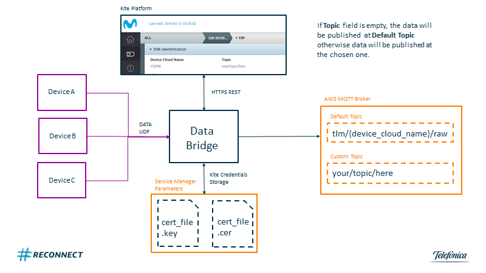
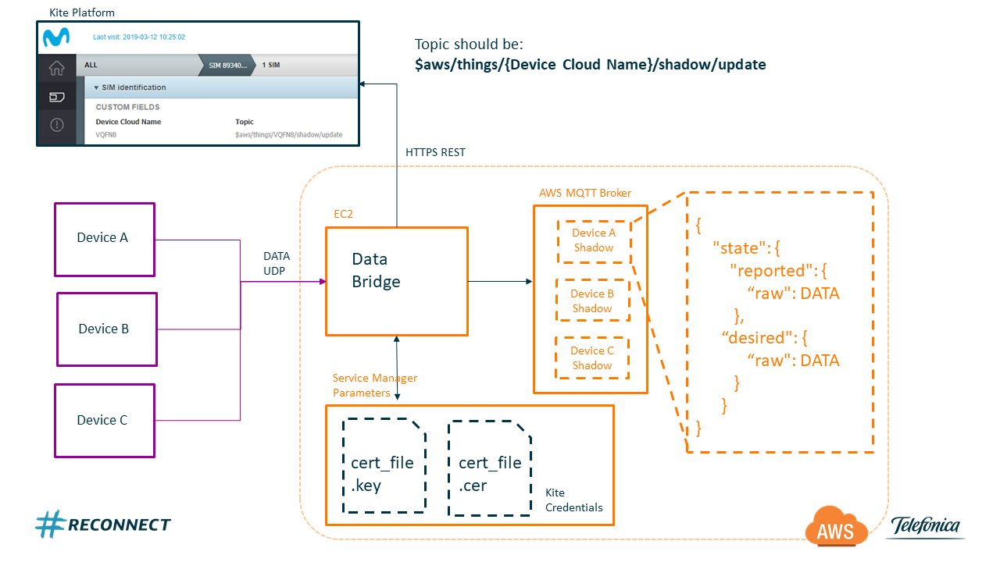
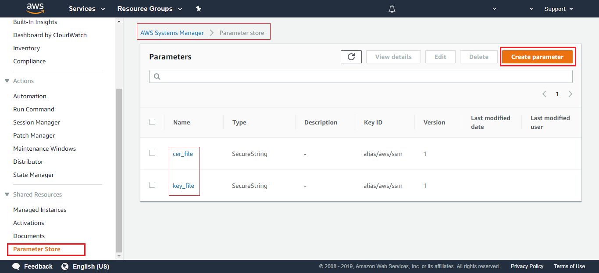
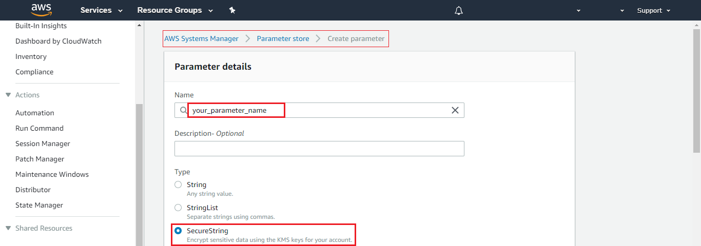
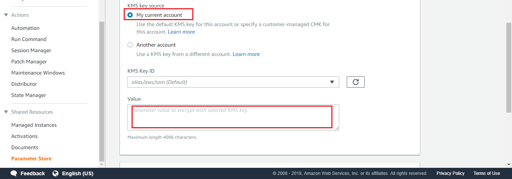

### Table of Contents

- [What does it do?](#what-does-it-do)
  * [AWS Options:](#aws-options)
    + [AWS Option 1: Telemetry](#aws-option-1-telemetry)
    + [AWS Option 2: Telemetry and Commands](#aws-option-2-telemetry-and-commands)
- [Deploy and defend your Bridge on AWS!](#deploy-and-defend-your-bridge-on-aws)
  * [What will you need?](#what-will-you-need)
  * [Data Bridge python code](#data-bridge-python-code)
  * [KITE Platform certificates](#kite-platform-certificates)
  * [IPsec tunnel configuration between Telefónica and AWS](#ipsec-tunnel-configuration-between-telefónica-and-aws)
  * [Amazon Web Services Cloud Computing Services](#amazon-web-services-cloud-computing-services)
    + [AWS Identity and Access Management (IAM)](#aws-identity-and-access-management-iam)
    + [AWS Systems Manager Parameter Store](#aws-systems-manager-parameter-store)
    + [AWS IoT Core](#aws-iot-core)
    + [Amazon Elastic Compute Cloud (EC2)](#amazon-elastic-compute-cloud-ec2)
- [How to run it](#how-to-run-it)
  * [Download it](#download-it)
  * [Configure it](#configure-it)
  * [Launch it](#launch-it)


# What does it do?

Each UDP message or CoAP request sent by a device, it is linked to several information such as source IP, destination IP and destination Port. 
The Bridge will use the device source IP to gather all the sim information stored at Kite platform. 

For the tutorial purpose you should pay attention to SIM's custom fields, 
that you can manage from your Kite Platform account. 

- **Field 1** : Device Cloud Name (required) -> this is the name that will appear at the cloud (shadow name, twin name ...) 
- **Field 2** : topic to publish (optional)

Depending on the content of the fields, the Bridge will act differently. 

To choose between the different options you have to configure SIM information at the [Custom Field](Kite_Platform.md#edit-custom-field)

&#x1F4CD;
The device name is a mandatory field, otherwise an error code will be returned, because the bridge wouldn't know the virtual representation of the physical device.

As we said before, There are two ways of working depending on the information provided as custom parameter in Kite. 

## AWS Options:

- [AWS Option 1: Telemetry](#aws-option-1-telemetry)
- [AWS Option 2: Telemetry and Commands](#aws-option-2-telemetry-and-commands)


#### AWS Option 1: Telemetry

This is the most straight forward option. 
You only have to provide a device cloud name at the first custom parameter in Kite. 
As a result all the messages sent by your device will be published at the default topic. 

The default topic has this structure:  **tlm/{DEVICE_NAME_IN_KITE}/raw**

Otherwise, If you prefer to send your device messages to another topic, you should add it as a second custom field at Kite.



#### AWS Option 2: Telemetry and Commands

The configuration is quite simple, you should identify the topic update of your device and copy it into the second custom field.
It should look like this: **$aws/things/{DEVICE_NAME_IN_KITE}/shadow/update**

The bridge will recognize it as an AWS reserved topic and will use the appropriate logic for the connection. 

The data sent will be published in the shadow in the **raw** field as shown in the following example.

```json
{  
  "reported": {
    "raw": "<MESSAGE SENT HERE>",
  }
}
```

Moreover, the Bridge will subscribe to the Accepted and Rejected topics, so you will be able to control if the publication has been done  or rejected by the broker.

Another advantage of using the AWS shadows, is the communication with the device, it allows you to send commands to it.
You have to complete the json raw data field at device shadow desired field. 

```json
{  
  "desired": {
    "raw": "<MESSAGE FOR THE DEVICE>",
  }
}
```



If you try to publish into a shadow that it isn't already provisioned the Data Bridge will create it before publishing so you don't have to worry about it :). 

But if you still want to create it manually you can follow these [steps](AWS_create_new_thing.md)

[](#table-of-contents)


# Deploy and defend your Bridge on AWS!

## What will you need?

- Data Bridge [code](https://github.com/telefonicaid/iot-activation/tree/master/scripts/Data_Bridge)
- KITE Platform [Certificates files](Kite_Platform.md#what-is-kite-platform-api)
- An IpSec Service provided by Telefónica [(IPsec)](BP_IPsec.md#what-is-ipsec)
- AWS account:
	- Identity and Access Management roles
	- AWS Systems Manager Parameter Store
	- Amazon Elastic Compute Cloud instance (EC2)
	- AWS IoT Core

&#x1F4CD;
For the time being, if you use a SIM from the Thinx testing network you will not have access to the Kite Platform.

[](#table-of-contents)


## Data Bridge python code

You can download it from our [repository](https://github.com/telefonicaid/iot-activation/tree/master/scripts/Data_Bridge)

Or use the command: `wget`

```
wget https://raw.githubusercontent.com/telefonicaid/iot-activation/master/scripts/Data_Bridge/Data_Bridge.zip
```

Unzip the new file

```
unzip Data_Bridge.zip
```

[](#table-of-contents)


## KITE Platform certificates

One of the Data Bridge strong points, is the integration with Kite.
Kite is the Telefónica's IoT Connectivity Platform, and Kite provides an API interface for management via HTTPS.

Ask your Telefonica's local contact for the certificates associated to your account. 

Once you receive this certificate, you will need to extract the keys that the Bridge will use to validate the connection.
If you want to see how to do it, you can follow our 
[documentation](Kite_Platform.md#extract-your-credentials-files)

When you finish these steps, you should have a file with the certificate and another one with the access key:
- your_customer_certificate.cer
- your_customer_certificate.key

[](#table-of-contents)


## IPsec tunnel configuration between Telefónica and AWS

An IPsec tunnel is a direct connection between the mobile network of your SIM pool and the Data Bridge deployed in AWS.

This connection not only creates a new network (VPN) but also guarantees the security of your data 
by allowing communication only between the devices that belong to this network.

Although its functioning is quite complex to explain. The configuration is quite simple if you follow our 
[tutorial](BP_IPsec.md#how-to-make-your-own-ipsec-vpn)

When you finish this tutorial, you will also have created a EC2 machine. 
This is the machine you will use to deploy your Data Bridge.

Remember to keep both the private IP of your IPsec network and the public IP to remotely access the machine. 

[](#table-of-contents)


## Amazon Web Services Cloud Computing Services

If you are using this tutorial is because you have chosen Amazon as your cloud.

For this reason, we have tried that all the services provided in the Data Bridge are integrated at AWS platform.
In the following steps we will explain how to configure these services.

[](#table-of-contents)


### AWS Identity and Access Management (IAM)

IAM is a service that allows you to manage access to AWS services and resources securely.
This service will allow you to control users and their permissions. 
But it will also allow you to manage access policies between the different Amazon services.

You will need it in this tutorial because it is necessary to assign an access policy to the EC2 machine 
that allows access to the other services. 

Your EC2 needs the following policies:
- Access to IoT Core
- Access to AWS Systems Manager Parameter store

To attach an IAM role to an instance ...

1. Open the Amazon EC2 console at https://console.aws.amazon.com/ec2/.
2. In the navigation pane, choose Instances.
3. Select the instance, choose Actions, Instance Settings, Attach/Replace IAM role.
4. Select the IAM role to attach to your instance, and choose Apply.


[](#table-of-contents)


### AWS Systems Manager Parameter Store

AWS Systems Manager is a service that gives you visibility and control of your infrastructure.

Among its resources, there is the Parameter Store. 
This parameter storage allows the secure storage of certificates and passwords.

For this example, we will use this service to store the content of the Kite certificates files.

In the AWS Console.

Go to Systems Manager / Parameter Store / Select: Create parameter 



Select a name for the parameter. And copy the contents of the file in the **value** field.

Do this for each of the files:
- your_customer_certificate.cer
- your_customer_certificate.key




And click on the **Create parameter** button at the bottom of the page.

Save the names of the parameters, they are necessary to configure the Bridge.

[](#table-of-contents)


### AWS IoT Core

AWS IoT Core is a managed cloud service that lets connected devices easily and 
securely interact with cloud applications and other devices.

If you have not previously worked with IoT Core, we recommend that you familiarize with the environment. 
And make sure you understand concepts like MQTT, Broker and Shadow.

As for configuring a new device, you can do so by following these 
[steps](AWS_create_new_thing.md#create-device-thing-in-aws-iot)

but if you're too lazy for it. "No problemo" The Bridge will create it for you.

Auto provisioning of new devices!!

[](#table-of-contents)


### Amazon Elastic Compute Cloud (EC2)

Amazon EC2 is a web service that provides secure, resizable compute capacity in the cloud.

If you have carefully followed the steps to create the IPsec tunnel, you should already have created an instance.

We have chosen an instance with linux, but if you prefer any other, 
just make sure that the instance can execute code in python.


To attach an IAM role to an instance that has no role, the instance can be in the stopped or running state.

1. Open the Amazon EC2 console at https://console.aws.amazon.com/ec2/.
2. In the navigation pane, choose Instances.
3. Select the instance, choose Actions, Instance Settings, Attach/Replace IAM role.
4. Select the IAM role to attach to your instance, and choose Apply.

Requirements to connect to your EC2 instance with SSH

- SSH **file.pem** provided by Amazon when you launch the instance
- **IP-address** assigned to your ec2 instance
- The **username** on the instance distro

On linux

1. Open a terminal
2. Type the SSH command 
```
ssh -i file.pem username@IP-address
```
3. Now you’re connected

On Windows

1. Install Putty https://www.putty.org/
2. Open PuttyGen
3. Select checkbox “RSA”
4. Click load and select your **file.pem**
5. A message will prompt, click ok.
6. Click on save private key. 
7. Then a message will prompt, select yes
8. Type a name for your key **file.ppk**
9. Now close PuttyGen program and open Putty
10. Go to Connection/SSH section and double-click it.
11. Go to Auth section and select your **file.ppk**
12. Go back at the top in the Session section. Fill the field Hostname **IP-address** and click open
13. A warning will prompt. Click yes.
14. Type your **username**
15. Now you’re connected

Upload files using FTP Client

You can download Filezilla using the next link (https://filezilla-project.org/download.php)

1. Go to Edit/Settings/Connection/SFTP, Click "Add key file”
2. Browse to the location and select your **file.pem**
3. A message box will appear to convert the file into .ppk. Click Yes, and store it.
4. If the new file is shown in the list of Keyfiles, then continue to the next step. If not, then click "Add keyfile..." and select the converted file.
5. Go to File/Site Manager/Add a new site with the following parameters:

- Protocol: SFTP
- Host: **IP-address**
- Logon Type: Key File
- User: **username**

[](#table-of-contents)


# How to run it

Now that you know how to configure AWS. You can run it in just 3 steps !!!

## Download it

You can choose between several options: 

- Option 1: Download the Github repository on the instance

1. Install git on the instace
```shell
sudo yum upgrade
sudo yum install git
```
2. Clone the repository
```shell
git clone https://github.com/telefonicaid/iot-activation.git
```
3. Go to Bridge path: **scripts/Data_Bridge/**

- Option 2: Download the Data Bridge Code

1. Download the Code with the command: `wget`
```
wget https://raw.githubusercontent.com/telefonicaid/iot-activation/master/scripts/Data_Bridge/Data_Bridge.zip
```
2. Unzip the new file
```
unzip Data_Bridge.zip
```

Now that you have the code in the machine you just have to install the python libraries.


If you are using an instance of EC2, run the following command. It will allow you to install python libraries

```shell
sudo yum install python-pip
```

You can install them one by one from the Bridge folder.

```python
sudo pip install -r requirements.txt
```

[](#table-of-contents)


## Configure it

We have tried to make this as simple as possible.

So, you'll only need to fill in a few fields in the configuration file 
[Configuration.yaml](https://github.com/telefonicaid/iot-activation/tree/master/scripts/Data_Bridge/config/Configuration.yaml)

```yaml
cloud: AWS

UDP:
  ip: "0.0.0.0"
  port: 4114

COAP:
  ip: "0.0.0.0"
  port: 5683

KITE:
  url: "https://m2m-api.telefonica.com"
  certificate: "cer_file"
  private_key: "key_file"

```


#### Configure the Cloud

This parameter is used to identify the cloud and select the configuration file. 
In this example you must select AWS

```yaml
cloud: AWS
```


#### Configure the UDP socket

Here you can choose the port through which you will receive the UDP messages and the allowed IP addresses

```yaml
UDP:
  ip: "0.0.0.0"
  port: 4114
```

allowed values:
- ip: "0.0.0.0"    (allow any address)
- ip: "X.X.X.X"	   (restrict to a single address)

If you don't want to configure the connection through UDP, remove this section from the file.

#### Configure the COAP proxy

Here you can choose the port through which you will receive the UDP messages and the allowed IP addresses

```yaml
COAP:
  ip: "0.0.0.0"
  port: 5683
```

allowed values:
- ip: "0.0.0.0"    (allow any address)
- ip: "X.X.X.X"	   (restrict to a single address)

If you don't want to configure the COAP proxy, remove this section from the file.

#### Configure the Kite Platform connection

This parameter allows you to select the files the certificates to access the Kite Platform.

```yaml
KITE:
  url: "https://m2m-api.telefonica.com"
  certificate: "cer_file"
  private_key: "key_file"
```

Do you remember the name of the parameters created in AWS?
Now is the time to use them.

[](#table-of-contents)


#### Configure the AWS file

Here is an example of a configuration file for AWS connection 
[Configuration_AWS.yaml](https://github.com/telefonicaid/iot-activation/tree/master/scripts/Data_Bridge/config/Configuration_AWS.yaml)

```yaml
cloud: AWS
region: "xx-xxxx-x"
MQTT:
  topic:
    update: "$aws/things/<DEVICE_NAME>/shadow/update"
    default: "tlm/<DEVICE_NAME>/raw"
    log_device: "log/device/provision/new"
    reserved: "$aws"
```

The file is quite intuitive, however here you can see carefully how to configure each section

##### Region configuration

Configure the region of your devices

```yaml
cloud: AWS
region: "xx-xxxx-x"
```

##### Topic configuration

At the moment you only have to keep the fields as is

```yaml
MQTT:
  topic:
    update: "$aws/things/<DEVICE_NAME>/shadow/update"
    default: "tlm/<DEVICE_NAME>/raw"
    log_device: "log/device/provision/new"
    reserved: "$aws"
```

- **update**: this topic is the specific of AWS. It doesn't make any sense to modify it.
- **default**: configure this field to select the default topic name.
- **log_device**: topic name in which the new things creations are reported.
- **reserved**: this parameter indicates that the name is a AWS standard topic.

[](#table-of-contents)


## Launch it

Go to Bridge path and execute this command

```shell
sudo nohup python main.py &
```
- **sudo** Execute the instruction as if you were the administrator.
- **nohup** It'll keep running even when you close the session.
- **python main.py** will execute the code

When the Bridge is running, it will record all UDP messages he receives in a log file. 
You can monitor the last lines of the file with this command:

```sh
tail -f log/data_bridge.log
```

This is a log file example.

```log
INFO : ################################# waiting for a new message #################################
INFO : Message Received [ {"v":33,"a":28} ] from [ 10.5.0.5 ] : [ 4114 ]
INFO : KITE Response status code [ 200 ]
INFO : GET information related to [ 10.5.0.5 ] from  KITE Platform
INFO : Found device cloud name [ MyDevice ] and topic [  ] in KITE Platform
INFO : Select Option 1: DEVICE [ MyDevice ] and DEFAULT TOPIC
INFO : Publish message [ {"v":33,"a":28} ] into topic [ tlm/MyDevice/raw ]
INFO : Publish Accepted code [ 200 ]
INFO : Sent MESSAGE [ {"msg": "OK: msg published", "code": 200} ] to [ 10.5.0.5 ] : [ 4114 ]
INFO : ################################# waiting for a new message #################################
INFO : Message Received [ aaa ] from [ 00.00.00.00 ] : [ 4114 ]
INFO : KITE Response status code [ 204 ]
INFO : GET information related to [ 00.00.00.00 ] from  KITE Platform
INFO : Sent MESSAGE [{"msg":"ERROR:connection with Kite not established","code":404}] to [ 84.78.20.223 ]:[4114]
```

[](#table-of-contents)

