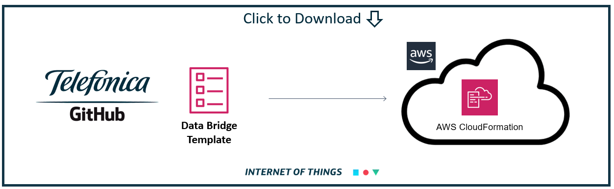
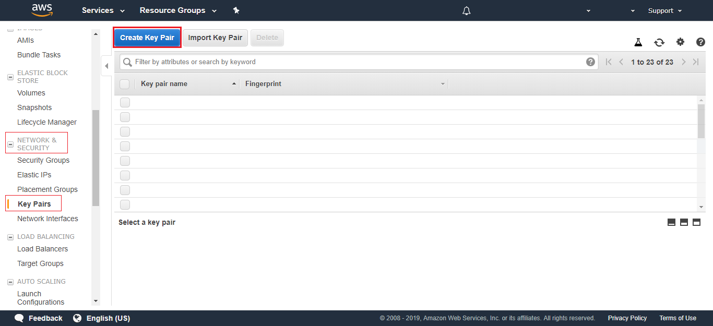
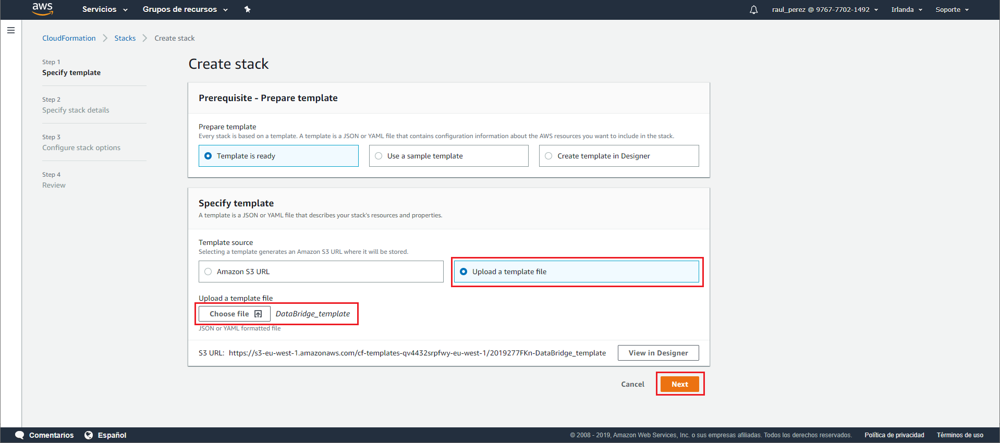
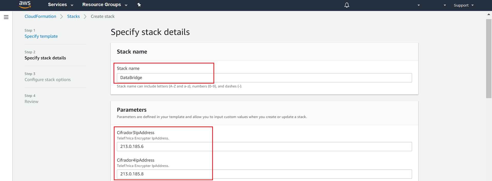
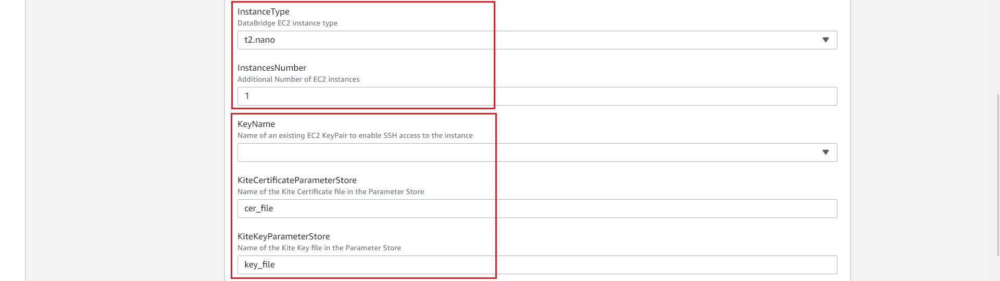
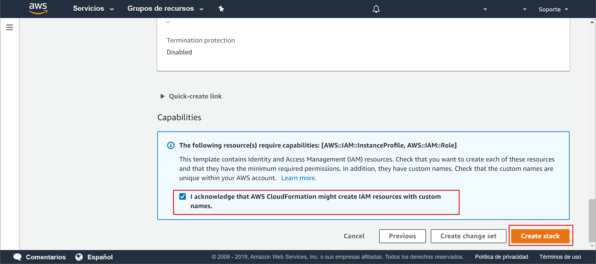
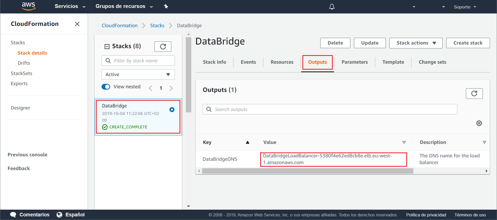
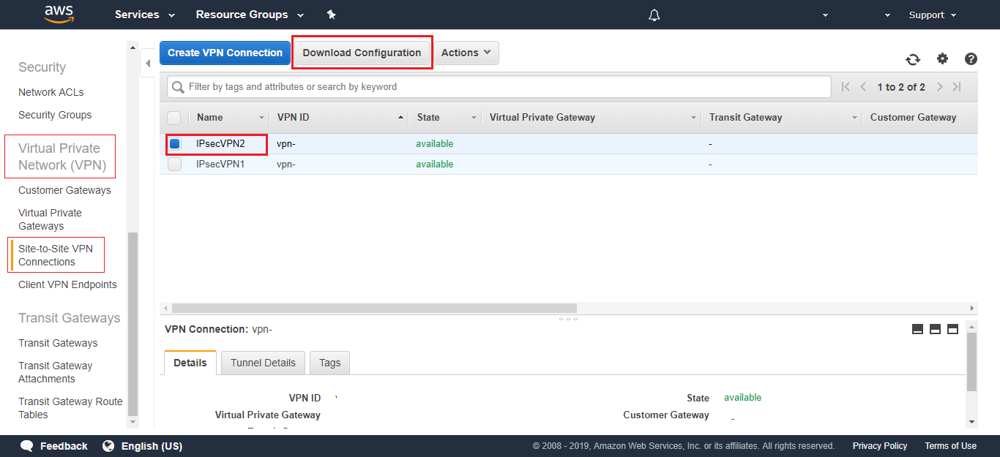
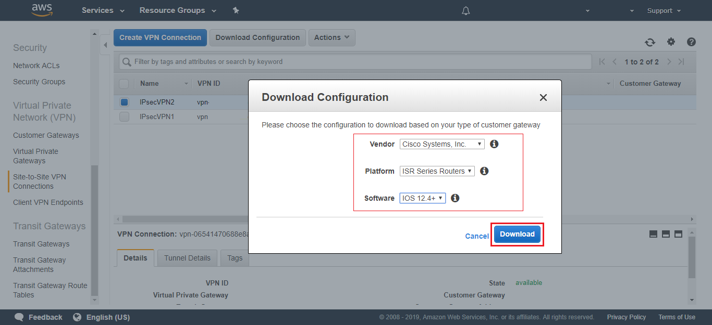

<a href="https://raw.githubusercontent.com/telefonicaid/iot-activation/master/scripts/Cloud_Formation/DataBridge_template.yml" align="center" download>
	
</a>


### Table of Contents

- [What does it do?](#what-does-it-do-)
  * [AWS Options:](#aws-options-)
- [Deploy and defend your Bridge on AWS!](#deploy-and-defend-your-bridge-on-aws)
  * [What will you need?](#what-will-you-need)
  * [KITE Platform certificates](#kite-platform-certificates)
  * [IPsec tunnel configuration between Telefónica and AWS](#ipsec-tunnel-configuration-between-telefónica-and-aws)
  * [EC2 Key Pair](#ec2-key-pair)
  * [AWS Systems Manager Parameter Store](#aws-systems-manager-parameter-store)
  * [AWS CloudFormation](#aws-cloudformation)
  * [Download IPsec configuration](#download-ipsec-configuration)


# What does it do?

Each UDP message sent by a device, it is linked to several information such as source IP, destination IP and destination Port. 
The Bridge will use the device source IP to get all the sim information stored at Kite platform. 

If you use the API CoAP, you can make two types of requests for the URI 
- **GET** coap://host:5683/shadow?icc=xxxxxxxxxx
- **PUT** coap://host:5683/shadow


For the tutorial purpose you should pay attention to SIM's custom fields, 
that you can manage from your Kite Platform account. 

- **Field 1** : Device Cloud Name (required) -> this is the name that will appear at the cloud (shadow name, twin name ...) 
- **Field 2** : topic to publish (optional)

Depending on the content of the fields, the Bridge will act differently. 

To choose between the different options you have to configure SIM information at the [Custom Field](Kite_Platform.md#edit-custom-field)

&#x1F4CD;
The device name is a mandatory field, otherwise an error code will be returned, because the bridge wouldn't know the virtual representation of the physical device.

As we said before, There are two ways of working depending on the information provided as custom parameter in Kite. 

## AWS Options:

- [AWS Option 1: Telemetry](#aws-option-1-telemetry)
- [AWS Option 2: Telemetry and Commands](#aws-option-2-telemetry-and-commands)

#### AWS Option 1: Telemetry

This is the most straight forward option. 
You only have to provide a device cloud name at the first custom parameter in Kite. 
As a result all the messages sent by your device will be published at the default topic. 

The default topic has this structure:  **tlm/{DEVICE_NAME_IN_KITE}/raw**

Otherwise, If you prefer to send your device messages to another topic, you should add it as a second custom field at Kite.


#### AWS Option 2: Telemetry and Commands

The configuration is quite simple, you should identify the topic update of your device and copy it into the second custom field.
It should look like this: **$aws/things/{DEVICE_NAME_IN_KITE}/shadow/update**

The bridge will recognize it as an AWS reserved topic and will use the appropriate logic for the connection. 

The data sent will be published in the shadow in the **raw** field as shown in the following example.

```json
{
  "reported": {
    "raw": "<MESSAGE SENT HERE>",
  }
}
```

Moreover, the Bridge will be able to control if the publication has been done or rejected by the broker and it will return the code.

Another advantage of using the AWS shadows, is the communication with the device, it allows you to send commands to it.
You have to complete the json raw data field at device shadow desired field. 

```json
{
  "desired": {
    "raw": "<MESSAGE FOR THE DEVICE>",
  }
}
```


If you try to publish into a shadow that it isn't already provisioned the Data Bridge will create it before publishing so you don't have to worry about it :). 

But if you still want to create it manually you can follow these [steps](AWS_create_new_thing.md)

[](#table-of-contents)


# Deploy and defend your Bridge on AWS!

I suppose you've read about how the [Data Bridge works](BP_DataBridge_AWS.md) and you're deeply convinced of the advantages It can bring you.

But if you have a problem running it, don't worry, you can use our Cloud Formation template

Follow the link to deploy  the Data Bridge [step by step](BP_DataBridge_AWS_detail.md)

## What will you need?

- Data Bridge [code](https://github.com/telefonicaid/iot-activation/tree/master/scripts/Data_Bridge)
- KITE Platform [Certificates files](Kite_Platform.md#what-is-kite-platform-api)
- IpSec Service provided by Telefónica [(IPsec)](BP_IPsec.md#what-is-ipsec)
- AWS account:
  - EC2 Key Pair
  - Systems Manager Parameter Store
  - CloudFormation

&#x1F4CD;
For the time being, if you use a SIM from the Thinx testing network you will not have access to the Kite Platform.

[](#table-of-contents)

## KITE Platform certificates

One of the Data Bridge strong points, is the integration with Kite.
Kite is the Telefónica's IoT Connectivity Platform, and Kite provides an API interface for management via HTTPS.

Ask your Telefonica's local contact for the certificates associated to your account. 

Once you receive this certificate, you will need to extract the keys that the Bridge will use to validate the connection.
If you want to see how to do it, you can follow our 
[documentation](Kite_Platform.md#extract-your-credentials-files)

When you finish these steps, you should have a file with the certificate and another one with the access key:
- your_customer_certificate.cer
- your_customer_certificate.key

[](#table-of-contents)


## IPsec tunnel configuration between Telefónica and AWS

An IPsec tunnel is a direct connection between the mobile network of your SIM pool and the Data Bridge deployed in AWS.

This connection not only creates a new network (VPN) but also guarantees the security of your data 
by allowing communication only between the devices that belong to this network.

Although its functioning is quite complex to explain. The configuration is quite simple if you follow our 
[tutorial](BP_IPsec.md#how-to-make-your-own-ipsec-vpn)

When you finish this tutorial, you will also have created a EC2 machine. 
This is the machine you will use to deploy your Data Bridge.

Remember to keep both the private IP of your IPsec network and the public IP to remotely access the machine. 

[](#table-of-contents)

## EC2 Key Pair

Before starting, you need create a Key Pair for secure access to the EC2 machine. This is the server where the code will be executed.

For it, go to EC2 AWS console / **NETWORK & SECURITY** / **Key Pairs**

and click on **Create Key Pair** button.



Type a Key Pair name:


A new .pem file is created. Use this file to connect EC2 machine using a SSH client.

[](#table-of-contents)


## AWS Systems Manager Parameter Store

AWS Systems Manager is a service that gives you visibility and control of your infrastructure.

Among its resources, there is the Parameter Store. 
This parameter storage allows the secure storage of certificates and passwords.

For this example, we will use this service to store the content of the Kite certificates files.

In the AWS Console.

Go to Systems Manager / Parameter Store / Select: Create parameter 


Select a name for the parameter. And copy the contents of the file in the **value** field.

Do this for each of the files:
- your_customer_certificate.cer with the name **cer_file**
- your_customer_certificate.key with the name **key_file**


And click on the **Create parameter** button at the bottom of the page.

[](#table-of-contents)


## AWS CloudFormation

CloudFormation provides a common language for you to describe and provision 
all the infrastructure resources in your cloud environment.

It allows you to use a simple text file to build and rebuild your infrastructure.

To begin with, Go to CloudFormation Console:

Click on **Create Stack** button



In the new window that opens, fill the form with the template file.

[Download the Data Bridge Cloudformation Template](https://raw.githubusercontent.com/telefonicaid/iot-activation/master/scripts/Cloud_Formation/DataBridge_template.yml)

The following parameters appear by default with values, but the template allows you to edit the values to suit your needs:

1. Choose a name for your Stack 
2. Select the IPsec source IP addresses 
3. Enables the port for receiving CoAP requests 
4. Cofiguration of the IPsec Tunnels
5. Choose the size and number of instances
6. Select your EC2 Key Pair and Parameters Store names created in the previous steps.
7. Configure the Kite URL and the APN of your SIM cards
8. Edit the VPC and AWS Subnet range






Click **Next**. until the last step.

Check the capabilities box for create IAM resources and click on **Create Stack**



wait until all resources are created and review the stack output



This DNS is the address to which your device will send reports

&#x1F4CD;
find the IP using the `host` command in the linux console
```
host DataBridgeLoadBalancer-xxxxxxxxxxxxx.elb.xx-xxxx-xx.amazonaws.com
```
[](#table-of-contents)


## Download IPsec configuration

As the last step it is necessary to download the configuration of your IPsec tunnels.

To Configure the IPsec connection with Telefonica's network you must send a configuration file.
This file can be download from AWS console.

Go to VPC console / **Virtual Private Network (VPN)** / **Site-to-Site VPN** / 
And Select your VPN connections



complete the information as in the image below and click **Download**



Amazon provide a redundant connection. You have to download and send the two VPN connection files.

[](#table-of-contents)

