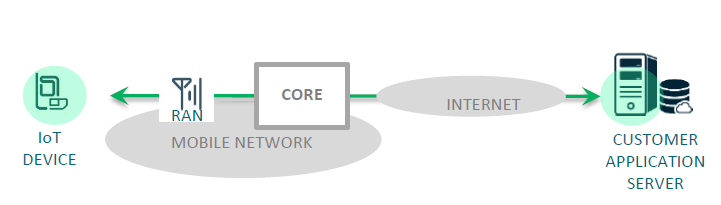
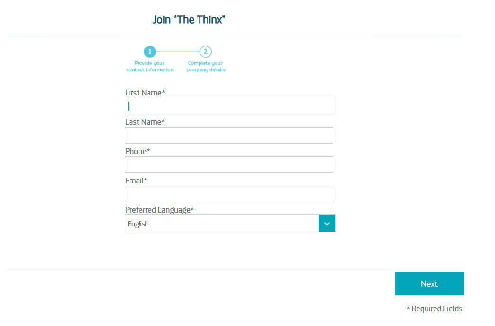
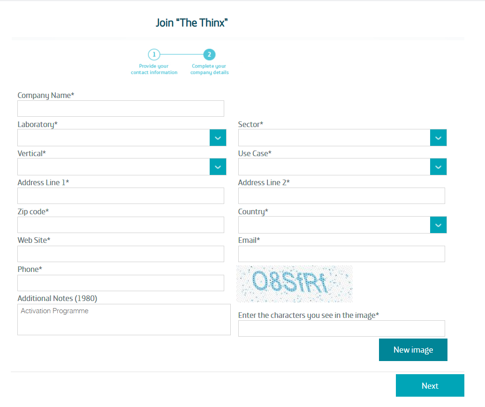
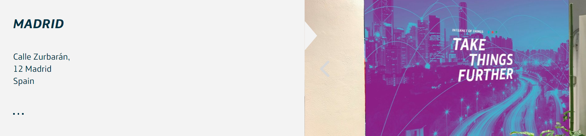
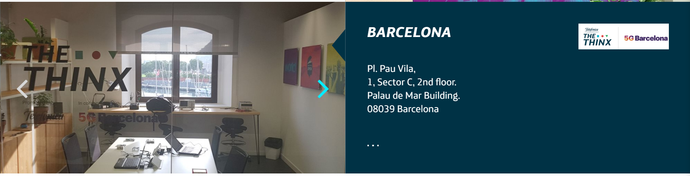

### Table of Contents
- [The Thinx](#the-thinx)
  * [The Thinx Madrid](#the-thinx-madrid)
  * [The Thinx Barcelona](#the-thinx-barcelona)

# The Thinx

[The Thinx - Telefonica IoT OPEN LAB]((https://iot.telefonica.com/en/about-us/the-thinx-iot-lab/)) is one of the most advanced IoT spaces in the world, 
fully equipped with state-of-the-art in radio access and CORE technologies, 
NB-IoT and LTE-M. The Thinx is the open lab where our clients, 
partners and institutions can take any IoT project for mass deployment as close as possible to the real thing

## Why the Thinx? 

Create ecosystem around LPWA (NB-IOT and LTEM)


**New Technology Lab**
- Chipset Makers
- Module Vendors
- Network Vendors IoT
- Platform Vendor


**New Partners Centre**
- Device & Communication
- Module Manufacturer
- Application Developers Integrators

**New Ecosystem Center**
- Launch New Products & Solutions

## Benefits

**Partners**
- e2e Testing
- Shorten Go-To-Market
- GCF has accepted that
- Telefonica’s Thinx is a valid
- Field Trial Qualified
- - Network (FTQN)

**Customers**
- Simulate an environment
- guarantying a successful pilot

**Telefonica**
- New Products & Solutions
- Customer Engagement
- Creating New Business
- Reducing their costs with IoT

## LAB Architecture



The laboratory is equipped with radio access network from different manufacturers (Huawie, Ericsson, Nokia, ZTE )
this four RAN/CORE network manufacturers represents more than 90% of the global market.

## Test Features

In the lab you can execute the same operations you can execute in a deployed net work such as:
- Connecting to the net work and attaching to the data network.
- Send and receive TCP and UDP traffic to and from the Internet.
- Use the eDRX and PSM features.
- Measure power consumption.
- Measure module delays.
- Generate and test your AT command recipes and even embedded code.

Besides, being in the lab allows you some other tests:
- Test using different network manufacturers, always from the same location.
- You can connect to the network using a cable interface, avoiding interferences.
- Simulate different coverage levels.
- Use a Faraday cage to control completely the air radio connection.
- Monitor in real time the traces of your connection to the network.
- You can leave your device at the lab for some time, so you can develop and debug remotely your code.

## Services

**Basic Engineering Support**

- Guided access to facilities.
- Warranty the correct functioning of our network infrastructure at all times.
- Quick guides for the set-up of modules (Telit and Quectel).
- Access to network traces.
- Access to the support of our infrastructure partners vendors and modules.
- Support in the commissioning of the tests.

**Advance Engineering Support**

From the lab you can contract advanced support services for your project.

- Engineering support
- Testing servicesFrom field radio tests to application and even security tests, from leading testing houses.
- Access to Telefonica device certification process

## Register

Write us to the mail contact@activationprogramme.telefonica.com

As a first step, access the following [link](https://thethinxportal.azurewebsites.net/)
and fill out the form, 
indicating in the **"Additional Notes"** section that you are part of the **Activation Programme**

This is important so that we can identify you and offer you the advantages and you can benefit from the program's perks.




Depending on the laboratory you request access to, you must do a different procedure.
Send us an email to **contact@activationprogramme.telefonica.com**, telling us which lab you have chosen.

## The Thinx Madrid



When we receive your application by email, we will send you a **.zip** file with the required  documents:

1. **20180307_Thinx Open Lab Introduction_v03.pdf**
2. **Mobile IoT Lab Quick User Guide.docx**
3. **20180131_QuestionsOnTests.docx**
4. **20181113 OPENLAB TDigital - Partners (Template).docx**
5. **20180129 Anticorruption Certificate_Template.pdf**

First of all, we recommend that you read the **20180307_Thinx Open Lab Introduction_v03.pdf**. and **Mobile IoT Lab Quick User Guide.docx**.
These are introductory documents about the laboratory in Barcelona.
This will help you better understand what you can do in the lab.

The next step is to send an email to **thethinx@telefonica.com** with **contact@activationprogramme.telefonica.com** in CC with the following documents:

1. Attach the completed questionnaire **20180131_QuestionsOnTests.docx**
2. Attach a first completed revision of the contract **20181113 OPENLAB TDigital - Partners (Template).docx** with track changes activate.
In order to allow access, this document will be reviewed and once confirmed by the laboratory.

NOTE: To avoid duplicate shipments, please wait until you receive confirmation


Once the document has been approved by the lab, you must then send a two physical copy signed on both sides to the following address:
```
TheThinx
thethinx@telefonica.com 
Distrito C Edificio Oeste 1, Planta 3, Ronda de la Comunicación s/n, 28050 Madrid, España

```

Once this is done, you can request a date to visit the lab.
On the mail loop, send us a digital copy of the signed contract and indicate the following information to make the appointment.

1. Preferred date for your visit.
2. Complete the following table with the information of the visitors

| full name | ID card or Passport | Company email |
|:------ | ----- | ----- |
|  |  |  |


On the day of the visit, do not forget to bring the documentation of the attendees, as well as the following signed document: **20180129 Anticorruption Certificate_Template.pdf**


## The Thinx Barcelona




When we receive your application by email, we will send you a **.zip** file with the required  documents:

1. **The ThinX 5G Barcelona - Lab presentation.pdf**
2. **The ThinX 5G Barcelona - User Guide.pdf**
3. **The ThinX 5G Barcelona - QuestionsOnTests.docx**
4. **The ThinX 5G Barcelona - Declaration of access (v.18.10).docx**

First of all, we recommend that you read the **The ThinX 5G Barcelona - Lab presentation.pdf** and **The ThinX 5G Barcelona - User Guide.pdf**.
These are introductory documents about the laboratory in Barcelona.
This will help you better understand what you can do in the lab


The next step is to send an email to **thethinx@telefonica.com** with **contact@activationprogramme.telefonica.com** in CC with the following documents:


1. Attach the completed questionnaire: **The ThinX 5G Barcelona - QuestionsOnTests.docx**
2. Attach the signed document: **The ThinX 5G Barcelona - Declaration of access (v.18.10).docx**.
2. Indicate the preferred date for your visit.
