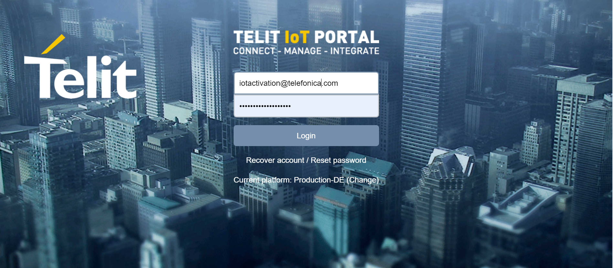
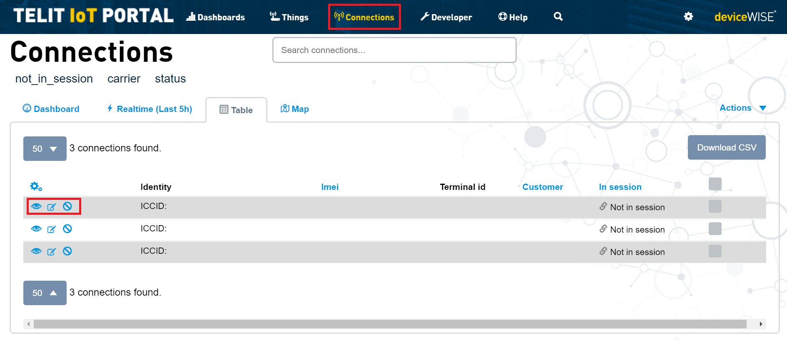
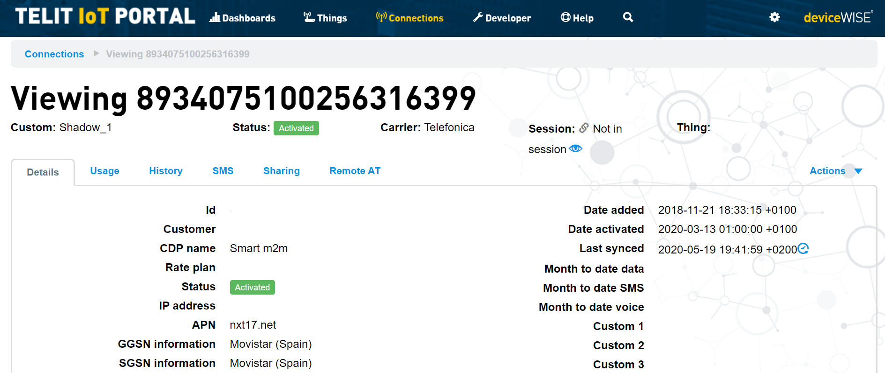
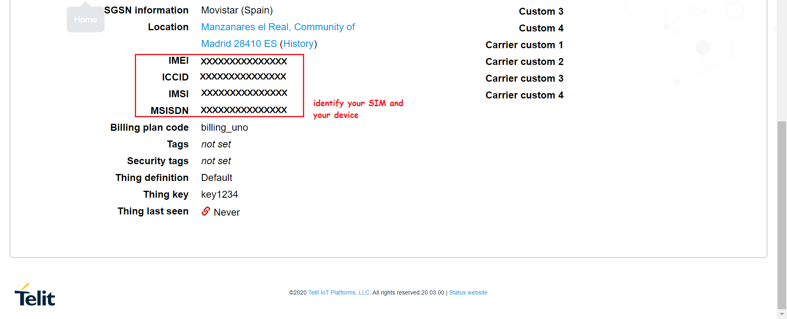
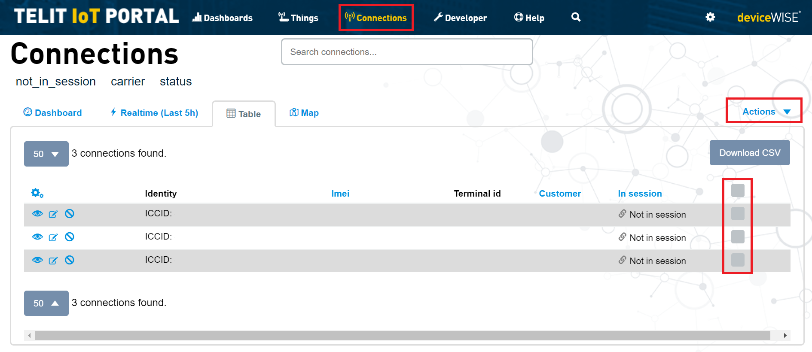
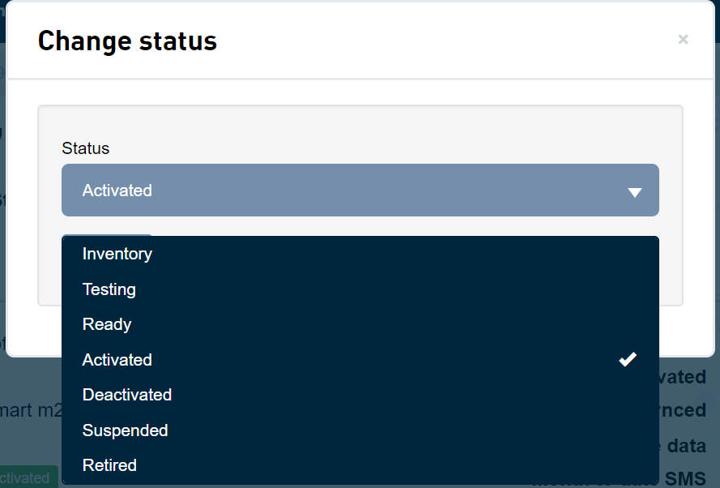
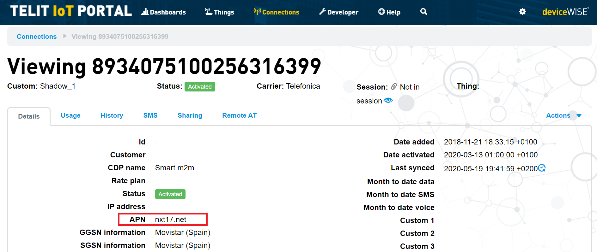

### Table of Contents
- [Telit IoT Portal](#telit-iot-portal)
  * [SIMs Connections](#sims-connections)
  * [SIMs Activation](#sims-activation)
  * [Identify the APN](#identify-the-apn)
- [Next steps](#next-steps)

# Telit IoT Portal

If you have been accepted into the program, in a few days you will receive a development kit with a set of SIM cards.

You will be eager to start playing with it, but first of all you must make sure that the SIM cards are activated and you have access 
to the management platform.


In addition to the package with the Kit, you will receive a welcome email with access to the platform Telit

``` 
You have been granted access to deviceWISE AEP under the Telefonica Global Organization.
This invitation is valid for 24h.
Please click here or copy and paste the following URL into your browser:
https://portal-de.telit.com/app/invitation/xxxxxxxxxxxxxxxxxxxxxxxxxxx

```




## SIMs Connections

In this portal you can access the connectivity management portal and manage all your SIM.

To do this, click on the Connections tab in the top menu:



The Connections page provides a representation of your SIM cards in one central location, 
regardless of Mobile Network Operator (MNO) identity, technology (GSM/CDMA) or its current location. 
A connection represents a cellular device and includes a carrier, rate plan, deployment status, data usage, location, roaming status, 
various identifiers (ICCID, IMEI, ESN, etc.), 
and other items that enables the cellular device to connect to the network.

It provides a unified global visibility and control over your cellular devices through the following capabilities:

- **Inventory Management:** Provides a detailed view of each cellular device including tagging, labeling, editing, searching, and batch update capabilities.
- **Lifecycle Management:** Enables functions to activate, deactivate, suspend, retire, and monitor event log history throughout the cellular device’s lifecycle.
- **Usage Profile:** Provides the detailed usage by the cellular device per service (Voice, Data, SMS).
- **Device Locaion:** Provides a mobile-based global positioning solution.

In the inventory you will be able to visualize each one of the SIM cards and be able to access all the information related to the SIM.
To do so, click on the eye icon next to the ICCID





## SIMs Activation

Now that you know how to identify and visualize the information we will teach you how to modify the Lifecycle for activate your SIM.

You can select the SIM using the checkbox on the left and then click to display the list of allowed actions.



Then select the status to activate the SIM and start using the SIM card




## Identify the APN 


Now your SIM is activated and you know everything necessary to make it work.

Your next step is to plug it into your device and start developing.


In addition to other values such as ICC or IMSI you must know the APN.

This is an address that your device will use to connect to the Internet.




These are just the basic concepts to start with your development, but the Platform offers many more services. 
If you want to discover more don't forget to check the documentation of the 
[Telit portal](https://docs.devicewise.com/Content/Products/Management_Portal/Connections/Connections.htm)

# Next steps

Now your SIM is activated and you know everything you need to know to make it work.

Your next step is to insert it into your device and start developing.

- [Telit's Bravo Evaluation Kit](Telit_Bravo.md)

- [other development kits boards...](IoT_Activation_boards.md)

