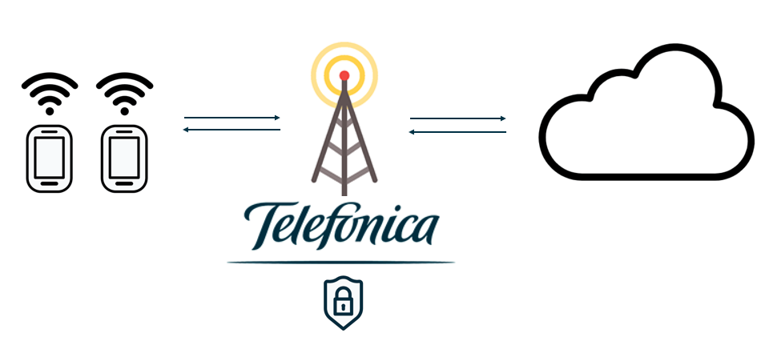

### Table of Contents
- [Our Know-How](#our-know-how)
- [Getting Started](#getting-started)
  * [1. IoT Development Toolkit](#1-iot-development-toolkit)
  * [2. Access to Telefonica's lab](#2-access-to-telefonicas-lab)

# Our Know-How

We advocate that the use of Iot devices should be simple and intuitive.
This is the reason why we believe that any IoT project must be conceived as the following architecture:

The proposal, highlighting the need for a device to report their status.
This implies that it is not necessary to have ultra-powerful devices that perform expensive calculation operations.
You can save on the manufacture of your devices and take advantage of cloud computing.

**Device:**
Its main function is to make the measurements and send the obtained values.
It does not need a great power of calculation nor will it have to carry out the most complex tasks for its analysis.
You will be able to invest all your effort in optimizing its cost and reducing its energy consumption,
especially when this is a crucial point

**Connectivity:**
You should make sure you choose the one that best suits your needs.
Among the already known 2G/3G/4G cellular networks, you should know that nowadays there are more appropriate networks for IoT devices
such as LTE-M and NB-IoT.
If you need more low-power wide-area network technological background on things click on the following [link](technological_background.md)

**Cloud:**
Sometimes thinking about the cloud leads to the wrong idea of simply thinking about a remote server that we can access over the Internet.
But nowadays the most popular public clouds such as AWS, Google or Azure offer innumerable services that provide permanent scalable storage
and accessibility. Simplifying and reducing the costs of development and maintenance of the infrastructure.

Please remember that by participating in the IoT Activation Programme you get credit on some of these platforms thanks to
[Activation Programme Perks.](Activation_Programme_Perks.md)

**Network Security:**
The advantages offered by IoT technologies, is a reality. However, the information handled by these devices is increasingly sensitive.
The growth of these devices also means an increase in the number of new vulnerabilities.

By following these steps, you will make it incredibly easy to achieve your goals:

- Better use of assets
- Cost reduction
- New business strategies
- Service improvement
- Greater knowledge

and many other...

# Getting Started

You've probably come a long way in the world of IoT
but if you need a little introduction about the basics you can check our [IoT basics guide](IoT_basic.md)

However, if you still have any doubts, we will guide you step by step so you can start developing.

The first step is to identify the three elements that are part of the benefits of the program

## 1. IoT Development Toolkit

It is composed of three elements:

- [Global SIM](IoT_Activation_GlobalSIM.md)

Telefonica SIMs with 6 months of free global connectivity to test and validate your IoT solution.

&#x1F4CD; As these are test SIM's, it is possible that global coverage in other countries is restricted.
If you wish to test your solutions in a different country, please contact us to confirm that it is available

- **An Evaluation Kit:**
 A Kit to test your solution with the connectivity NB-IoT or LTE-M (LPWA)

- **Access to the IoT connectivity platform:**
Connectivity management functionalities like inventory, real time expenses control, alarms, automatic business rules or reporting.
Remote management of devices that allow features like APN configuration.

&#x1F4CD; Additionally, you'll be able to access [Activation Programme Perks](Activation_Programme_Perks.md), where you'll have free access to various tools and services,
including Amazon **AWS** Activate, to grow and scale in the cloud.

## 2. Access to Telefonica's lab

[The Thinx](https://iot.telefonica.com/en/about-us/the-thinx-iot-lab/)
 facilities to test new applications and devices simulating real network conditions

In this innovative and collaborative space, you will be able to:

- Test end to end NB-IoT and LTE-M solutions
- Have access to basic engineering support
- Have support in the certification process of your devices

Go on to find out how [to apply](IoT_Activation_TheThinx.md)

# First Steps

Now that you know all the advantages we offer within the IoT Activation Program.
Click here for [your first steps in the program](IoT_Activation_firststeps.md)
