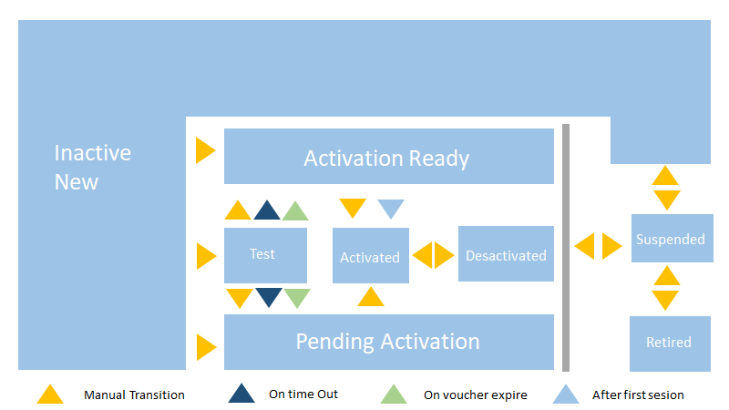

### Table of Contents

- [This is KITE!](#this-is-kite)
- [Quick view to Kite Graphic Interface](#quick-view-to-kite-graphic-interface)
  * [Manage your SIMs](#manage-your-sims)
    + [SIM inventory](#sim-inventory)
      - [SIM inventory bottom menu](#sim-inventory-bottom-menu)
    + [SIM details](#sim-details)
- [How to get started with your SIM](#how-to-get-started-with-your-sim)
- [What is Kite Platform API?](#what-is-kite-platform-api)
  * [How to access Kite Platform API?](#how-to-access-kite-platform-api)
    + [Extract your credentials files](#extract-your-credentials-files)
    + [Access API using a command](#access-api-using-a-command)
- [How it's made](#how-its-made)
    + [Activate Data traffic](#activate-data-traffic)
    + [Activate Location Service](#activate-location-service)
    + [Activate LTE / NB (4G)](#activate-lte-nb-4g)
    + [Assign Subscription group](#assign-subscription-group)
    + [Change life cycle state](#change-life-cycle-state)
    + [Edit Custom Field](#edit-custom-field)
    + [Select APN](#select-apn)
    + [Deactivate any Service](#deactivate-any-service)

[](https://www.youtube.com/watch?v=Kr5aICVJxSA)

# This is KITE!
Kite Platform improves productivity globally in the M2M sphere, providing tools to
manage your devices connectivity.

Among these tools are:
- SIM card management
- Display and management SIM's parameters 
- Activation services and other administrative changes
- Line assignment or migration to different commercial plans
- Pre-bill invoices inquiries
- Users and organizations management
- Alarms and reports

In addition, Kite Platform, provides an API for the integration in the client's systems. 
This API description are available in the Help menu in the web portal.

# Quick view to Kite Graphic Interface

The graphic interface of Kite is organised in three sections:

- 1 Configuration menu
- 2 Main menu
- 3 Work area

[](#table-of-contents)

## Manage your SIMs

### SIM inventory

You can use the search engine of the platform to locate a SIM by copying its ICC number in the bar
or you can access the SIM inventory, where you can locate and manage all your cards.

If you want to check the SIM details, you make double click on each of them.

Some of them may be deactivated, and you may need to change their status. 
In the next step we will show you how to check that a SIM card is operational.

#### SIM inventory bottom menu

It appear at the bottom of the window when you select a SIM card.

It allows you to perform actions such as activate or deactivate services, change SIM parameters and other options.

### SIM details

Different tabs appear in this menu, allowing you to review all SIM information about services, connectivity and status.

- **SIM identification:**
When the section opens, the detailed information on the SIM card is accessed.
Some of these fields are editable with the **Edit** button on the top right corner.
Here you can add an **Alias** to your SIM and add a **custom field**.

- **Life cycle state:**
It groups information related to the status changes in the life cycle of the SIM card.
It displays only the value of the current state.

- **Presence:**
It displays SIM information related to the connectivity.
If you do not know the APN which your SIM can connect,
you can check it in this section.

- **Traffic consumption control:**
It shows detailed, summary information on the SMS messages, data and traffic and
voice consumption of the SIM card during the current billing period.

- **Monthly expense control:**
It shows detailed, summary information on the SMS messages, data and traffic and
voice consumption of the SIM card during the last months.

- **Basic services and Supplementary services:**
They includes a list of services for SIM cards and they indicate if they are activated

- **Location:**
It allows you to preview the location in a map.

[](#table-of-contents)

# How to get started with your SIM

1. First of all, your SIM must be [assigned to a subscription group](#assign-subscription-group)
2. In order for a SIM to be operational, it must be in [activated state](#change-life-cycle-state)
3. And lastly you must make sure that the SIM has the [data traffic activated](#activate-data-traffic)

There are many more options and [services available](#how-its-made) for your SIM

##### Learn about life cycle state

For connect your SIM need to be operational. for it, the SIM must be activated.
Follow the diagram below



- **Inactive new**: initial state of any SIM card. The card will remain in this state until you 
assign a Subscription Group to it (including a commercial plan).

- **Test**: optional and available test for once the SIM card is assigned to a
Subscriptions group that takes into account that state in its commercial plan.
This state enables a limited traffic in order to prove the SIM card is functioning
correctly.

- **Activation ready**: previous state to Activated and state the SIM card changes to
once the time or the available traffic is consumed in the Test state.

- **Pending activation**: It is a state similar to the previous one, but in this one the change
to the Activated state is done manually from Inventory.

- **Activated**: In this state the SIM card is fully operating.

- **Deactivated**: In this state, the SIM card does not have traffic but its permanence
can entail an associated fee. From this state, the card can be activated again
manually.

- **Suspended**: This is used typically in cases of fraud or unpaid.

- **Retired**: This state will always be the last.. This state can only be reached if the card is suspended.
Once in this state, there is no going back. 

[](#table-of-contents)

# What is Kite Platform API?
The Kite Platform offers you an API (application program interface) that allows you to integrate it with all your systems.
It enables you to access all your data and it offers you news possibilities.

## How to access Kite Platform API?

The API is available in the address m2m-api.telefonica.com through the port 8010.
Therefore, this API services can be used from any system with Internet access.

&#x1F4CD;
All your API requests must use the HTTPS protocol. This guarantees the confidentiality of your data.

For this reason, you have to use the SSL (Secure Sockets Layer) protocol. 
This protocol allows you to establish a bidirectional communication between your systems and Kite.

This request is made through a certificate and a private key for encryption,
these files are exclusive to you. Take good care of it!
Remember that they are the gateway to all your SIM data.

### Extract your credentials files

If you requeste access to the Kite Platform API, the support team will provided you an encrypted file.pfx.
This file contain both the key and the certificate for the SSL context of your connection. They will also provide you
a password so that you can extract them.

&#x1F4CD;
It is important not to modify the name of the file.pfx until you extract the files.

1. Open a Linux Terminal and install openssl, if you do not have it installed.
This command allows you to decrypt your file
```
sudo apt-get install openssl
```
2. Extract the public key from Customer certificate **your_customer_certificate.pfx**
```
openssl pkcs12 -in your_customer_certificate.pfx -clcerts -nokeys -out \
your_customer_certificate.cer -password pass:xxxxxxx
```
You will need the password provided by the Kite Platform Support Team

3. Extract the private key from the Customer certificate
```
openssl pkcs12 -in your_customer_certificate.pfx -nocerts -nodes -out \
your_customer_certificate.key -password pass:xxxxxxxx
```
also you will need your password here.

&#x1F4CD;
Remember, keep these new files in a safe place!!

### Access API using a command

The Curl command is used to transfer files from a server, it supports various protocols such as HTTP, FTP...

There is an example about the access to the Commercial Plan API REST using the CURL command

```
sudo curl --cert ./your_customer_certificate.cer --key ./your_customer_certificate.key \
https://m2m-api.telefonica.com:8010/services/REST/GlobalM2M/ServicePacks/v2/r12/servicePack
```

[](#table-of-contents)

# How it's made

- [Activate Data traffic](#activate-data-traffic)
- [Activate Location Service](#activate-location-service)
- [Activate LTE / NB (4G)](#activate-lte-nb-4g)
- [Assign Subscription group](#assign-subscription-group)
- [Change life cycle state](#change-life-cycle-state)
- [Edit Custom Field](#edit-custom-field)
- [Select APN](#select-apn)
- [Deactivate any Service](#deactivate-any-service)

&#x1F4CD;
Some services will only be available if they are included in your data plan.
But if they're not available you should contact your local SIM distributor.

[](#table-of-contents)

### Activate Data traffic

Go to **SIM Inventory** / **Select your SIM** / and Press **Activate** on the bottom-menu

find the opction **Activate Data traffic (home/roaming)** and click it

A new window is open! Click in **Activation**

Now the service is activate, click on **Finish**

[](#table-of-contents)

### Activate Location Service

Go to **SIM Inventory** / **Select your SIM** / and Press **Activate** on the bottom-menu

find the opction **Activate Location** and click it

A new window is open! Click in **Activation**

Now the service is activate, click on **Finish**

[](#table-of-contents)

### Activate LTE / NB (4G)

Go to **SIM Inventory** / **Select your SIM** / and Press **Activate** on the bottom-menu

find the opction **Activate LTE** and click it

A new window is open! Click in **Activation**

Now the service is activate, click on **Finish**

[](#table-of-contents)

### Assign Subscription group

Go to **SIM Inventory** / **Select your SIM** / and Press **Assign** on the bottom-menu

find the opction **Assign to subscription group** and click it

A new window is open! Choose the new Subscription group name and click in **Proceed**

Select **Assign** to continue

Now your SIM is subscribed to the group, click on **Finish**

[](#table-of-contents)

### Change life cycle state

Go to **SIM Inventory** / **Select your SIM** / and Press **Change** on the bottom-menu

find the opction **Change life cycle state** and click it

A new window is open! Choose the new state name and select **Proceed**

Select **Change** to continue

Now the state is changed, click on **Finish**

[](#table-of-contents)

### Edit Custom Field

Go to **SIM Inventory** / **Select your SIM** 

double Click on your SIM

find the opction **SIM identification** unfold the tab and select **Edit**

Edit the information and click on **Save**

[](#table-of-contents)

### Select APN

Go to **SIM Inventory** / **Select your SIM** / and Press **Change** on the bottom-menu

find the opction **Change dynamic APNs** and click it

A new window is open! Choose the new APN name and Select the action **Add/Delete**

Select **Add APN** to continue

Now the APN is added, click on **Finish**

[](#table-of-contents)

### Deactivate any Service

Follow the same steps as to activate, but from the tab **Deactivate**

Go to **SIM Inventory** / **Select your SIM** / and Press **Deactivate** on the bottom-menu

[](#table-of-contents)

