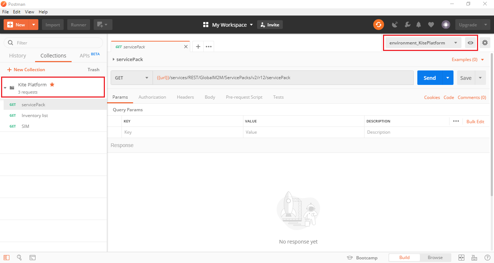
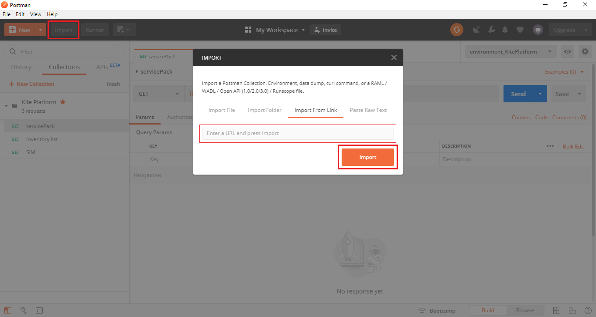
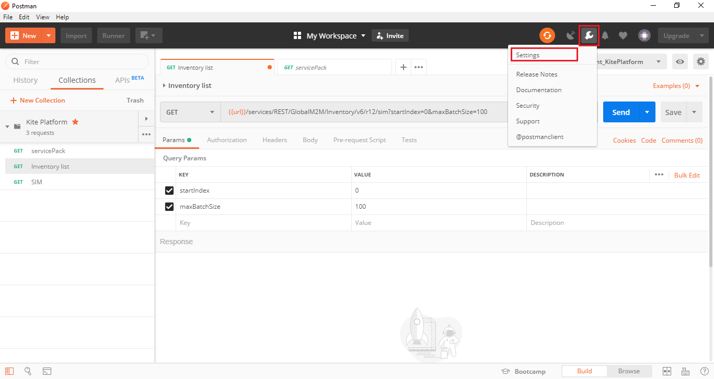
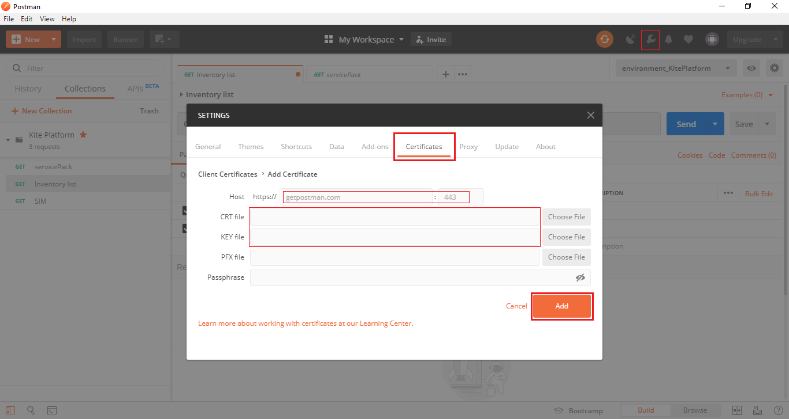
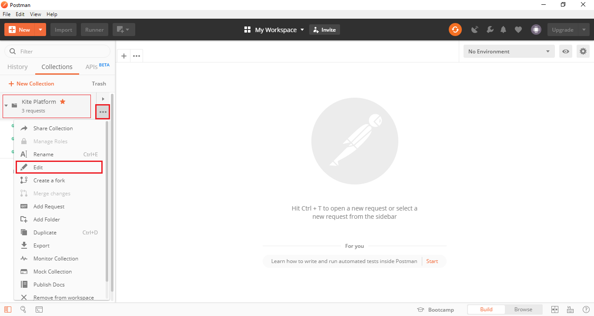
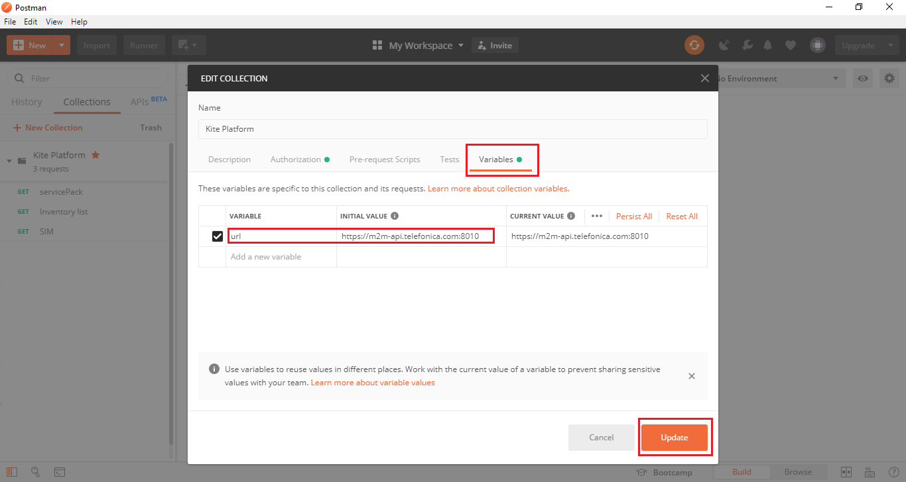
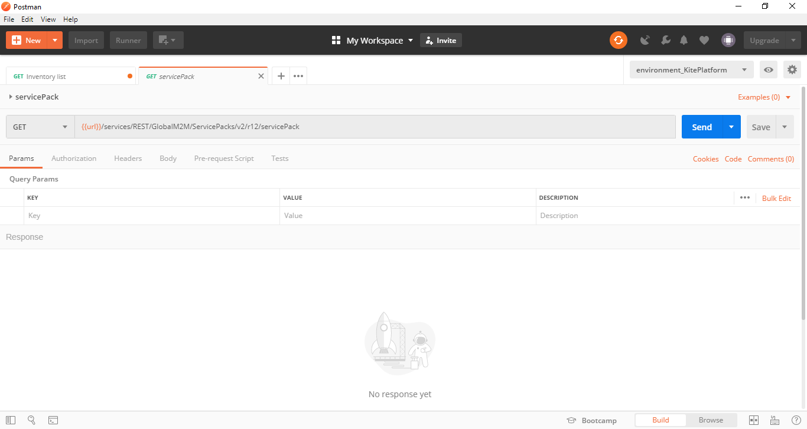
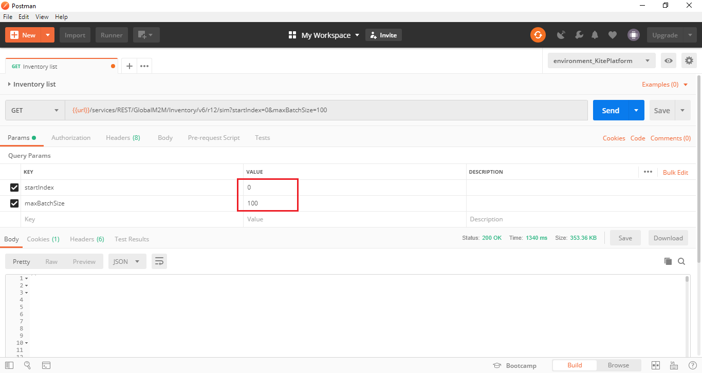
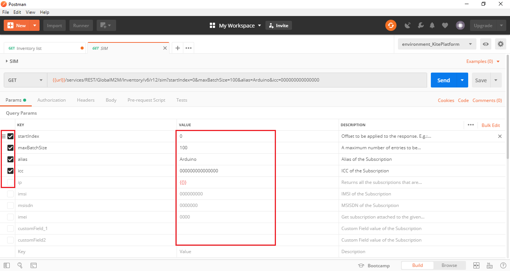

## Table of Contents
- [API REST for Kite](#api-rest-for-kite)
  * [What is REST?](#what-is-rest)
  * [What is Postman?](#what-is-postman)
  * [Kite Environment](#kite-environment)
    + [Import a collection](#import-a-collection)
    + [Setting up certificates](#setting-up-certificates)
    + [Edit Variable url](#edit-variable-url)
  * [Kite Platform API Collection](#kite-platform-api-collection)
    + [Service](#service)
    + [Inventory list](#inventory-list)
    + [SIM](#sim)


# API REST for Kite

If you're reading this, it's because you're willing to start using the Kite API.

You already know many of the things you can do with [Kite](Kite_Platform.md) and have your [certificates](Kite_Platform.md#extract-your-credentials-files) to access your account.
But in this case, a small introduction on how to start working may be helpful.

[](#table-of-contents)


## What is REST?

**Representational State Transfer (REST)** is a software architectural style that defines a set of constraints 
to be used for creating Web services.
In a simpler definition, REST is any interface between systems that uses HTTP to obtain data 
or generate operations on that data. 

The following operations are the most used in a REST API:

- **GET**: Retrieve the URIs of the member resources of the collection resource in the response body.

- **POST**: Create a member resource in the collection resource using the instructions in the request body. 
The URI of the created member resource is automatically assigned and returned in the response Location header field.

[](#table-of-contents)


## What is Postman?

Postman is a great tool when it comes to testing or using a REST API.
It offers a user interface with which to make HTML requests, without the hassle of writing a lot of code. 

[Get Postman here!](https://www.getpostman.com/downloads/)

One of the strengths of Postman is the collection creation and the possibility of use environment variables.

[](#table-of-contents)


## Kite Environment

As usual in our tutorial.
If we can work to make your job easier. 
We will do!



As shown the previous screenshot, you can create a collection with a list of operations and chosse between diferent environment.

[](#table-of-contents)


### Import a collection

To add the collectionto your Postman application, click on the import button, 
and copy the next link:

```
https://raw.githubusercontent.com/telefonicaid/iot-activation/master/scripts/API/Kite/Kite%20Platform.postman_collection.json
```



[](#table-of-contents)


### Setting up certificates

Now that you've extracted your [certificates](Kite_Platform.md#extract-your-credentials-files) 
is necessary add they to the postman setting

Click on the wrench icon and select **Setting**


On the certificates tab and the files paths



[](#table-of-contents)


### Edit Variable URL

As you may have seen some of the operations contain parameterized values `{{url}}`
You may need to edit this value to access your Kite account



Edit the value



[](#table-of-contents)


## Kite Platform API Collection

This collection include the next operations:

### Service 

This resource is used to retrieve Basic Services Commercial Plans of consumer
Customer account



[](#table-of-contents)


### Inventory list

Retrieves Customer Subscriptions inventory.

- **startIndex:** Offset to be applied to the response.
Accepted values range is from 0.

- **maxBatchSize:** A maximum number of entries to be returned in the response. 
Accepted values range is 1 to 100



[](#table-of-contents)


### SIM

It allows to list all deployed SIM's that match a given criterion.

You can identify your SIM cards using the checkbox parameters:

alias, icc, imsi, apn, ip, imei ...



[](#table-of-contents)

