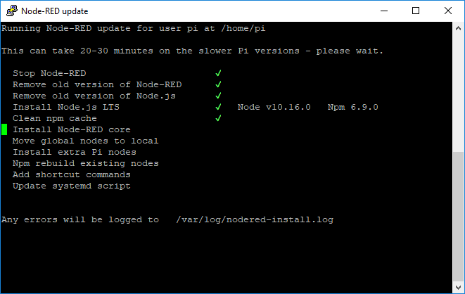
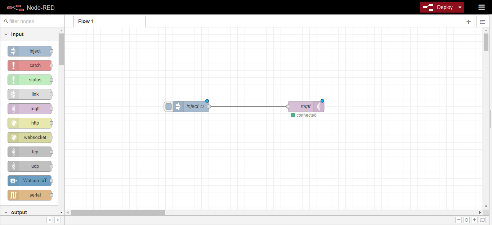
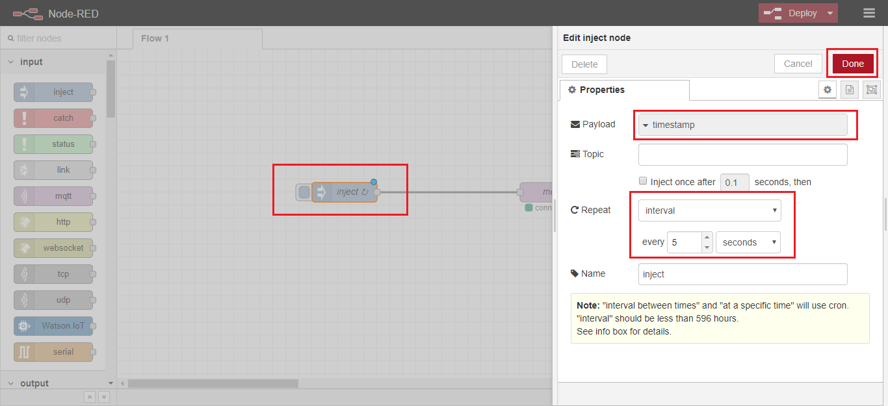
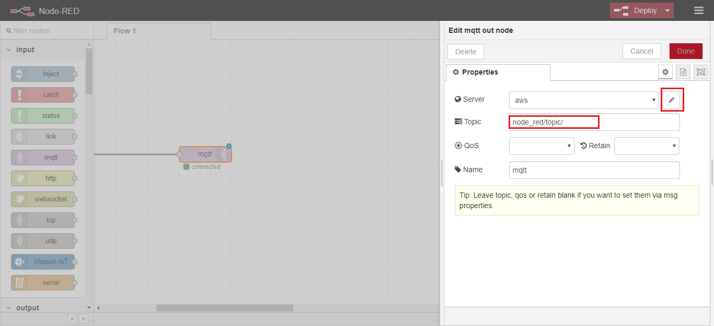
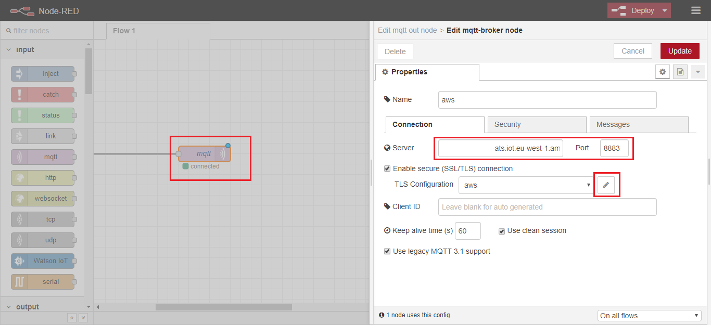
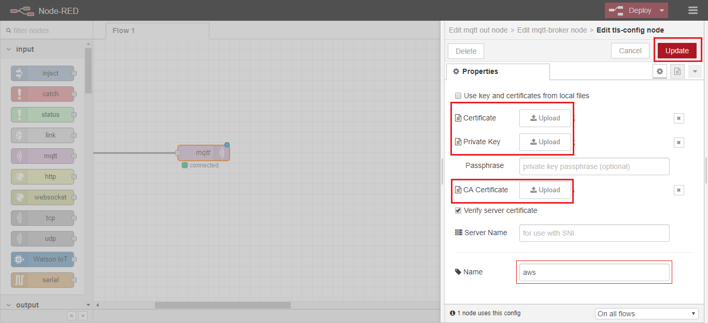

## Table of Contents
- [Install Node-RED on Raspbian](#install-node-red-on-raspbian)
- [Running Node-RED on your Raspberry](#running-node-red-on-your-raspberry)
- [Develop in Node-RED](#develop-in-node-red)

## Install Node-RED on Raspbian

You can install or upgrade using the Node-RED upgrade script command from your Raspberry 
```
bash <(curl -sL https://raw.githubusercontent.com/node-red/raspbian-deb-package/master/resources/update-nodejs-and-nodered)
```

you'll have to wait until all the resources are updated.



[](#table-of-contents)

## Running Node-RED on your Raspberry

To start Node-RED, you can either:

- on the Desktop, select **Menu -> Programming -> Node-RED**
- in a terminal run `node-red-start`

Once Node-RED is running - point a browser to the machine where Node-RED is running. 
One way to find the IP address of the Pi is to use the command `hostname -I`

Then browse to 
```
http://{the-ip-address-returned}:1880/
```



&#x1F4CD; If you are connected via [SSH](RaspberryPi_StarterKit.md#use-a-remote-access-enable-ssh-server-on-raspbian) to your Raspberry, you can browse from your pc `http://192.168.0.10:1880/` 

[](#table-of-contents)

## Develop in Node-RED

This example is a simple development, in which you can publish in the [MQTT](references_mqtt.md) broker of AWS.

The first step is to set up a data entry.

Select the **inject** box from the list in the left panel.
selects it and configures the data type and a set atime period.



Then configure the output to AWS IoT Core.

Selet the **mqtt** box from the output list and type your **topic**. You just have to conigure the server.



Set your AWS broker address and then edit a new **TLS configuration**



Upload your files [download](AWS_create_new_thing.md) from AWS or type their path:



[](#table-of-contents)

