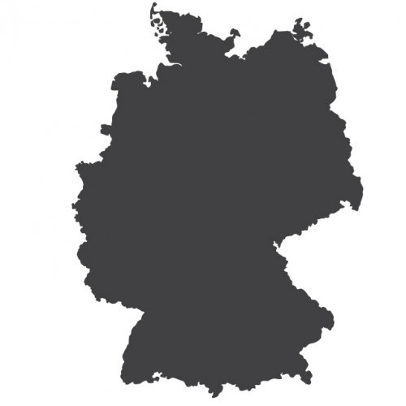
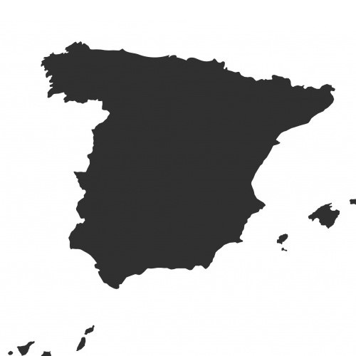

# Welcome to Telefónica Activation Programme #IoT

We welcome you to The IoT World.
These tutorials are designed to assist you in your beginnings and resolve any doubts that may arise you.
With this guide you will discover the advantages of IoT devices.
You'll learn how to collect data online, remotely control your devices and automate deployment processes.
IoT will allow you to reduce costs and offer a better service, while improving quality.

Along with welcome e-mail, you will also have received a starter kit with a lot of gadgets that that you probably don't identify.
Don't worry, you will be playing with it in no time!

This Kit is the first step to achieve your business goal.
IoT development kit are very versatile devices that will offer you endless possibilities,
but take it easy... You'll never walk alone!

During this journey, you will learn about cellular communications and you will discover
the benefits offered by low-power wide-area network (LPWAN)
and all the advantages of cloud computing.

It may seem small, but the possibilities are immense!!

## IoT Toolkit – Benefits

Receive your IoT Toolkit Modules and devices with Telefónica SIMs, along with 6 months free global connectivity to test and validate your IoT solution
to try your solution with the new NB-IoT, LTE-M and 5G connectivity.

- **Connectivity:** 6 months free connectivity to test and validate your solution.

- **Devices:** by requesting LPWA connectivity, you will receive an IoT module provided by Telit: [Bravo Board](Telit_Bravo.md)

- **Access to the IoT Connectivity Platform:**
Manage comprehensively the cellular connectivity of your IoT devices, such as inventory, expense control, alarms,
automatic business rules and reporting, access via API,

- **Access to The Thinx labs:**
[The Thinx](IoT_Activation_TheThinx.md) is a innovative and collaborative space.
In this space, you can test and validate your IoT solutions, especially for new connectivity (NB-IoT, LTE-M and 5G).

- **Activation Programme Perks:**
By participating in the IoT Activation Programme you can get free credits on different platforms such as: AWS, Google Cloud ... applying to [Activation Programme Perks](Activation_Programme_Perks.md)

- **Mentoring:**
For technical support, contact us in the following email: **contact@activationprogramme.telefonica.com**

# Select your Country

<table>
  <tr>
	<th>
		
	</th>
	<th>
		
	</th>
	<th>
		
	</th>
  </tr>
</table>
