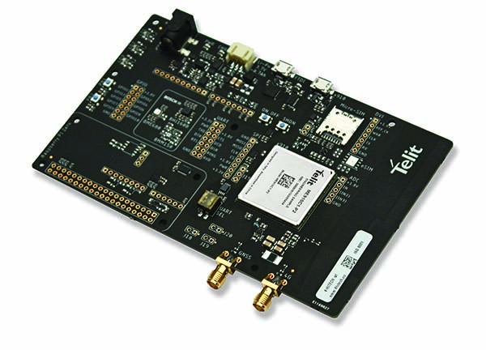

### Table of Contents
- [Telit's Bravo Evaluation Kit](#telit-s-bravo-evaluation-kit)
  * [Key Benefits](#key-benefits)
    + [How can I develop my IoT application using Bravo?](#how-can-i-develop-my-iot-application-using-bravo-)
    + [Which module interfaces are exposed on Bravo?](#which-module-interfaces-are-exposed-on-bravo-)
  * [Tutorials](#tutorials)    
    

# Telit's Bravo Evaluation Kit

Bravo, a next-gen Telit IoT evaluation kit designed for the rapid prototyping of IoT applications. It includes most building blocks involved in traditional evaluation kits 
but is more compact and embeds extra components, such as a cellular antenna and Bosch smart sensors.

Bravo can be used as a standalone solution with Telit’s AppZone API or as a non-standalone solution connected to Arduino or Raspberry Pi. 
Bravo uses Telit’s [ME910C1-WW](https://www.telit.com/me910c1/) module with LTE-M and NB-IoT support and 2G fallback. 
This evaluation kit is complete and affordable for developers creating their solution based on cellular LPWA for quick and easy deployment.

## Key Benefits

The Telit Bravo Board is a tool designed for engineers, programmers and developers.

Main features:

- Easy to use, ideal for rapid IoT application design
- Mounts ME910C1-WW module with LTE Cat M1/NB1 and GSM/GPRS connectivity and GNSS receiver
- High-performance, low power Bosch Sensortec motion and environmental sensors
- Telit OneEdge™ ready
- Can be used as standalone with Telit IoT AppZone application development SDK
- Arduino and Raspberry Pi open hardware platforms support
- Built-in wideband cellular antenna, SMA receptacle for external GNSS antenna with LNA supply
- High-efficiency battery charging circuit
- Three LEDs and two pushbuttons
- Connectors exposing UART (direct or through USB to serial converter), USB, SPI, GPIO, ADC

### How can I develop my IoT application using Bravo?

There are three options:

- the first option is to set up the module as a modem. An external application processor (PC or other board) 
communicating with the IoT module through USB or serial port. With this option you can send AT commands directly to the communications module.

- The second is AppZone, Telit’s Application Development Environment (ADE), which allows you to develop your C-language application to run on the module’s application
processor. You can find the download link and all the documentation on 
[IoT App Zone Developer Resources](https://www.telit.com/developer-zone/iot-app-zone/iot-app-zone-developer-resources/)

- The third is either Arduino or Raspberry Pi. These boards can be mounted directly on Bravo, with the application communicating with the Telit IoT module 
through the serial port. 

### Which module interfaces are exposed on Bravo?

- The analog-to-digital converter **(ADC)**
- Digital Voice Interface **(DVI)**
- GNSS antenna
- **I2C** bus 
- Serial Peripheral Interface **(SPI)**
- Universal asynchronous receiver-transmitter **(UART)** (serial port, direct or through USB to serial converter).

For more info about the evaluation kit visit the telit page:

https://www.telit.com/developer-zone/telit-bravo-evaluation-kit/

## Tutorials
- [Use your module as a modem](Telit_Bravo_modem.md)
- [Connect with MQTT](Telit_Bravo_mqtt.md)

