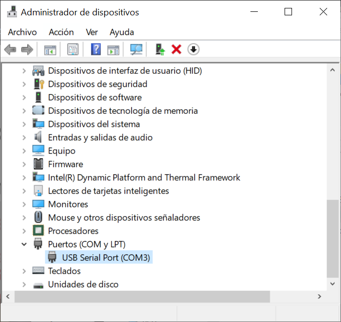
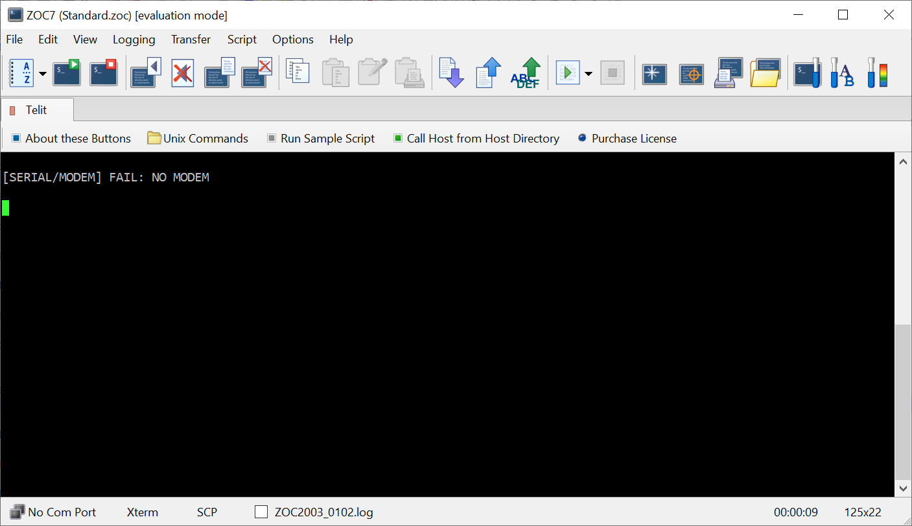
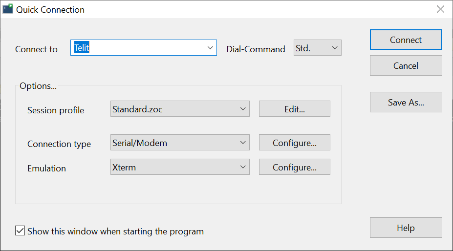
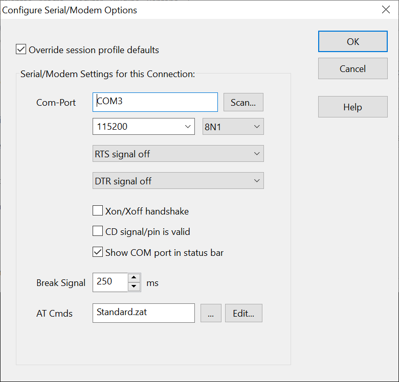
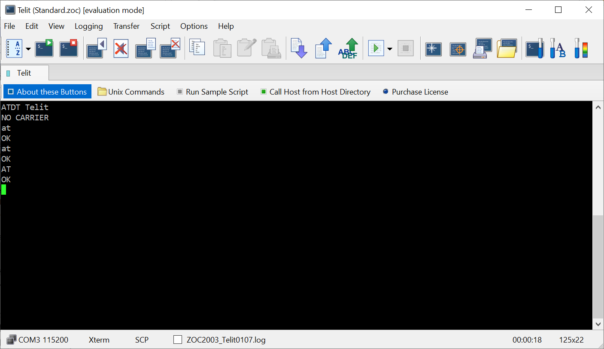

### Table of Contents
- [Use the Kit as a modem](#use-the-kit-as-a-modem)
  * [Connect the board to your PC](#connect-the-board-to-your-pc)
  * [Communicate via UART](#communicate-via-uart)
  * [Your first AT commands](#your-first-at-commands)
  * [Run test script](#run-test-script)
  
# Use the Kit as a modem

One of the options allowed by the development board is to connect to the IoT module through the USB connection.
This allows to process information externally and send AT command to the module using the communication with its UART


## Connect the board to your PC

To ensure that the board works properly you must first install the drivers.
Telit allows you to download it directly from the [evaluation kit homepage](https://www.telit.com/developer-zone/telit-bravo-evaluation-kit/)


The ME910 main UART is available for use with FTDI Serial to USB converter.

&#x1F4CD;
make sure you don't confuse it with the ME910 native USB port. To do so, check the labels on the board: 
- **label :** FTDI Serial to USB converter
- **label :** ME910 native USB port

If you have read the documentation, you will know that the module's UART can be exposed through several interfaces, but only one interface 
can be selected at a time using J6/J7 selector

To enable the interface FTDI, turn both switches to the ON position.

Once the drivers have been installed and the port to be used has been selected, it is time to connect the board.

&#x1F4CD;
The board can be powered via the usb but it is advisable to use the external power supply.

If you are developing on Windows, when you plug the board into your pc, you can check using the Device Manager



In this window you can identify the **COMx** port with which the connection to the module is identified

[](#table-of-contents)

## Communicate via UART

In this tutorial we will teach you how to send information to your module externally.
To do this you will need to connect to the UART (Universal Asynchronous Receiver Transmitter)

In the previous section you learned that the USB interface can be connected to the UART by setting the switches, 
and that by the using of a USB cable to connect it to your PC, you can easily identify the COM port to which it is connected.

Well, the rest of the process is exactly the same. Now you only have to configure one terminal on your computer 
to be able to send and receive data through the connection.

Although there are different tools with which to perform this task that allow you to set up the connection in a friendly way.

In this example we are going to use the ZOC Terminal Emulator, which in addition to direct communication allows the execution of scripts.
Which is extremely useful for your first connectivity tests!

You can download this tool directly from their website: https://www.emtec.com/download.html



Configure your connection in the **Quick Connection** tab



Open the configuration and select the port on which the board is configured



type the AT command, if the answer is "OK"
Congratulations on sending your first AT command!!!




[](#table-of-contents)

## Your first AT commands

AT commands are a specific command language to configure and parameterize modems.

In this case the set of AT commands you can use is determined by the model of modem used on the board.

You can learn more about the ME910 commands by visiting the 
[Telit documentation](https://www.telit.com/developer-zone/telit-bravo-evaluation-kit/)


In the example below we show how to configure the sss to send an UDP message.
This example can be used for the deployment test of our [Data Bridge](BP_DataBridge.md)

It can be used to reboot the system after update of the script in order to have the new
one running:
```
AT#REBOOT
```

Turn OFF the RF emission to configure band 20 and NB-IoT Technology
```
AT+CFUN=4
AT#BND=0,0,524288
AT#WS46=1
```

Turn ON the RF emission and connect to 
```
AT+CFUN=6
AT+CEREG=2
AT+CFUN=1
```

Configure the APN and PLMN
```
AT+CGDCONT=1,"IP"
AT+COPS=0
```

Check the Connection parmeter and Signal Quality
```
AT+COPS? 
AT+CGPADDR=1 
AT+CEREG? 
AT+CSQ
```

Open a socket and send a data
```
AT#SGACT=1,1
AT#SSENDEXT=1,50  
"01234567890123456789012345678901234567890123456789"
```

Read a data
```
AT#SRECV=1,50,1
```

[](#table-of-contents)

## Run test script

One of the advantages of using terminal emulators is that they allow you to automatically execute a sequence or list of commands.

Here is a list of scripts ready for you to start your connection test in a faster and more efficient way:

- [NB-IoT Band 20](https://github.com/telefonicaid/iot-activation/tree/master/scripts/Telit/ME910C1_NBIoT.zrx)
- [NB-IoT Band 20 UDP](https://github.com/telefonicaid/iot-activation/tree/master/scripts/Telit/ME910C1_NBIoT_UDPTX.zrx)
- [NB-IoT Band 20 with PSM](https://github.com/telefonicaid/iot-activation/tree/master/scripts/Telit/ME910C1_NBIoT_PSM1hour50bytes.zrx)

- [LTE-M Band 20](https://github.com/telefonicaid/iot-activation/tree/master/scripts/Telit/ME910C1_LTEM.zrx)
- [LTE-M Band 20 UDP](https://github.com/telefonicaid/iot-activation/tree/master/scripts/Telit/ME910C1_LTEM_UDPTX.zrx)
- [LTE-M Band 20 with PSM](https://github.com/telefonicaid/iot-activation/tree/master/scripts/Telit/ME910C1_LTEM_PSM1hour50bytes.zrx)

[Github](https://github.com/telefonicaid/iot-activation/tree/master/scripts/Data_Bridge)


[](#table-of-contents)


