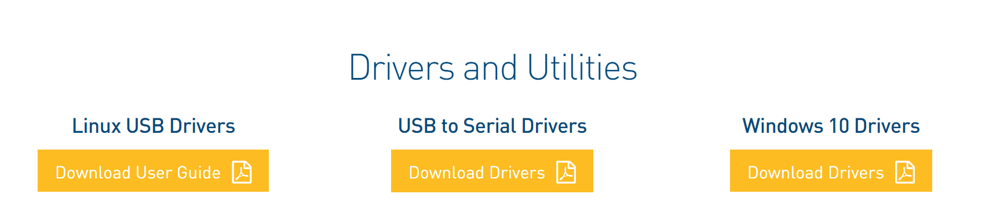
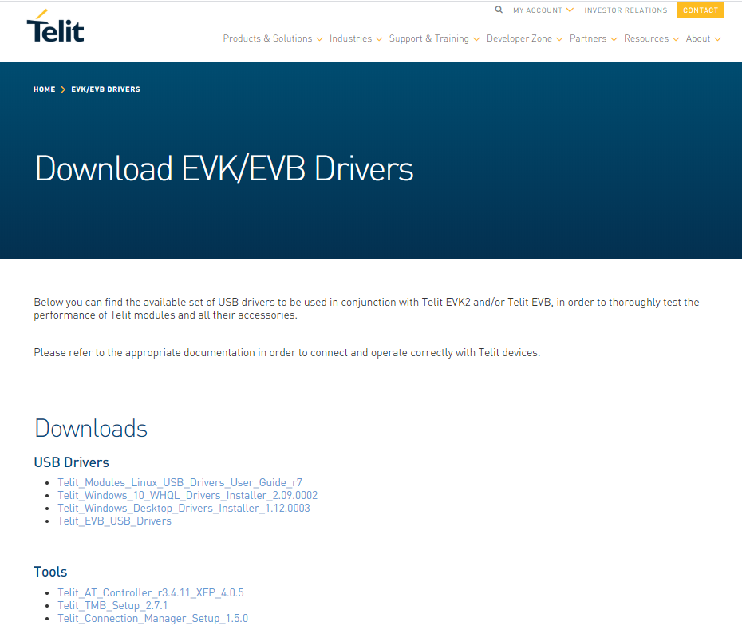
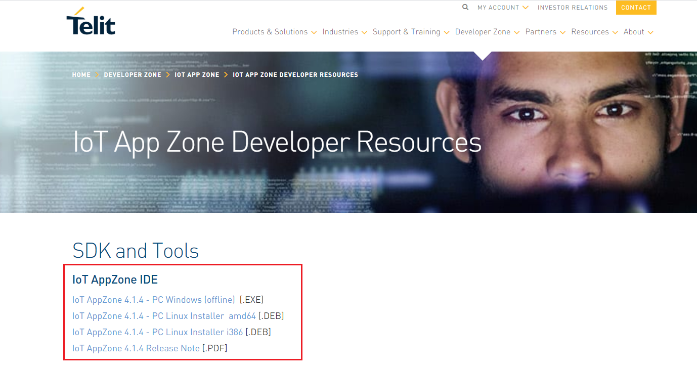
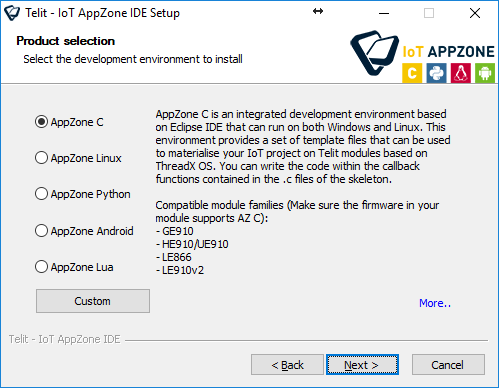
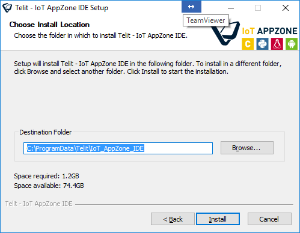
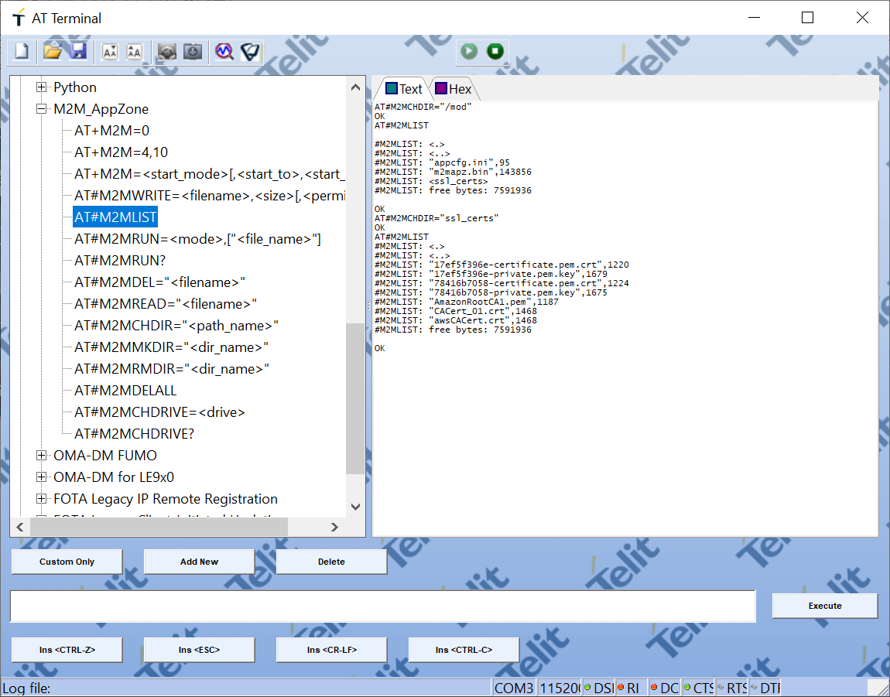
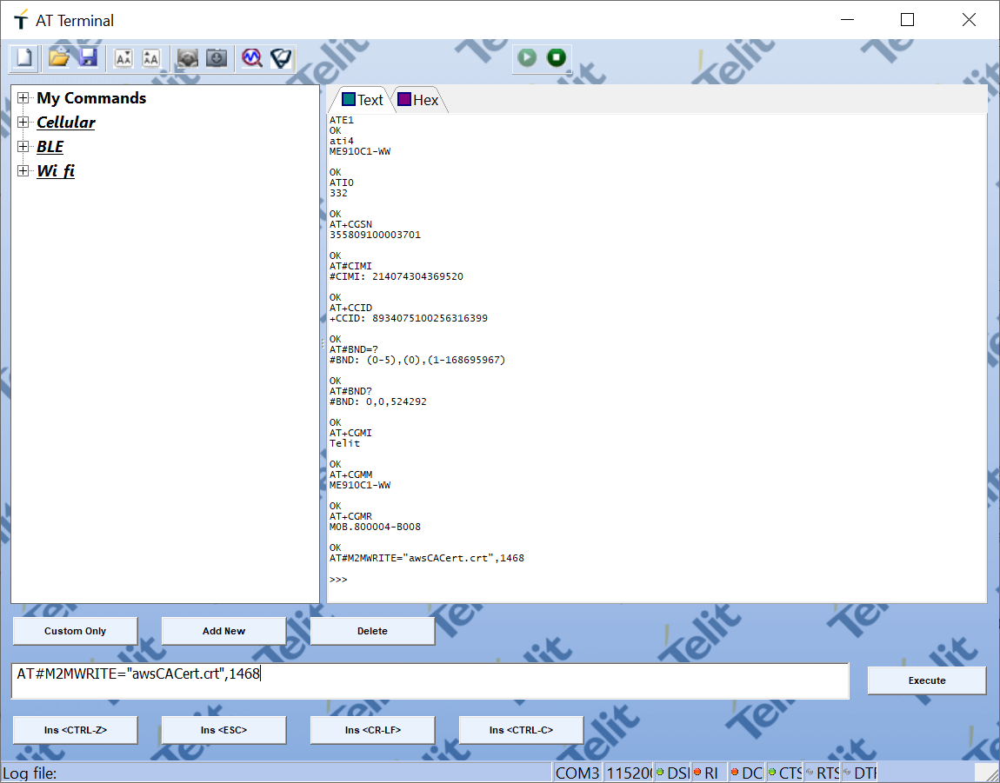
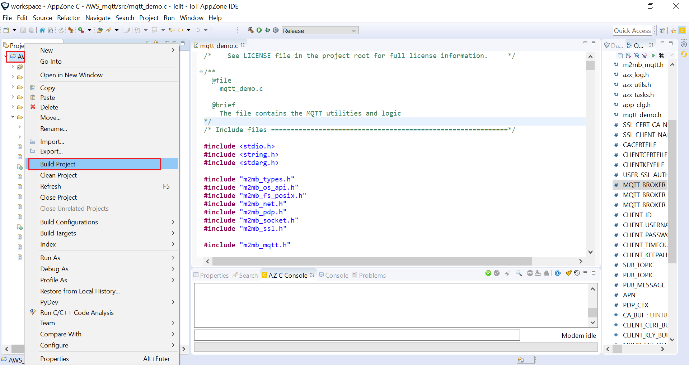
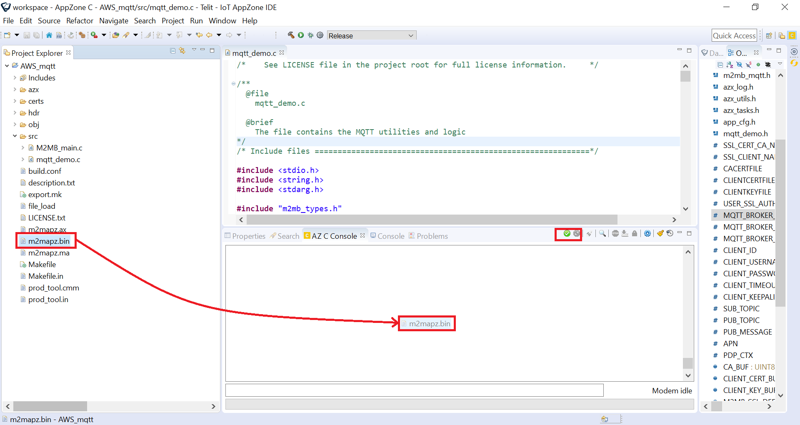

### Table of Contents
- [Use the Kit for send datas to AWS-IoT Core](#use-the-kit-for-send-datas-to-aws-iot-core)
  * [Register your device in AWS "Shadows"](#register-your-device-in-aws-shadows-)
  * [Connect the board to your PC](#connect-the-board-to-your-pc)
  * [Configure and test you module](#configure-and-test-you-module)
  * [Build and load del app](#build-and-load-del-app)
  * [Run your Script](#run-your-script)
  * [troubleshooting](#troubleshooting)
    + [trace_tools](#trace-tools)
    + [Update fw](#update-fw)
    + [Install plug-in](#install-plug-in)

  
# Use the Kit for send datas to AWS-IoT Core

As we have discussed in previous chapters, the best option to get the most out of your IoT devices is to send 
the information from the sensor to the cloud. So you can save on HW design 
and get all the processing power offered by public clouds as AWS.

For this tutorial we will use the **IoT Core**, it is a managed cloud service from AWS 
that lets connected devices easily and securely interact with applications and other devices.

Whether you already have your own AWS account, or have not yet decided on this cloud, remember that by participating in the program 
you have free credits in AWS by requesting them through the [Wayra's offers](Wayra_Offers.md)

[](#table-of-contents)


## Register your device in AWS "Shadows"

The first step for store the information in the IoT Core is to create the **Shadow**. 

Shadows provide a reliable data store for your things. the shadows are able to share
They are capable of share the status of a device for applications and other cloud services even if the device is disconnected.

If it's your first time using the IoT Core and you don't know how to create the shadow you can see the next [link](AWS_create_new_thing.md)

Once you have your shadow created and the certificates stored in a safe place (private.pem.key and certificate.pem.crt)

You don't need to configure anything else in aws for your data to be saved. 
However, it is advisable to use a test tool to verify that both certificates work. 

[](#table-of-contents)


## Connect the board to your PC

Now you only need to put your kit to work but first of all, you must install the development tools that Telit offers for the Bravo board

To ensure that the board works properly you must first install the drivers.
Telit allows you to download it directly from the [evaluation kit homepage](https://www.telit.com/developer-zone/telit-bravo-evaluation-kit/)



[](#table-of-contents)

### Telit AT Controller

The AT console allows you to send commands directly to the module, upload files, read logs in a simple and unified way.
In addition to a series of facilities that will be useful for your tests.

To download it access the links of the [telit's tools](https://www.telit.com/evkevb-drivers/)



[](#table-of-contents)


### AppZone C

AppZone C is a development environment that allows to build and run applications on Telit cellular modules. 
The integrated development environment and tools are based on Eclipse IDE and running on Windows and Linux.

Try to download always the latest version available

To install AppZone C on Windows:

1.  Access the Telit portal: https://www.telit.com/developer-zone/iot-app-zone/iot-app-zone-developer-resources/



2.  Click the AppZone installation file.
The installation wizard starts.

3.  If the correct Java version is not installed, the wizard downloads the appropriate package and prompts the user to install it. 
Once it is installed, restart the installer.

4.  Click Next to continue.

5.  Read the license agreement. If you agree, click I Agree to continue.

6.  Select AppZone C, and then click Next.



To install more than one development environment, click Custom and select the development environments that you want to install.

7.  Choose the destination folder in which to install AppZone C. You can leave the default folder or click Browse to select a new destination folder.



8.  Click Install to begin the installation.
The installation wizard downloads the files that are required for the development environment that you selected.

9.  Click Finish to close the AppZone C installation wizard.

As you progress in your development you will gain more knowledge of the tool,
however before you start don't forget to take a look at the documentation and follow the 
[Get Started](https://s3.amazonaws.com/site_support/Telit/AppZone-SDK/User+Guides+AppZone+2.0/az-c-m2mb-ug-r1/index.html#!Documents/getstarted.htm)

[](#table-of-contents)


## Configure and test you module

As you may have seen, the tools they will need are very different.
**AppZone** will allow you to develop more powerful scripts in C and the **AT Controller** will allow you to send commands and communicate directly with the


### Check your versión

To avoid possible errors and bugs that have already been solved, it is always advisable to work with the most current version of fw. 

To check the version of your module you can use the command `AT#SWPKGV`

```
AT#SWPKGV 
30.00.817-B004-P0B.810100
M0B.800004-B008
P0B.810100
A0B.810000

OK
```

For this guide, we have used the version **30.00.817-B004-P0B.810100**  So you should use that version 4.0 or newer.

Check how update it, from [troubleshooting section](#update-fw).

### Configure and test your conection

AT commands are a specific command language to configure and parameterize modems.

In this case the set of AT commands you can use is determined by the model of modem used on the board.

You can learn more about the ME910 commands by visiting the 
[Telit documentation](https://www.telit.com/developer-zone/telit-bravo-evaluation-kit/)

In the example below we show how to configure the sss to send an UDP message.

It can be used to reboot the system after update of the script in order to have the new
one running:
```
AT#REBOOT
```

Turn OFF the RF emission to configure band 20 and NB-IoT Technology
```
AT+CFUN=4
AT#BND=0,0,524288
AT#WS46=1
```

Turn ON the RF emission and connect to 
```
AT+CFUN=6
AT+CEREG=2
AT+CFUN=1
```

Configure the APN and PLMN
```
AT+CGDCONT=1,"IP"
AT+COPS=0
```

Check the Connection parmeter and Signal Quality
```
AT+COPS? 
AT+CGPADDR=1 
AT+CEREG? 
AT+CSQ
```

If you want to see more examples of code with AT commands, visit our tutorial: [how to use the module as a modem ](Telit_Bravo_modem.md)

### Upload your certs files

1. Change the directory: `AT#M2MCHDIR="/mod"`

2. Create your new directory `AT#M2MMKDIR="ssl_certs"`

3. List the path to check the new directory `AT#M2MLIST`

4. Change to the new directory `AT#M2MCHDIR="ssl_certs"`


5 Then Copy the certificates in the module with the command `AT#M2MWRITE=<file_name>,<file_size>`



repeats the process with the rest of the files
```
AT#M2MWRITE="awsCACert.crt",1468
AT#M2MWRITE="xxxxxxx-certificate.pem.crt",xxxx
AT#M2MWRITE="xxxxxxx-private.pem.key",xxxx
```

You can find the CA root cert file on the [Github](https://github.com/telefonicaid/iot-activation/tree/master/scripts/Telit/AWS_mqtt/certs)

[](#table-of-contents)

## Build and load del app

download the code from the [Github](https://github.com/telefonicaid/iot-activation/tree/master/scripts/Telit/AWS_mqtt)

Build a new proyect for copy the files with the code. Check the [troubleshooting](#Install-plug-in) section to update the version of fw if necessary 

To make it work, it's only necesaty modify some parameters por work it.

Open de file with de develpment tool AppZone C and edit the next macros:

1. Edit the certificates files name from your module (use the same name you used in the previous step)
```
#define CLIENTCERTFILE    "/mod/ssl_certs/xxxxxxx-certificate.pem.crt"   /* Client certificate file path in module filesystem (if needed) */
#define CLIENTKEYFILE     "/mod/ssl_certs/xxxxxxx.pem.key"   /* Client private key file path in module filesystem (if needed) */
````

2. Use the reserved topic, for the shadow you created in the first steps.
```
#define SUB_TOPIC "$aws/things/xxxxxxx/shadow/update/delta"
#define PUB_TOPIC "$aws/things/xxxxxxx/shadow/update"
```

3. Be sure to use the access point for your AWS account
```
#define MQTT_BROKER_ADDRESS "xxxxxxxxxx-ats.iot.xx-xxxx-x.amazonaws.com"
```

[](#table-of-contents)

## Run your Script

Right click on the project folder and select **build**:


This will compile the C files and create a binary file that you can load on the module.

All you have to do is drag the file into the console.


Now your file has been loaded into the module.
Just check the file permissions and configure it to run the application.

Follow the following commands

```
AT#M2MRUN=2,"m2mapz.bin"
AT#M2MRUN?
AT+M2M=4,10
```

If there was already a previous script uploaded it is recommended to delete the old file.

```
AT#M2MLIST
AT#M2MDEL=m2mapz.bin
```

Upload the new script and  edit the permissions again.
```
AT#M2MRUN=2,"m2mapz.bin"
AT#M2MRUN?
AT+M2M=4,10
```

[](#table-of-contents)

## troubleshooting

Please, any new question contact us **contact@activationprogramme.telefonica.com**

### Update fw

To check the version of your module you can use the command `AT#SWPKGV`

```
AT#SWPKGV 
30.00.817-B004-P0B.810100
M0B.800004-B008
P0B.810100
A0B.810000

OK
```
Download the tool from our 
[repository](https://github.com/telefonicaid/iot-activation/tree/master/scripts/Telit/resources/fw)
or send us an email to **contact@activationprogramme.telefonica.com**

[](#table-of-contents)

### Install plug-in

Vistit the [guide](Telit_InstallingbetaversionlibrariesPlugin.md) for Installing new libraries, change the project libraires or create new project

or send us an email to **contact@activationprogramme.telefonica.com**


[](#table-of-contents)

### trace_tools

Sometimes when a problem gets complicated it is unexpected you will need to resort to obtaining a more detailed log.

To do this you must connect the board to your computer through the debug port, and use a tool that allows you to obtain a file with the traces

Download the tool from our [repository](https://github.com/telefonicaid/iot-activation/tree/master/scripts/Telit/resources/tracetool)
or send us an email to **contact@activationprogramme.telefonica.com**

[](#table-of-contents)

