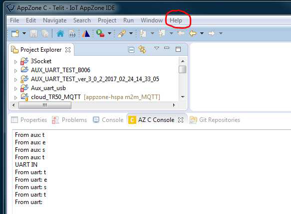
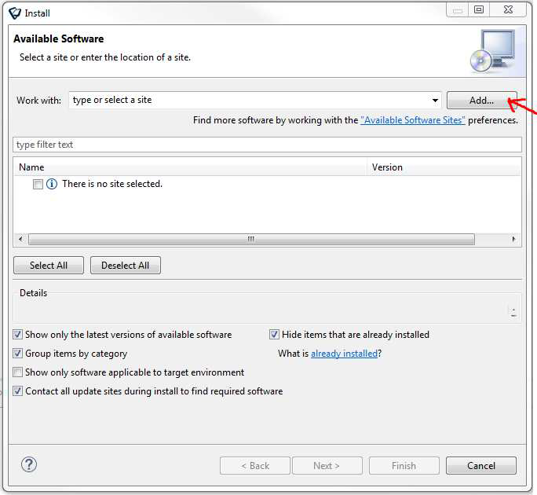
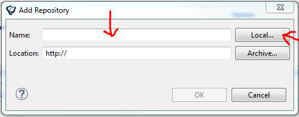
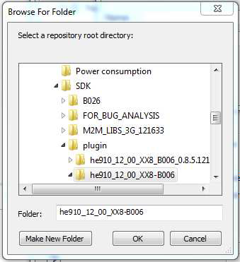
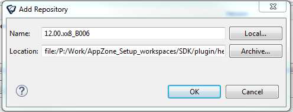
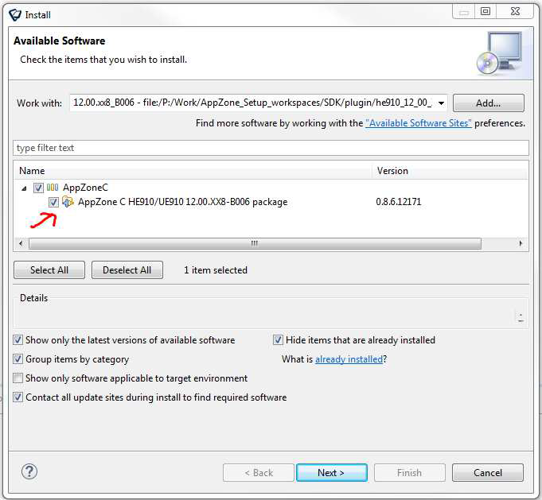
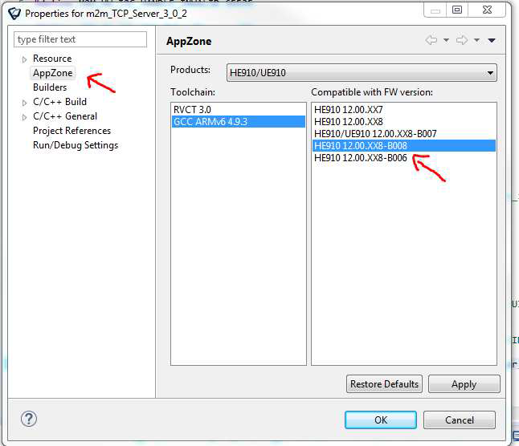
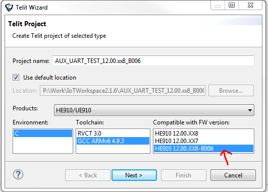

## Installing libraries Plug-in

To install a new plug-in into SDK you have first to save [.zip](https://github.com/telefonicaid/iot-activation/tree/master/scripts/Telit/resources/plugin)
plug-in packet into a folder on your PC. 
Then unzip the file and open SDK.

Click on “Help “ tag and choose “Install New Software…”

This window will appear:

Click on “Add…” button and then in the following window click on “Local…” to select unzipped folder with the plug-in

Once selected the plug-in folder in “Location:” you will find the folder path. Now in “Name:” write name of
the new libraries (for example 12.00.xx8_B006) and click on “OK” button.

Now the new packet is ready to be Installed, select it and click on “Next >” button until “Review Licenses”
window will appear.

Accept the licenses when required and click on “Finish” button to complete installation.

## Change existent project libraries

If you want to align an old project to the new libraries just installed you just have to right click on the
project and chose “Properties”.

Now select “AppZone” on the right end of the window and on the left select the packet with

## How to create a project with the new plug-in
To use the new libraries just installed you have to create a new project: “File”-> “New” -> “Telit Project”

Select the new fw version (HE910 12.00.xx8-B006) and create an empty project.
Then copy ONLY src and hdr folder of the old project in the just created one.