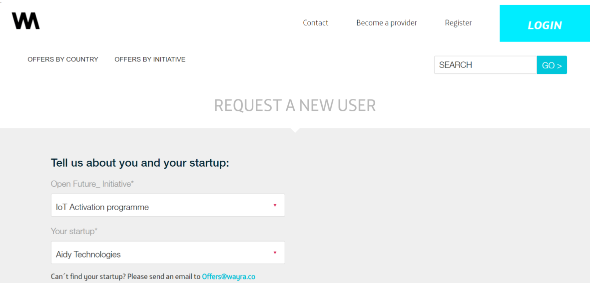
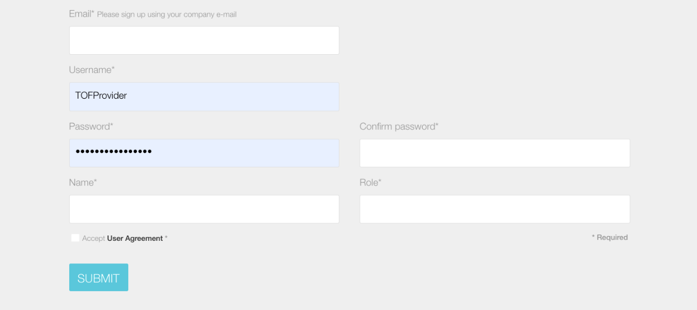
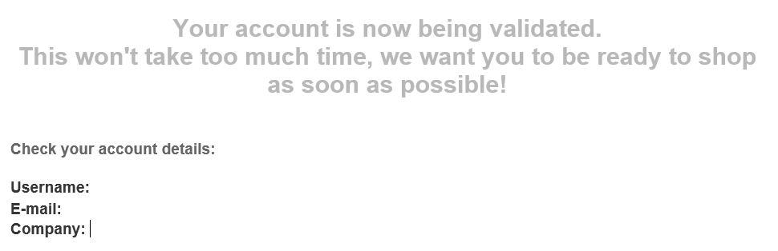
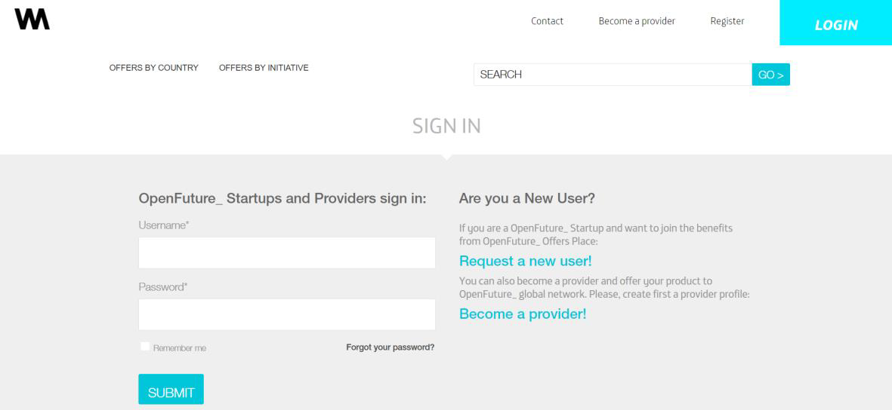
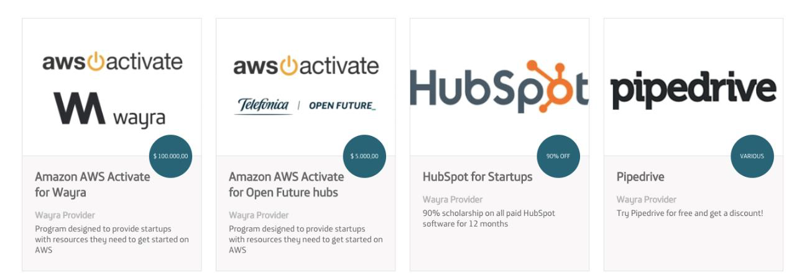
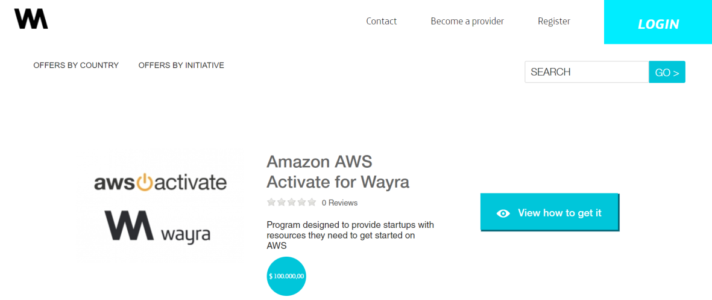
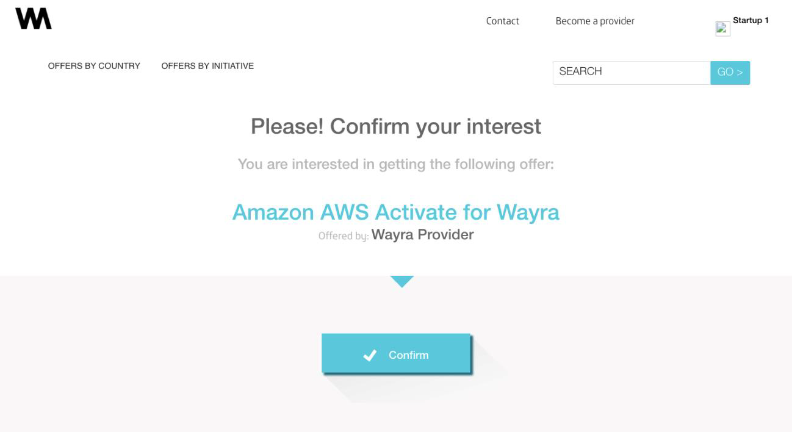
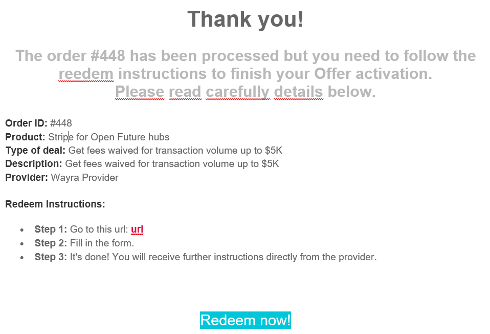
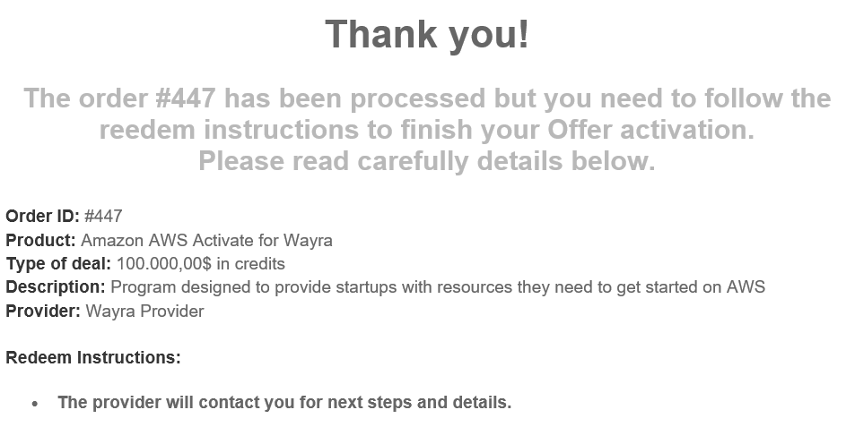
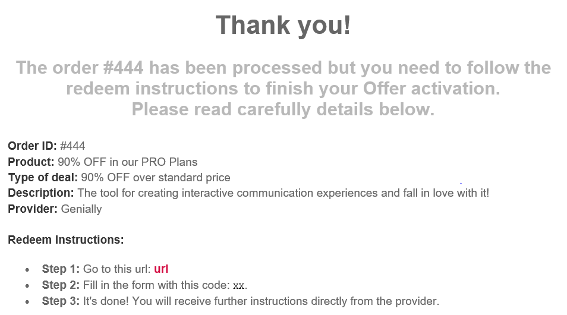

# Wayra Offers: how to access?

1. Go to https://offers.wayra.co/

2. Click on Register

3. Fill out the form:
   - **a)** Open Future initiative: IoT Activation programme
   - **b)** Your startup: select your startup from the dropdown
   - **c)** Email, username, password, etc.
   - **d)** Click on Submit

4. Once you submit it, you account will have to be validated. 
You will receive an email including your account information and that it is being validated.

5. When your account is validated, you will receive another email

6. You can now log in the [website](https://offers.wayra.co/sessions/login), with the credentials you used when you signed up.

7. Once you are logged into the website, you can check out the offers you need and redeem them.

8. To redeem an offer, click on **"View how to get it"**

9. Depending on the perk/offer, you will you be either: redirected to the providers webpage, 
send an email with instructions or be shown a promotional code.

**E.g.:** Sample email when directed to the providers webpage.

**E.g.:** Sample email when the provider must contact you to proceed.

**E.g.:** Sample email when you need to use a promotional code.

