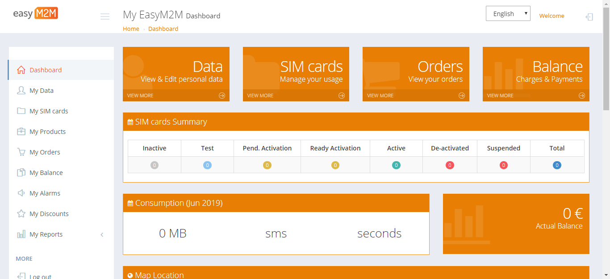
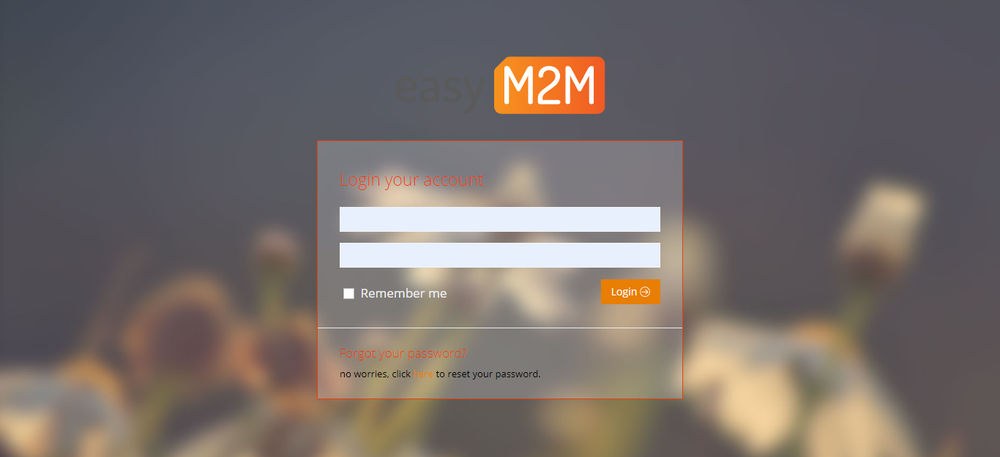
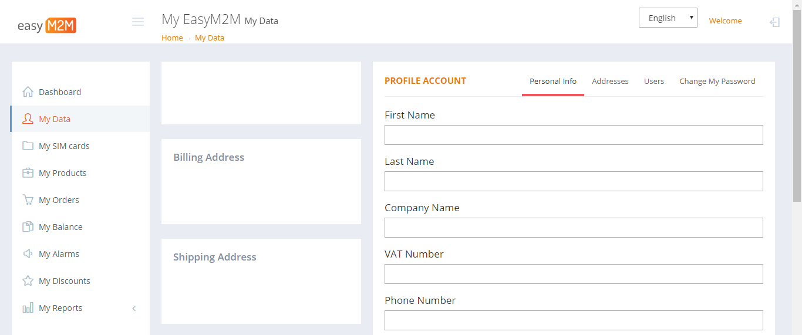
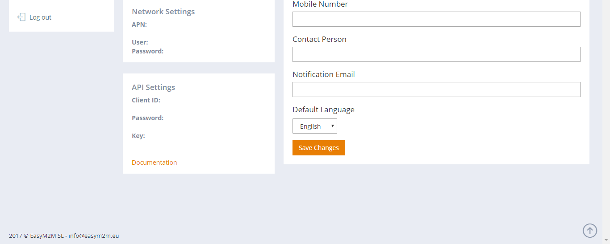
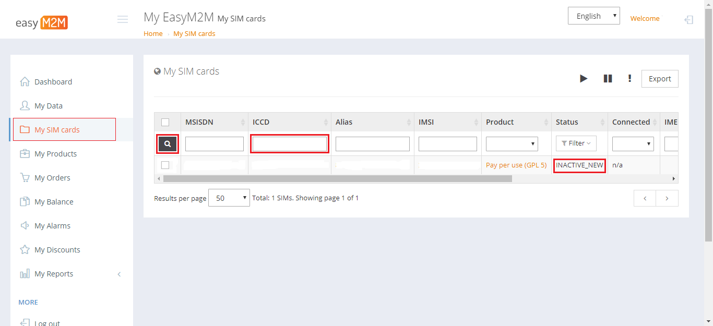
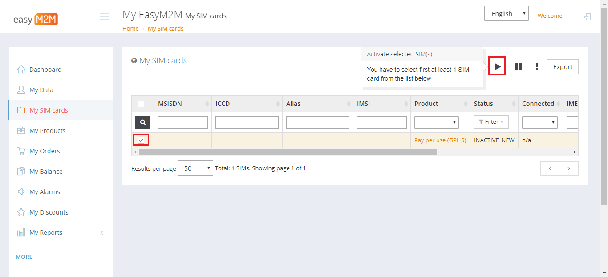
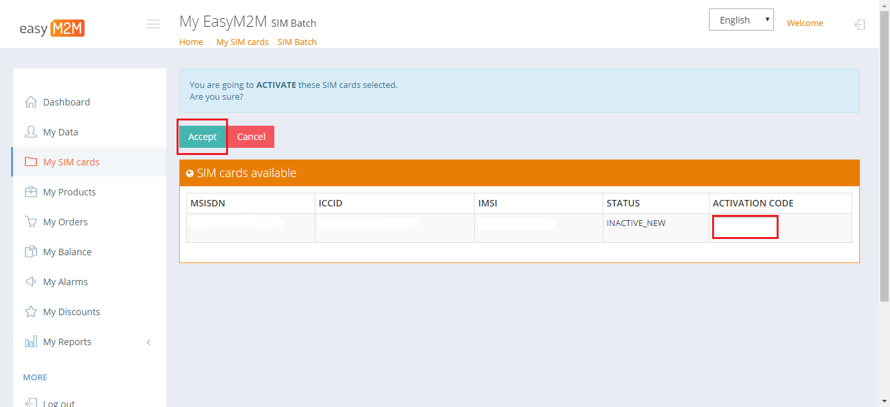
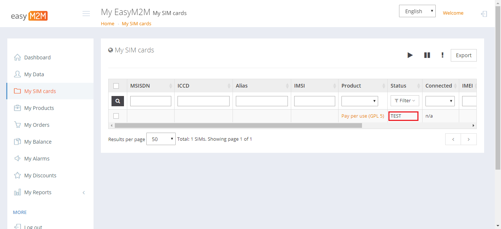

## Table of Contents

- [Who is easym2m?](#who-is-easym2m2)
- [easyM2M customer portal](#easym2m-customer-portal)
  - [Activate your SIM](#activate-your-sim)
- [easyM2M API](#easym2m-api)

## What is easym2m?

Easym2m is a Telefónica's partners

visit their web to learn more about them: www.easym2m.eu

## easyM2M customer portal

All your SIMs from a single location: 
activate, deactivate, suspend, set consumption limits and much more. 

Go to https://www.easym2m.eu/login.php and login

Now you can browse on the web. 

All from a single web-enabled interface

### Activate your SIM

When you receive your SIM cards, you can activate them to start enjoying Telefónica's connectivity.

1- On the **My SIM card** tab, use the search engine for find your SIM card

2- Select your SIM and click on **Play** button

3- Copy the activation code that you received with your SIM card, and click on **Accept**

4- Now the SIM is activated, check the status: **TEST**

## easyM2M API

This API includes practically 100% of the functionality offered in the easyM2M customer portal. It was been created for you  

In this document, you will find the information needed to integrate your computer systems with the management of their inventory of M2M cards.

With the easyM2M API, you will do:

1. Obtain a list of SIM cards in inventory.
2. Filter by its life cycle
3. Obtain all the attributes of a SIM card using its ICCID
4. Update SIM card attributes
5. Show the balance of the SIMs
6. Show statistics for usage

https://easym2mmanagementapiv2en.docs.apiary.io/

Learn how to use the API with the [Postman tool](easym2m_API.md)

