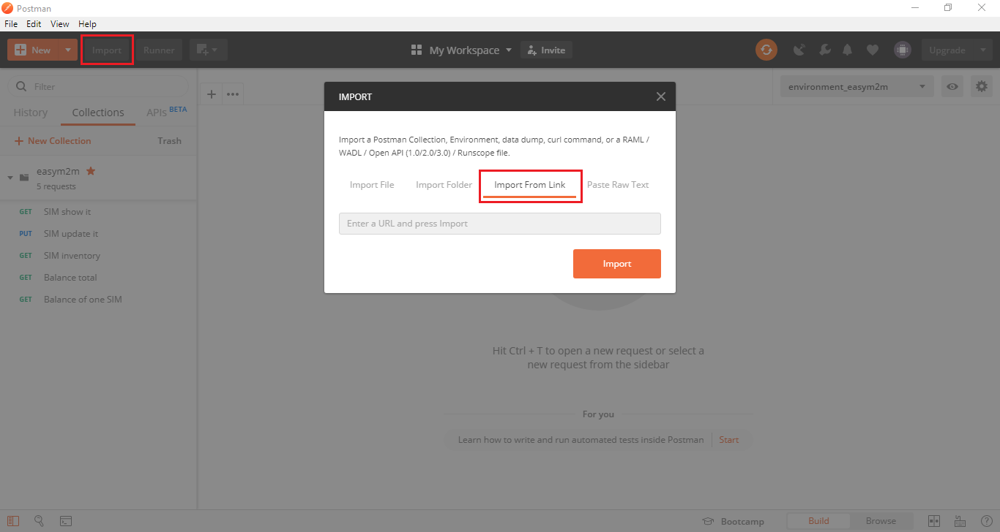
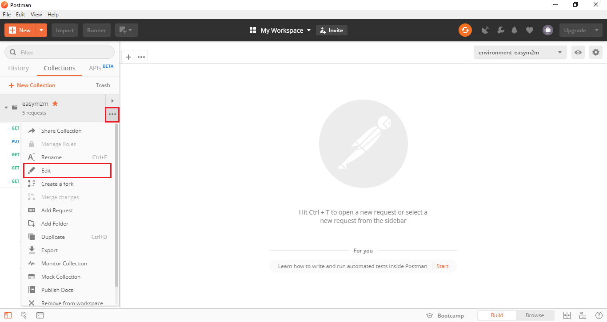
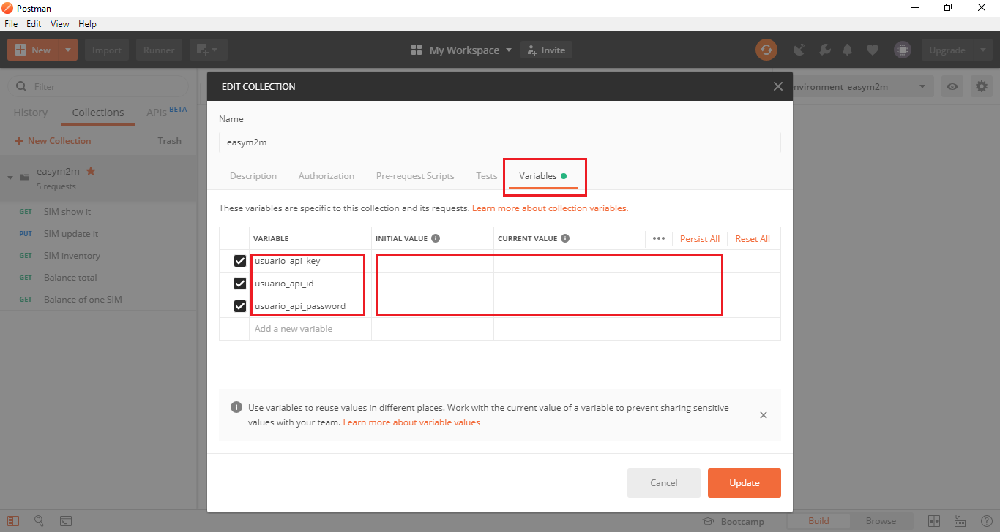
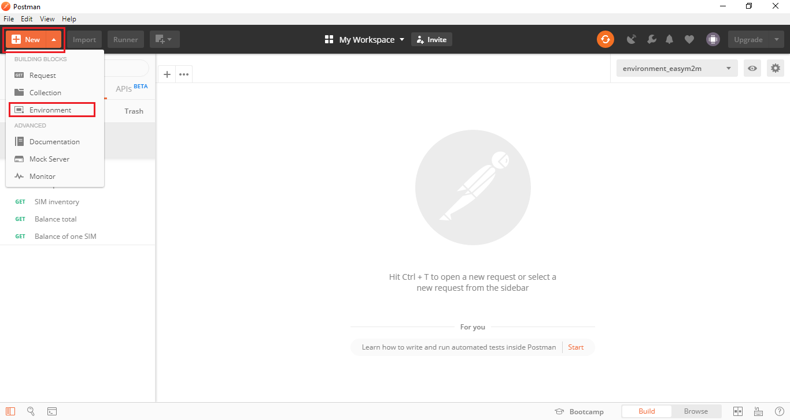
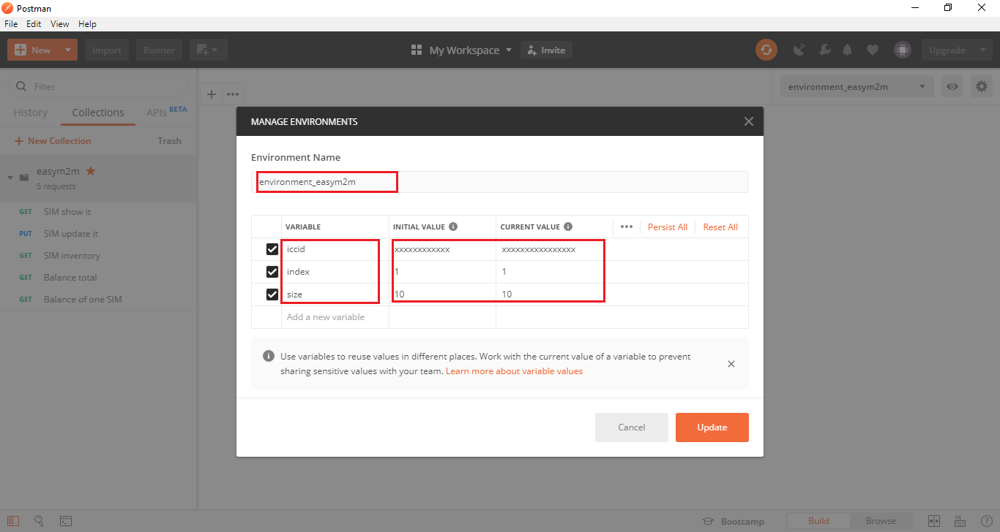

## Table of Contents
- [API REST for easym2m](#api-rest-for-easym2m)
  * [What is REST?](#what-is-rest)
  * [What is Postman?](#what-is-postman)
  * [easym2m Environment](#easym2m-environment)
  * [easym2m API Collection](#easym2m-api-collection)
    + [SIM show it](#sim-show-it)
    + [SIM update it](#sim-update-it)
    + [SIM inventory](#sim-inventory)
    + [Balance total](#balance-total)
    + [Balance of one SIM](#balance-of-one-sim)


# API REST for easym2m

If you're reading this, it's because you're willing to start using the easym2m API.

[](#table-of-contents)


## What is REST?

**Representational State Transfer (REST)** is a software architectural style that defines a set of constraints 
to be used for creating Web services.
In a simpler definition, REST is any interface between systems that uses HTTP to obtain data 
or generate operations on that data. 

The following operations are the most used in a REST API:

- **GET**: Retrieve the URIs of the member resources of the collection resource in the response body.

- **POST**: Create a member resource in the collection resource using the instructions in the request body. 
The URI of the created member resource is automatically assigned and returned in the response Location header field.

[](#table-of-contents)


## What is Postman?

Postman is a great tool when it comes to testing or using a REST API.
It offers a user interface with which to make HTML requests, without the hassle of writing a lot of code. 

[Get Postman here!](https://www.getpostman.com/downloads/)

One of the strengths of Postman is the collection creation and the possibility of use environment variables.

[](#table-of-contents)


## easym2m Environment

As usual in our tutorial.
If we can work to make your job easier. 
We will do!


As shown the previous screenshot, you can create a collection with a list of operations and chosse between diferent environment.

[](#table-of-contents)


### Import a collection

To add the collectionto your Postman application, click on the import button, 
and copy the next link:

```
https://raw.githubusercontent.com/telefonicaid/iot-activation/master/scripts/API/Kite/Kite%20Platform.postman_collection.json
```



[](#table-of-contents)

### Edit Variable User Key

To access your easym2m account, and ensure security. It is necessary to access through the use of a pair of keys, which are available from the web portal of your account.

As Postman allows the use of variables, you will only need to set your keys as in the following captures.





[](#table-of-contents)


### Creating new Environment

To access some easym2m api services it is necessary to configure some values in the URL.

Postman allows you to define environments in which to define different values for the variables





[](#table-of-contents)


## easym2m API Collection

This collection include the next operations:

&#x1F4CD;
If you want to know everything about the API options, don't forget to visit its 
[documentation](https://easym2mmanagementapiv2en.docs.apiary.io/).

### SIM show it

Obtain all the attributes of a SIM card using its ICCID.

```
https://www.easym2m.eu/api/v2/customer/simcard/{{iccid}}
```

variables:

- **{{iccid}}** = SIM iccid number

[](#table-of-contents)


### SIM update it

This method allows changes to specific SIM card attributes. It is necessary to enter the ICCID of the SIM card to be modified.
Depending on the type of product assigned to the SIM card, certain parameters can be changed.

For prepaid products, only the following can be updated:

- Life cycle of the SIM card or status (lifeCycleStatus)
- Alias (alias)
- Alarm ID (idAlarm)

For post-paid products, in addition to the parameters that can be modified for prepaid SIM cards, it is also possible to change the following:
- Threshold for daily consumption (dailyConsumptionThreshold)
- Threshold for monthly consumption (monthlyConsumptionThreshold)

```
https://www.easym2m.eu/api/v2/customer/simcard/{{iccid}}
```
variables:

- **{{iccid}}** = SIM iccid number

body example:

```json
{
    "lifeCycleStatus" : "ACTIVE",
    "alias" : "MAD5149",
    "idAlarm" : "2898723948.3423"

}
```

[](#table-of-contents)


### SIM inventory

Obtain a list of SIM cards in inventory. The result is paginated and can be filtered on life cycle of the SIM cards.

The valid entries for the SIM status are the following Status:

- INACTIVE_NEW 
- TEST
- ACTIVATION_READY
- ACTIVATION_PENDANT
- ACTIVE
- DEACTIVATED
- SUSPENDED

```
https://www.easym2m.eu/api/v2/customer/simcards/{{size}}/{{index}}/{{Status}}
```

variables:

- **{{size}}** =  Offset to be applied to the response
- **{{index}}** =  A maximum number of entries to be returned in the response
- **{{iccid}}** = SIM iccid number

[](#table-of-contents)


### Balance total

Show the actual customer balance in Euros (€).

```http
https://www.easym2m.eu/api/v2/customer/balance
```

[](#table-of-contents)

### Balance of one SIM

Show the balance of one SIM card.

```https
https://www.easym2m.eu/api/v2/customer/balance/{{iccid}}
```

variables:

- **{{iccid}}** = SIM iccid number

[](#table-of-contents)

