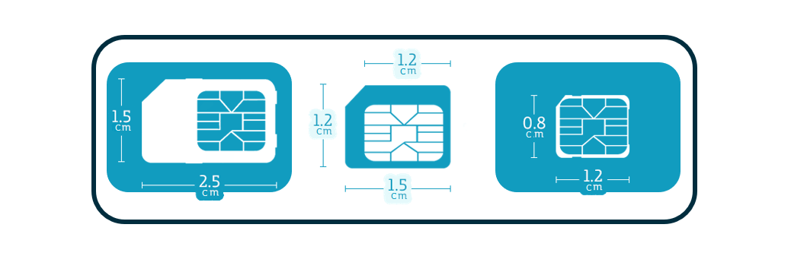
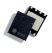

### Table of Contents

- [What is a SIM card?](#what-is-a-sim-card)
- [How to choose the type of SIM](#how-to-choose-the-type-of-sim)
  * [Format and Size](#format-and-size)
  * [Grade: Industrial or Commercial](#grade-industrial-or-commercial)
  * [eUICC - eSIM - SWAP](#euicc---esim---swap)
- [Your SIM identifiers](#your-sim-identifiers)
  * [ICCID](#iccid)
  * [IMSI](#imsi)
  * [MSISDN](#msisdn)
  * [IMEI](#imei)
- [Connectivity Services](#connectivity-services)
  * [FAQ](#faq--frequently-asked-questions)
    + [Are SIMs valid for NBIoT, LTEM and GPRS?](#are-sims-valid-for-nbiot--ltem-and-gprs)
    + [Do these SIMs have public or private IP?](#do-these-sims-have-public-or-private-ip)

# What is a SIM card?
**Universal Integrated Circuit Card** (**UICC**), also known as a SIM card **(Subscriber Identification Module)** 
is an integrated circuit for the secure identification and authentication of devices on the cellular network.

	

# How to choose the type of SIM
One of the first questions we ask ourselves when we develop IoT devices, is the type of SIM card we need to use.

These SIM cards are the same ones we are used to using in our mobile phones,
and cast the first stone who has never had a problem when renewing your old mobile.

If it has ever happened to you, here are some informative pills that can help you avoid these and other problems in your future designs

&#x1F4CD;
note that you will have to consider more factors than the format of the SIM card

## Format and Size
This is possibly the best-known factor, as it is visually appreciable. 
But it is possibly one of the least significant factors when designing a device.

&#x1F4CD;
We will use the classification according to the official standard, 
although we will try to make the analogy with some of the commercial names.

- **1FF:** (85,6 x 53,98 x 0,76 mm)
- **2FF - Mini SIM - Standard SIM:** (25 x 15 x 0,76 mm)
- **3FF - Micro SIM:** (15 x 12 x 0,76 mm)
- **4FF - Nano SIM:** (12,3 x 8,8 x 0,67 mm)

	

- **MFF2 - Solderable:** This format allows to integrate the SIM as if it were one more Integrated circuit.
you can find it with different packaging and it is the smallest option.

	

&#x1F4CD;
MFF2 is commonly referred to as eSIM or Industrial SIM. But it's a misconception.

## Grade: Industrial or Commercial
One of the most important factors when designing HW is understanding the requirements of the device.

Just as integrated circuits must resist more demanding Operating conditions for industrial environments, 
your SIM card must endure certain standards.

Here's a comparison between commercial SIM cards and industrial SIM cards.

|  | **Commercial**  | **Industrial** |
| :---:  | :---:  | :---:  |
| temperature range | -25ºC to 85ºC | -40ºC to 105ºC |
| Electrical conditions | 1.8V; 3V; 5V | 1.8V; 3V; 5V |
| Erase/write cycles | 500K | 2M |
| Data retention | 2 years | 10 years |

in addition to these differences, the industry standard has better tolerance to external conditions:

- temperature
- impacts/vibrations
- humidity
- corrosion

## eUICC - eSIM - SWAP
Embedded UICC is a mechanism for the remote provisioning and management of connections,
allowing the “over the air” provisioning of an initial operator subscription, and the subsequent change of subscription 
from one operator to another

learn more about [Embedded SIM Specification](https://www.gsma.com/iot/embedded-sim/)

&#x1F4CD;
The modules & devices must accomplish some requirements to support remote eUICC provisionng. 
This information is in the Annex G of the GMSA Specification:

Remote Provisioning Architecture for Embedded UICC Technical Specification

V3.2:
[[SGP.02 V3.2] annex G (Device Requirements)](https://www.gsma.com/newsroom/wp-content/uploads/SGP.02_v3.2_updated.pdf)

In order to be able to use eUICC with an interchangeable profile, 
the communication modules that are to be used must have certain
[Technical Specifications](https://www.gsma.com/newsroom/wp-content/uploads/SGP.02-v4.0.pdf).

# Your SIM identifiers
Part of the function of the SIM card is to store identifiers that allow identification and registration 
in the cellular network.

Some of the most important are:

## ICCID
**Integrated Circuit Card Identifier** is a number that uniquely identifies the SIM.
This number is stored in SIM card memory and printed on SIM card body. 
It belongs to the SIM, each new SIM will have a new number.

The number is composed of the following subparts:
- Issuer identification number (IIN)
- Individual account identification
- Check digit (Luhn algorithm)

ICCID numbers are also used to identify eSIM profiles

## IMSI
**International Mobile Subscriber Identity** is a number that uniquely identifies every user of a cellular network.
The device sends the number to the network to be authenticated and allow it to be connected.

This number is unique and belongs to the mobile phone operator, you can change SIM and keep the IMSI.

## MSISDN
**Mobile Station International Subscriber Directory Number** is a number uniquely identifying a subscription in a 
Global System for Mobile communications (GSM). It is a logical entity and is not stored in the SIM, 
the operator has a table that links with the IMSI.
This table is used for identifying a mobile subscriber and for routing calls.

This number is not tied to the phone operator and therefore allows us to migrate it to another operator. 

## IMEI
**International Mobile Equipment Identity** is a number usually unique used to identify the device on the network.

This number belongs to the communication module, and although it is not associated to the SIM card, it is just as important.

&#x1F48A;
Knowing the IMEI of the connection allows you to identify the device that is using the SIM card.

# Connectivity Services

When you purchase a new SIM card, you must choose the one that best suits your needs.

Remember to always evaluate these three points:

  * [Format and Size](#format-and-size)
  * [Grade: Industrial or Commercial](#grade-industrial-or-commercial)
  * [eUICC - eSIM - SWAP](#euicc---esim---swap)
  
However, these are the most common doubts when contracting the data service.

## FAQ: Frequently Asked Questions

Some of the most frequently asked questions when hiring a connectivity service:

### Are SIMs valid for NBIoT, LTEM and GPRS?

The connectivity service is independent of the type of card. All cards are prepared to connect to the type of connectivity contracted.
It is even possible that a SIM is enabled for several technologies. However, the ability to connect to the cellular network is found in the module of the device.

### Do these SIMs have Public or Private IP? 

Currently most of the IP addresses of the devices are natted IP.
This means that the devices use a Private IP address from ISP network.
However, there is a possibility that a device has a Public IP. Although this is not a common service.

