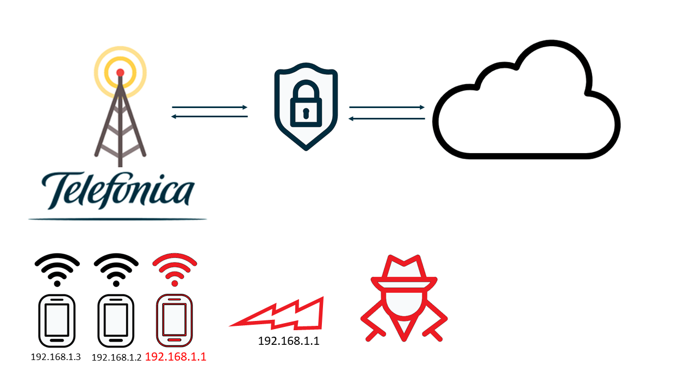
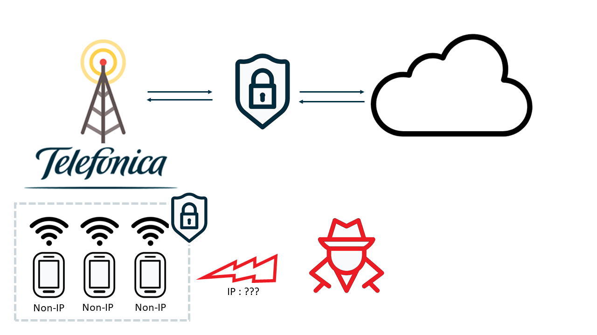

### Table of Contents

- [What is Non-IP!](#what-is-non-ip)
  * [You Can't Attack what You Can't See!](#you-can-t-attack-what-you-can-t-see)

# What is Non-IP!

A Non-IP Communication is one whose device does not have an assigned IP address.
This may seem obvious, but if you know how Internet communications work, you may think this is impossible.

As you already know, every device receives an IP address each time it connects to a network,
so that it can receive and communicate with the other devices on the network.

This allows each device to be identified and reached by another device on the network, making it vulnerable to a possible attack. 
Now imagine that the device didn't have an IP address, but would be the network itself Telefonica who would manage the traffic to the device.

hat is a brief overview of of how an unauthorized intruder can identify each device through its IP address

 
     

However, if traffic routing is managed through the cellular network, the intruder is not capable of detecting the device.

 
     

## You Can't Attack what You Can't See!

The purpose of a Non-IP communication is not only to hide the device, but also to manage the traffic to the network.

An IoT device is usually a device with a simple functionality, report data to the cloud and receive updates eventually.
This peculiarity makes it quite easy to manage the device traffic on the cellular network.
The device will only communicate with the Telefonica's network, and this will be responsible for making the secure communication
to the cloud.

