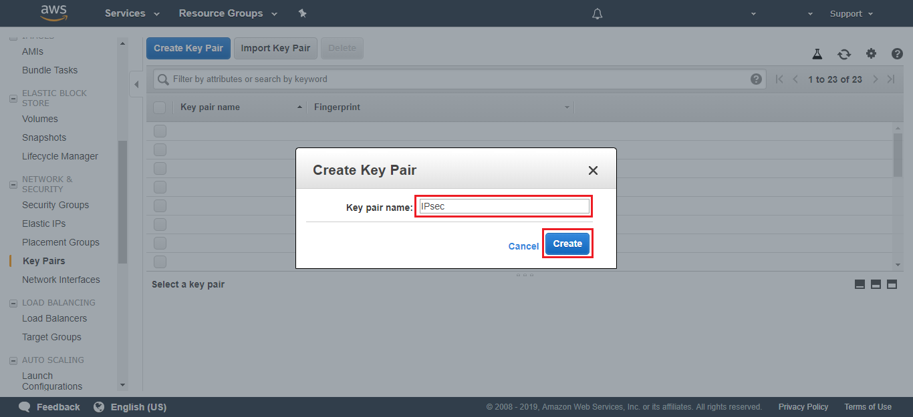
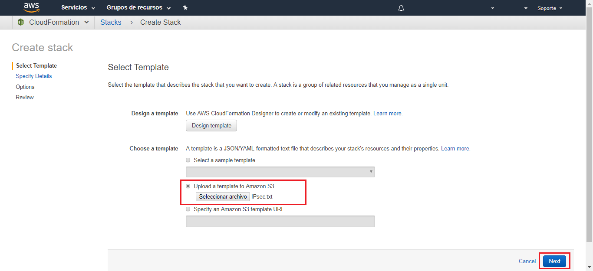
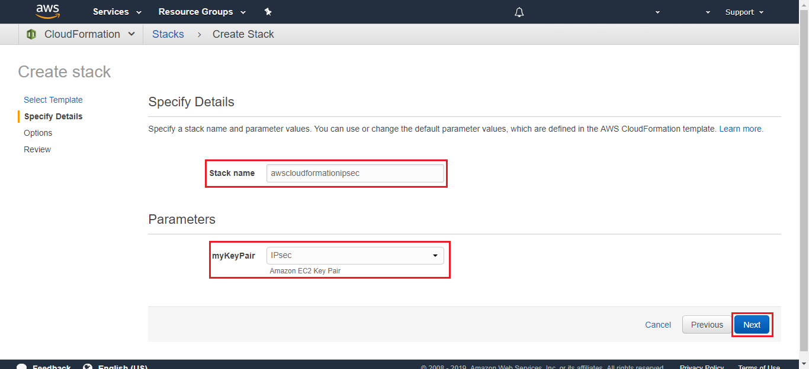
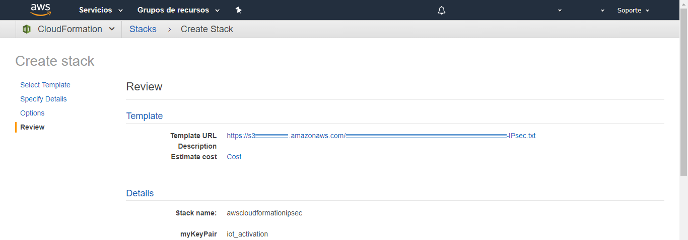
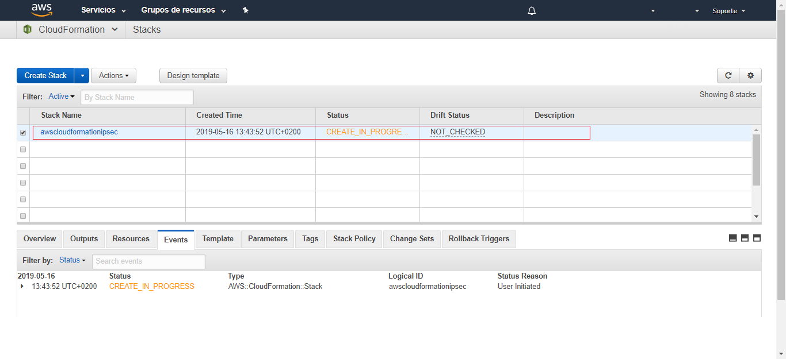

### Table of Contents
- [IPsec VPN one click away](#ipsec-vpn-one-click-away)
  * [AWS CloudFormation](#aws-cloudformation)
    + [EC2 Key Pair](#ec2-key-pair)
    + [Cloud Formation create new stack](#cloud-formation-create-new-stack)
    + [Download Configuration](#download-configuration)

# IPsec VPN one click away

if you prefer, you can configure the AWS IPsec following the next tutorial step by step.
But if this is not the case. We have this one click solution for you!!


## AWS CloudFormation

CloudFormation provides a common language for you to describe and provision 
all the infrastructure resources in your cloud environment.

It allows you to use a simple text file to build and rebuild your infrastructure.


### EC2 Key Pair

Before starting, you need create a Key Pair for secure access to the EC2 machine.

For it, go to EC2 AWS console / **NETWORK & SECURITY** / **Key Pairs**

and click on **Create Key Pair** button.


Type a Key Pair name:



A new .pem file is created. Use this file to connect EC2 machine using a SSH client.

[](#table-of-contents)

### Cloud Formation create new stack

To begin with, Go to CloudFormation Console:

Click on **Create Stack** button


In the new window that opens, fill the form with the [file](https://github.com/telefonicaid/iot-activation/tree/master/scripts/Cloud_Formation/IPsec.txt)



Click **Next**.

Choose a name for your Stack and select your EC2 Key Pair created in the previous step.

```
awscloudformationipsec
```



Click **Next**.

In the next window, you don't need to configure any options


Click **Next**.

Now the wizard shows you a stack review.




Click on the **Execute** button.

It can take several minutes for deploy all the services.



wait for a few minutes


Now, all you infrastructure are created. It just needs a last step.

[](#table-of-contents)


### Download Configuration

To Configure the IPsec connection with Telefonica's network you must send a configuration file.
This file can be download from AWS console.

Go to VPC console / **Virtual Private Network (VPN)** / **Site-to-Site VPN** / 
And Select your VPN connections


complete the information as in the image below and click **Download**


Amazon provide a redundant connection. You have to download and send the two VPN connection files.

