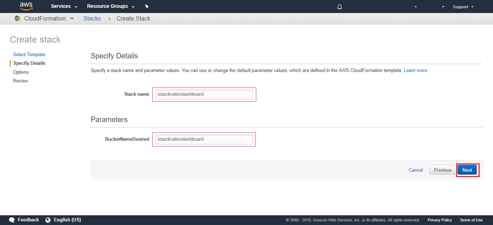
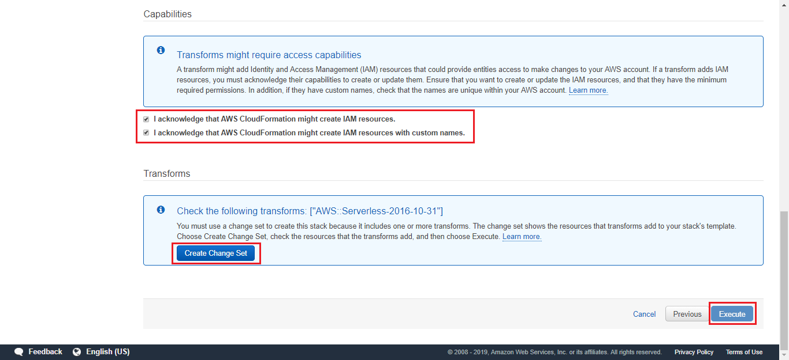
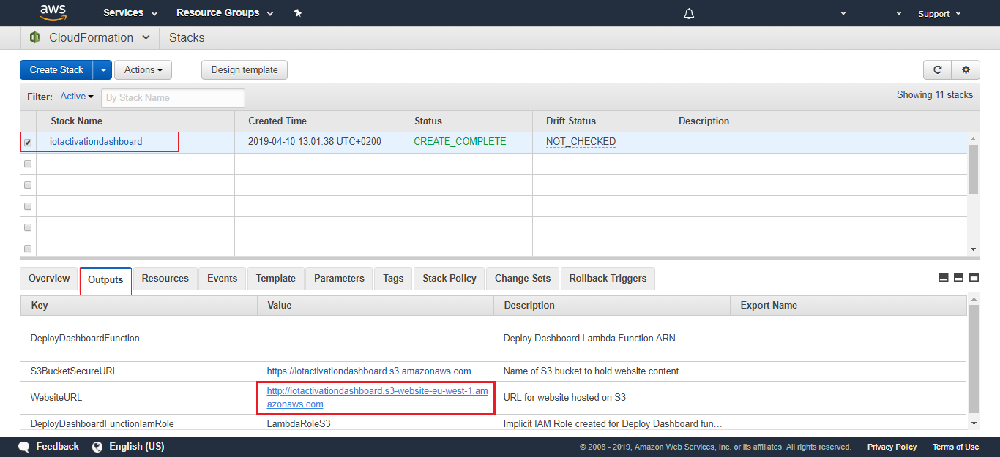

### Table of Contents
- [Display your dashboard](#display-your-dashboard-in-less-than-3-minutes-one-click-away)
  * [AWS CloudFormation](#aws-cloudformation)
  * [Freeboard](#freeboard)
    + [load a freeboard](#load-a-freeboard)


# Display your dashboard in less than 3 minutes. One click away!!

Storing your values in the shade is a great solution, but sometimes your clients become far more demanding.
In these cases, you need to develop a custom dashboard.

We've thought in this case. We have this one click solution for you!!


[](#table-of-contents)


## AWS CloudFormation

CloudFormation provides a common language for you to describe and provision 
all the infrastructure resources in your cloud environment.

It allows you to use a simple text file to build and rebuild your infrastructure.

To begin with, Go to CloudFormation Console:

Click on **Create Stack** button


In the new window that opens, fill the form with the link below:

```
https://s3-eu-west-1.amazonaws.com/lambda-for-deploy/cloud_formartion_freeboard.txt
```

In the link you can see a public s3 bucket with our CloudFormation template.


Click **Next**.

Select a name for your Stack and use the same for name your s3 bucket:

```
iotactivationdashboard
```



Click **Next**.

In the next window, you don't need to configure any options


Click **Next**.

Now the wizard will warn you about the capabilities. Just tick the boxes.

Finally, click on **Create Change Set**.



Click on the **Execute** button.

It can take several minutes for deploy all the services.


As a result, when it's finishes you will get a new link for display your dashboard.

Go to **Output** tab an click on the Website URL



You'll already have your freeboard created.


[](#table-of-contents)


## Freeboard

Freeboard is a simple dashboards for your devices.
It allow you build real-time, interactive dashboards and visualizations in minutes using the intuitive interface.


To add a new source, you must select and set up an AWS account and fill the fields with your broker and thing topic.


All you have to do is add new panes. Let your imagination fly!!!

[](#table-of-contents)


### load a freeboard

One simple example is the dashboard designed for this shadow.

```json
{
	"reported": {
		"raw": {
			"sensor1": 3,
			"text1": "TZEUXBZPZN",
			"sensor2": 76,
			"location": {
				"latitude": 40.431948,
				"longitude": -3.666315
			},
			"time": "Thu Mar 21 12:39:24 2019"
		}
	}
}
```


You can load it from this [file](https://github.com/telefonicaid/iot-activation/tree/master/scripts/AWS_Dashboard/freeboard.json)


In the same way, you can export your freeboard. It is an important step to recover your configuration. 
It is lost every time you refresh the web.

&#x1F4CD;
Be careful, you don't share this file. It contains your account access key.

[](#table-of-contents)

