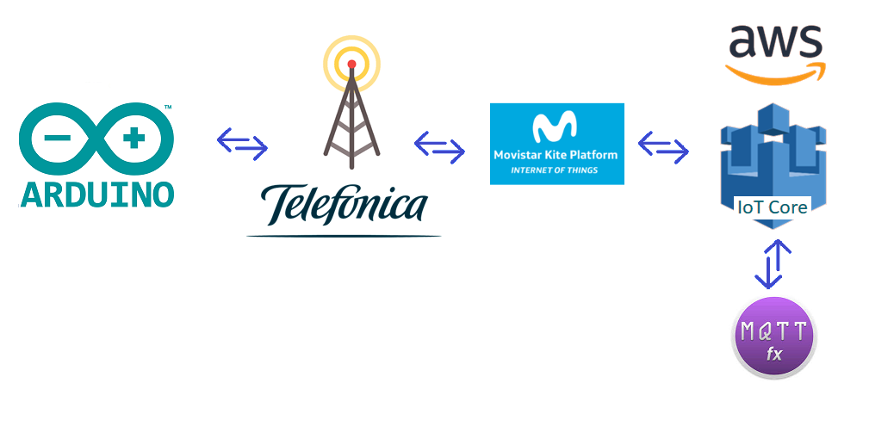
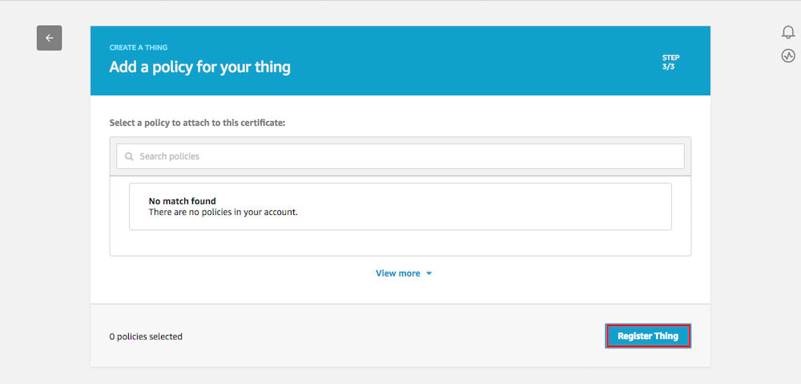
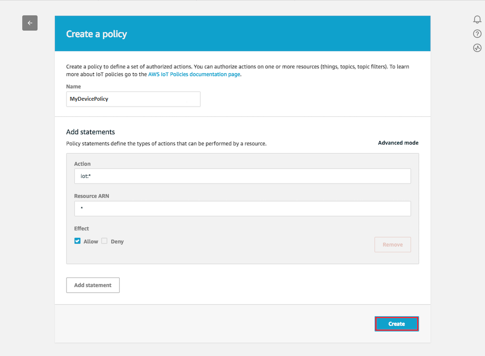
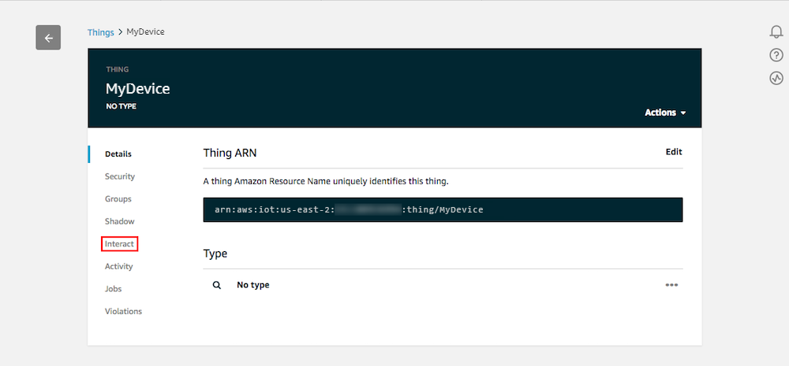
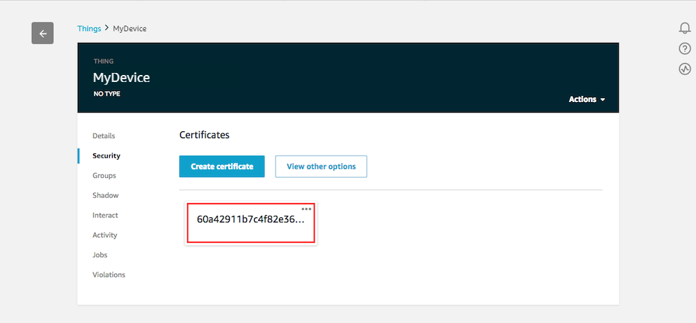
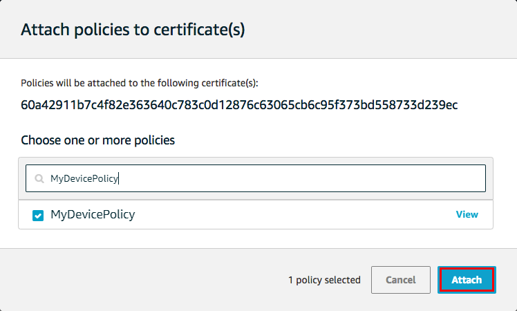
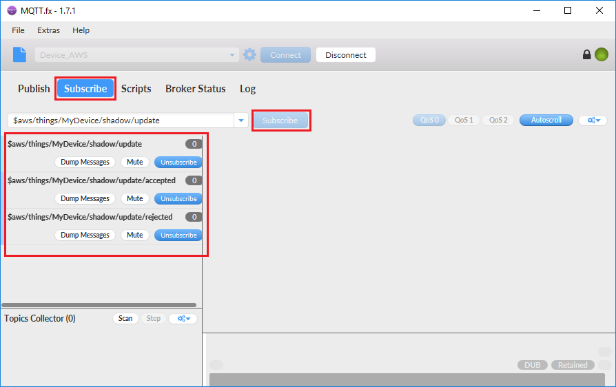
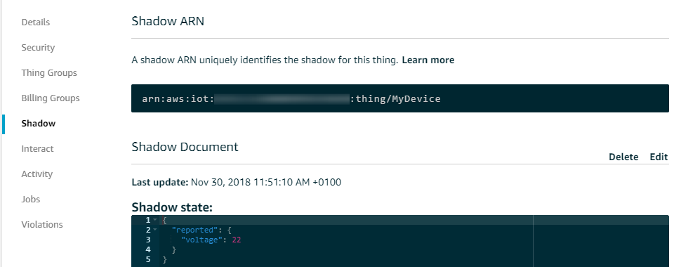
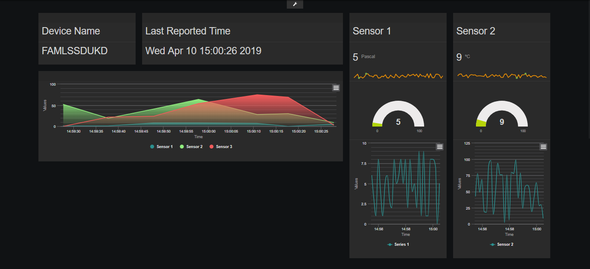

### Table of Contents

- [Arduino: MKR NB-1500 to AWS-IoT](#arduino-mkr-nb-1500-to-aws-iot)
  * [Getting started with the MKR NB-1500](#getting-started-with-the-mkr-nb-1500)
    - [What will you learn?](#what-will-you-learn)
    - [What will you need?](#what-will-you-need)
  * [Create a device thing in AWS-IoT](#create-a-device-thing-in-aws-iot)
  * [What is MQTT](#what-is-mqtt)
  * [How to communicate with AWS](#how-to-communicate-with-aws)
  * [Test your Certificates with MQTT.fx](#test-your-certificates-with-mqttfx)
- [How to Start with the project](#how-to-start-with-the-project)
  * [Arduino Board: Run a code file](#arduino-board-run-a-code-file)
  * [UDP data Bridge: Connecting using NB-IoT o LTE-M](#udp-data-bridge-connecting-using-nb-iot-o-lte-m)
  * [Check the Shadow](#check-the-shadow)
  * [Send a command](#send-a-command)
  * [Create your Dashboards](#create-your-dashboards)


# Arduino: MKR NB-1500 to AWS-IoT

For this project, we're going to use a Arduino board to take measures and publish their values in AWS.
You will also be able to send commands for turn the board led on/off.
 
<p align="center">
	  
</p>


## Getting started with the MKR NB-1500

The Arduino MKR NB 1500 adds wireless connectivity, Narrow Band IoT and LTE CAT M1, to the Arduino family. 
It is a  development board which contains the ATMEL SAMD21 micro controller, 
designed to integrate a low power-consumption core and a high performance.


#### What will you learn ?

- Control Arduino board MKR NB-1500 using the Arduino IDE
- Register a device on AWS
- Generate credentials for AWS
- Take measurements
- Build a bridge between UDP and AWS
- Send commands to the device


#### What will you need?

- Have successfully completed the Arduino [Starterkit tutorial](Arduino_StarterKit.md)
- Arduino board MKR NB-1500
- Micro USB cable
- Arduino IDE
- AWS account
- Telefónica SIMs with private APN [(IPsec)](BP_IPsec.md)
- [KITE Platform](Kite_Platform.md#access-step-by-step-using-the-curl-command) Certificates files
- Telefónica [data Bridge](BP_DataBridge.md)

If you had successfully completed the Arduino Starterkit tutorial, all the necessary software is already updated.

[](#table-of-contents)


##  Create a device thing in AWS-IoT

1. Sign in to the AWS Management Console, and then open the AWS IoT console at https://console.aws.amazon.com/iot

2. Go to the Monitor page. In the left navigation panel, choose Manage, and then choose Things.


3. You don't have a thing created yet. Choose Register a thing.


4. On the Creating AWS IoT things page, choose Create a single thing.


5. Enter a name for the device, leave the default values for all the other fields, and then choose Next.


6. Now you should generate the certificates.


7. Download your public and private keys, certificate, and root certificate authority (CA)on your PC. 


8. Download your root certificate authority, a new window will open for select a CA to download.


9. Don't forget to save these files, you need them to set the connection

10. Returns to the previous window and **Activate** 

11. Select **Attach a policy**


12. Close this window. Before, you need to create and attach a new policy to the certificate



13. Open the AWS IoT console again https://console.aws.amazon.com/iot

14. In the left navigation panel, choose **Secure**, and then choose **Policies**. 

15. Select **Create a Policy**


16. Enter a Name for the policy:
    - **Action**        enter **iot:***
    - **Resource ARN**  enter **\***
    - **Effect**        choose **Allow**
Select Create. This policy allows your Device to publish messages to AWS IoT.



17. In the AWS IoT console, choose **Manage**, **Things**. On the Things page, choose your Thing


18. On the thing's **Details** page, in the left navigation panel, choose **Interact**.
Make a note of the REST API endpoint. You need it to connect to your device shadow.



19. Now select **Security**, and choose the certificate that you created earlier. 



20. In Actions, choose Attach policy


21. Select your new policy and then choose Attach 



[](#table-of-contents)

## What is MQTT
MQTT is a machine-to-machine (M2M)/"Internet of Things" connectivity protocol.
It was designed as an extremely lightweight publish/subscribe messaging transport.

The first concept is the publish and subscribe system.
A device can publish a message on a topic,
or it can be subscribed to a topic to receive messages

AWS use this system to communicate with your devices.

Access to IoT Core in AWS Management Console and go to the left navigation pane. Select Manage, and then choose Things.

When you pick a thing you can find out the different topic that you can subscribe/publish

Select **Interact** to inspect them.

&#x1F4CD;
Don't forget to copy also the Rest API, you will need it as a broker address.


At the moment, you only need to know three topics:
- Publish in this topic to update the thing shadow
```
$aws/things/MyDevice/shadow/update
```
- Subscribe to this topic to check if the report was accepted
```
$aws/things/MyDevice/shadow/update/accepted
```
- Subscribe to this topic to check if the report was rejected
```
$aws/things/MyDevice/shadow/update/rejected
```

[](#table-of-contents)


## How to communicate with AWS

As you know, when you register a new device in AWS, his reserved Topics are created by default,
You can use these topics for send data and receive information from the shadow.

For the time being, you only need to know a couple of them:

- topic Update 
```
$aws/things/MyDevice/shadow/update
```
this topic is where you publish the status of the device for update the shadow,
in this tutorial this information is composed of values sent by the Arduino with the label **reported**

You'll also use the topic to communicate the desires to the shadow.
You must publish in the shadow like the Arduion, but using the label **desired.**
In this case we use MQTT.fx to communicate these desires to AWS and to report the change to the device.

- topic Delta
```
$aws/things/MyDevice/shadow/update/delta
```
This is the channel that AWS uses to communicate to the device 
the difference between the reported status and the desired status.
It is necessary that the device is subscribed to the topic.

All these status are recorded in the **shadow** of the device. 
To check the current status, you should access the AWS IoT core as we taught you at the previous section.

Here you have an example:

```json
{
  "desired": {
    "raw": "2"
  },
  "reported": {
    "raw": "{\"v\":34,\"a\":24}"
  },
  "delta": {
    "raw": "2"
  }
}
```

As you can read in the above example, there are three main keys:
- "desired": It contains the desired state sent from the MQTT.fx
- "reported": It contains the status information reported by the device
- "delta": It contains the differences between the reported status and the desired status. 
This is the information that is published in the delta topic.

[](#table-of-contents)


## Test your Certificates with MQTT.fx

One of the best ways to make sure that certificates had been created correctly, it is to try connecting via a 
MQTT client with graphical interface.

We recommend you download MQTT.fx from the following link https://mqttfx.jensd.de/

1. Open MQTT.fx and create a new connection.


2. Configure the broker as shown in the image below.
Remember to use the files you downloaded in the previous step. And configure the broker address associated to your device.


3. Now that you are connected to the broker, you need to subscribe to the topics accepted and rejected.

When a message is published, 
you can check in these topics if the message has been **accepted** or **rejected**.
```
$aws/things/MyDevice/shadow/update/accepted
$aws/things/MyDevice/shadow/update/rejected
```



4. To update your device's shadow, you should publish in the topic the following **json file**, 
you can use the following link to validate it https://jsonlint.com/

```
{
    "state": {
        "reported" : { 
            "voltage" : 22
        }
    }
}
```
This example simulates the publication of voltage measurements made by the device.



5. Select the topic to update your shadow.
Be sure to select the service quality level as QoS 0, amazon doesn't allow different police.
```
$aws/things/MyDevice/shadow/update
```


6. If you want to delete the shadow's document publish the next **json file**
```
{
    "state": null
}
```

7. Play with this, sending different values until you understand how it works.

&#x1F44D;
Remember to check if your values has been accepted or rejected

[](#table-of-contents)


# How to Start with the project

We will explain it to you later in detail. but in this tutorial,
first you need to be familiar with the following concepts

- Run a code file on your Arduino Board
- Run a python code
- Use MQTT.fx to post messages in a topic
- Review the shadow from AWS core

Now you can connect to the internet and send your data through the UDP protocol.

[](#table-of-contents)


## Arduino Board: Run a code file

For this Arduino project, it is necessary that you include some of the files that we have exclusively prepared 
for this tutorial. 

To do this, be sure to open the **.ino** file from the following 
[folder](https://github.com/telefonicaid/iot-activation/tree/master/scripts/Arduino/Connection_UDP_command). 
There are all the files that you will need.

In the following code you can check the main structure of the program:
1. Measuring
2. Modem connection to the network
3. Sending of the measures
4. Disconnection of the modem to reduce power consumption
5. Sampling timeout

```c
}

void loop() {
  // put your main code here, to run repeatedly:
    
  Serial.println("measuring...");
  data.measurement();
  Serial.print("- voltage: ");
  Serial.println(data.get_voltage());
  Serial.print("- amperage: "); 
  Serial.println(data.get_amperage());

  Serial.println("Sending... ");     
  nbAccess.noLowPowerMode();
  send_data_UDP(data.get_voltage(),data.get_amperage()); 
  nbAccess.lowPowerMode();
  
  delay(polling);
}
```
But first of all, don't forget to complete the configuration 
[file](https://github.com/telefonicaid/iot-activation/blob/master/scripts/Arduino/Connection_UDP_command/configuration.h)

You have to complete necessary information to connect to the UDP server.
```c
// COMPLETE your information
#define SECRET_PINNUMBER ""

#define LOCAL_PORT 4114
#define IP_ADDRESS "XX.XX.XX.XX"

// SET your sampling time
#define POLL_TIME 10

```
[](#table-of-contents)


## UDP data Bridge: Connecting using NB-IoT o LTE-M

One of the advantages of an iot device, is to be able to stop the connection when it is not necessary.
This option decrease the energy consumption. So, we suggest you, the deployment of a data bridge between the Arduino and the 
AWS IoT Core. 

Data Bridge will help you with the connection between UDP devices and the public clouds.
After the bridge deployment, it will gather your SIM information from KIte platform.
The data bridge recognizes the SIM and automatically and connects to the corresponding 
AWS MQTT broker based on the configuration you provide it.  

You just make sure to add the name of the thing as one of the fields of the SIM in Kite.
[Kite](Kite_Platform.md#sim-identification)

This [bridge](BP_DataBridge.md)
is the easiest way to connect to AWS using only one UDP send

&#x1F4CD;
If you're running the connection tests in The Thinx lab.
The SIM you use will not have connectivity with the Kite platform.
So you will not be able to use the connection through our Bridge. 
Even so you have access to the internet and you will be able to perform any test on your infrastructure.

```python
 logger.info("################################# waiting for a new message #################################")
 udp_msg, udp_ip = sock.recvfrom(1024)
 ip = udp_ip[0]

 logger.info("Message Received [ %s ] from [ %s ] : [ %s ]" % (udp_msg, udp_ip[0],udp_ip[1] ))

 response = bridge_routine(udp_msg, udp_ip[0], config_cloud)

 logger.debug("Generate ACK payload [ %s ]" % response)
 ack_msg = json.dumps(response)

 logger.info("Sent MESSAGE [ %s ] to [ %s ] : [ %s ]" % (ack_msg, udp_ip[0], udp_ip[1]))
 sock.sendto(ack_msg, udp_ip)
```

[](#table-of-contents)


## Check the Shadow

Before starting the execution you will check how your shadow is empty. 
With this Arduino script you can send voltage and current values to the shadow.
The shadow will be updated with every message received from the device. 

[](#table-of-contents)

## Send a command

To send a command to the device, you must use the MQTT as explained in the previous section through the json that we provide you.
You can change this instruction as many times as needed.

In this example you can turn on and off the small LED on the board, but you are unrestricted to program
your own instructions. Feel free!

- Turn on led
```json
{
	"state": {
		"desired": {
			"raw": 1
		}
	}
}
```
- Turn off led
```json
{
	"state": {
		"desired": {
			"raw": 2
		}
	
```

[](#table-of-contents)


## Create your Dashboards

Now, you can collect the information from your devices. But reviewing the data from the Shadow can be a tedious task.
The best option is to create a dashboard. It will allow you to visualize all the information.



There is a great availability of tools for this purpose. 
But some like freeboard, it can subscribe directly to the AWS topic.
If you want to learn how, click in the next [link](AWS_dashboard.md).

[](#table-of-contents)

