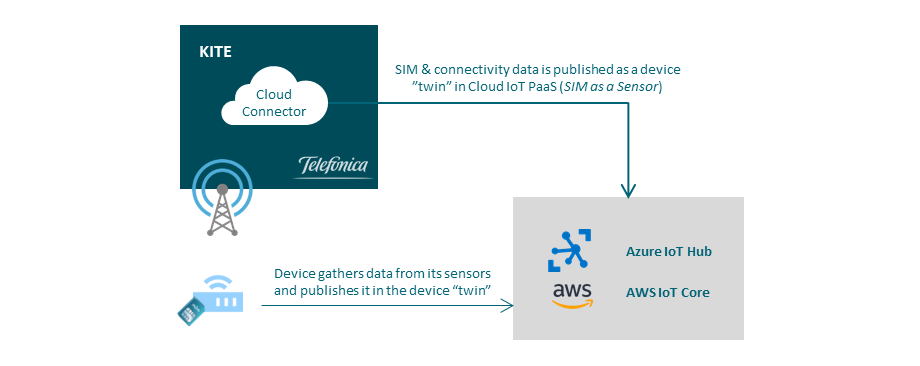

### Table of Contents

- [What is Cloud Connector?](#what-is-cloud-connector)
  * [Benefits of using Cloud Connector](#benefits-of-using-cloud-connector)
  * [Available information](#available-information)
  * [How to get it](#how-to-get-it)


# What is Cloud Connector?

Cloud Connector is a service that publish on different public cloud the SIM and
connectivity information available on the Kite Platform as your device does. 
It allows you to manage the information of your SIM's as a resource from your devices
With just a configuration change, network, consumption and location data can be sent to the Cloud



With some effort and imagination, you can do amazing things.


## Benefits of using Cloud Connector

- Integration cost and time reduction: customers don’t need to make complex integration between Kite and the Cloud platform.
- Unique information source
- Business logic built over network data:
  - Detect when a device is being used for another purpose than expected 
  - Device is having technical issues or poor performance
  - Cross information with other sources (operation systems, logistics, …)

[](#table-of-contents)


## Available information

The Kite Platform parameters set that are transferred to the public cloud platforms are:

- Level: named as "presenceLevel"
- IP
- Cause: named as "event"
- Timestamp
- Automatic Location: shown as "Latitude and Longitude" in the JSON
- APN
- Operator
- Daily Consumption: Voice (in seconds), Data in kB), SMS
- IMEI
- Comms Module Module
- Comms Module Manufacturer
- Life Cycle Status
- Activation Date
- Alias
- ICCID

Below is an example of the information dumped in the public cloud from the Kite
Platform:

```yaml
"reported": {
	"country": "ES",
	"commsModModel": "HUAWEI E3276s-150",
	"commsModManufacturer": "HUAWEI Technologies Co Ltd",
	"imei": "863781010957232",
	"iccid": "8952031422900140636",
	"alias": "8952031422900140636",
	"event": "ACCOUNTING_RADIUS_START",
	"dailyVoice": 0,
	"dailySMS": 0,
	"dailyData": 0,
	"apn": "mconnect.pre.telefonica.com",
	"lifeCycleStatus": "ACTIVATION_READY",
	"operator": "Telefonica Moviles España",
	"timestamp": 1560850561000,
	"activationDate": 1525947198000,
	"Latitude": 42.6217,
	"Longitude": -7.767138,
	"presenceLevel": "GPRS",
	"ip": "172.18.213.250"
}
```

&#x1F4CD;
The first time the SIM cards are registered in the Supervision group, all the
parameters are published in the public cloud, thereafter, only in case of any change.
There are no periodic updates of any parameter.

[](#table-of-contents)


## How to get it

Contact your Kite Provider and ask for it. Very soon you will be able to activate this service from your Kite platform.

If you already have the SIM cloud monitoring service available, you will have the option
to activate the service for all SIM cards you wants, by including them in a
Monitoring Group and activating Cloud Monitoring (ON mode).

[](#table-of-contents)

