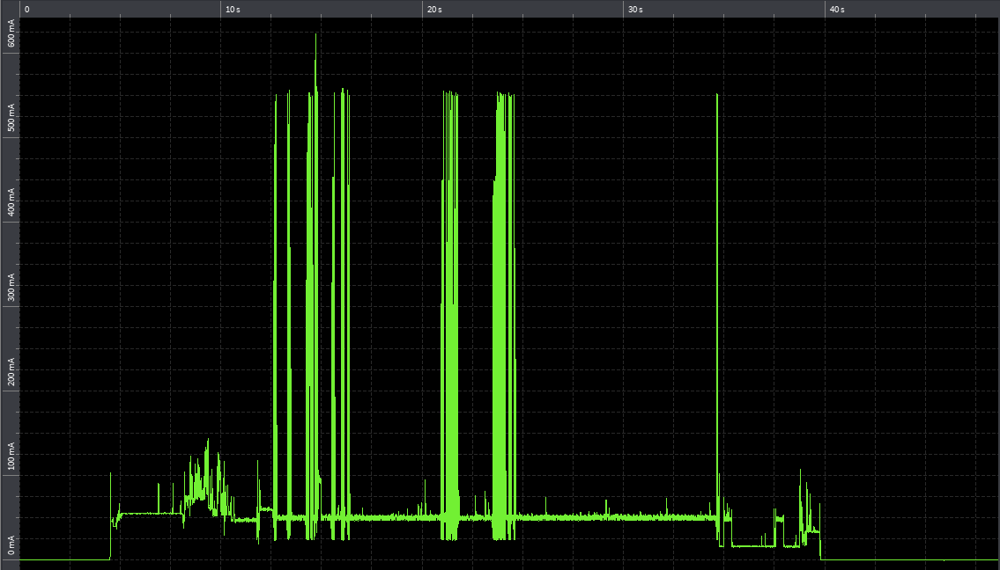

### Table of Contents

- [What is Data Bridge?](#what-is-the-data-bridge)
  * [Why do we need Data Bridge?](#why-do-we-need-the-data-bridge)
  * [What our bridge is already doing](#what-our-bridge-is-already-doing)
  * [What's it gonna do next?](#whats-it-gonna-do-next)
  * [What will you need?](#what-will-you-need)

# What is The Data Bridge?

Data Bridge is a Python script. It can be deployed in any machine as a server.
It enables the connection between public clouds IoT Core services and UDP messages.
As a result, It will send back a message to the device with the publish code.

## Why do we need the Data Bridge?

Among the communication protocols, MQTT is well known due to it is really easy to use and it secures the communication through a TLS context, although from the energetic perspective it is quite aggressive. You shouldn't choose between security and battery... so the Data Bridge will make your day :). 

We wanna show you a energy consumption comparison: We sent 300 bytes packet with the same device and the result looks as follows ...

<table>
  <tr>
	<th>
Consumption MQTT with TLS
</th>
	<th>
Consumption MQTT
</th>
	<th>
Consumption UDP
</th>
  </tr>
  <tr>
	<th>
		
	</th>
	<th>
		
	</th>
	<th>
		
	</th>
  </tr>
	<tr>
	<th>

			Secure data transfer  
			with high power consumption
</th>
	<th>

			Unsecured data transfer  
			(30% savings compared to TLS)
</th>
	<th>

			Security provided by Telefónica's network  
			(50% savings compared to MQTT + TLS)
</th>
  </tr>
</table>

## What our bridge is already doing

- It accesses to Kite Platform to retrieve your custom information (the device name and topic)
- It received a UDP message and it publishes in the Cloud.
- It returns a message with the process result and commands

## What's it gonna do next?

- Compatibility with other clouds
- Deploy your Bridge in One Click

## What will you need?

- A Linux instance on a Public Cloud
- Python Interpreter
- [KITE Platform](Kite_Platform.md#access-step-by-step-using-the-curl-command) Certificates files
- IpSec Service provided by Telefonica [(IPsec)](BP_IPsec.md)

&#x1F4CD;
For the time being, If you use a SIM from the Thinx, you will not have access to the Kite Platform.

### To continue with the installation select your Public Cloud

<table>
  <tr>
	<th>
		
	</th>
	<th>
		
	</th>
	<th>
		
	</th>
  </tr>
</table>

