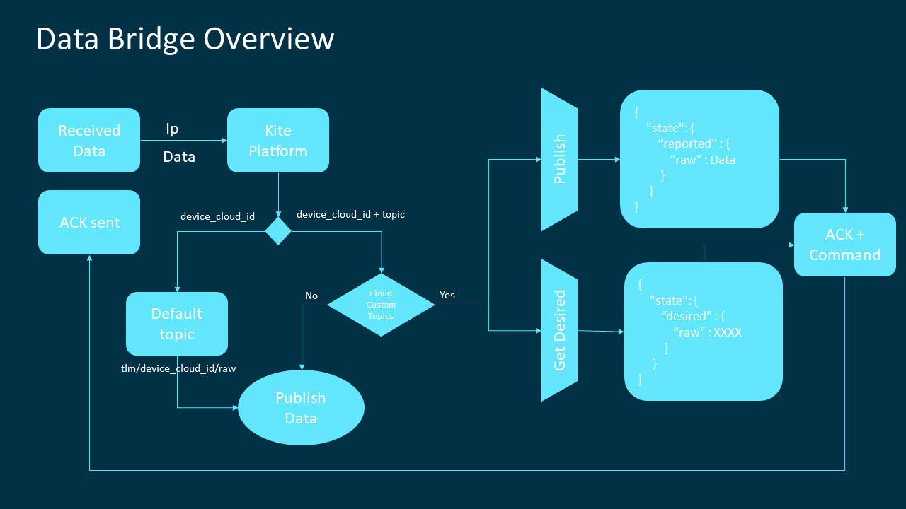
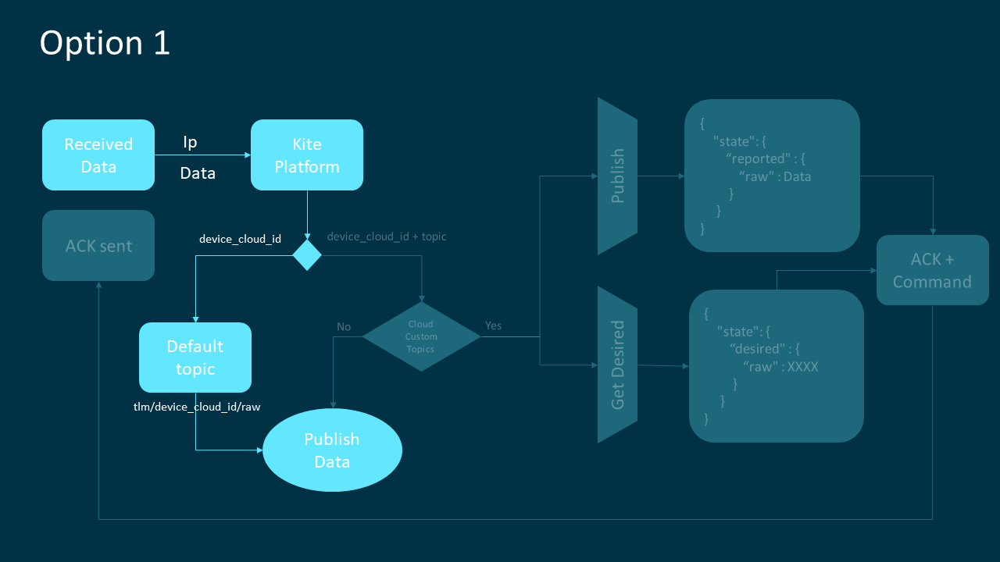

### Table of Contents

- [What is Data Bridge?](#what-is-data-bridge)
  * [What our bridge is already doing](#what-our-bridge-is-already-doing)
  * [What's it gonna do next?](#whats-it-gonna-do-next)
  * [What will you need?](#what-will-you-need)
  * [What it does?](#what-it-does)
    + [AWS Options](#aws-options)
    + [Responses codes](#responses-codes)
- [Deploy and defend your Bridge!](#now-deploy-and-defend-your-bridge)
  * [How to configure it](#how-to-configure-it)
    + [Configure the Cloud](#configure-the-cloud)
    + [Configure the UDP socket](#configure-the-udp-socket)
    + [Configure the Kite Platform connection](#configure-the-kite-platform-connection)
    + [AWS Configuration file](#aws-configuration-file)
  * [How to run it](#how-to-run-it)


# What is Data Bridge?

Data Bridge is a program written in python that can be executed in any machine as a server,
that allows you the possibility to connect directly to the Cloud only sending a UDP message. 
 
When the Bridge starts running, it will establish a UDP socket and will keep listening continuously 
for any UDP messages sent to this IP address using a configured port.
Using the same connection to return a response with the result of the procedure.

In addition the Bridge will use the Kite access to determine the identity of the device and decide the publishing option.

But if you continue reading you will appreciate all the work that the Bridge can do for you.

## What our bridge is already doing

- It accesses Kite Platform to retrieve your custom information (the device name and topic)
- It uses the IP address device to connect to the Cloud
- It publishes in AWS the message received through UDP message
- It returns an answer with the result of the publication
- It receives commands from the cloud
- A Telefonica network and your own security VPN

## What's it gonna do next?

- Compatibility with other clouds
- It will have more versatility in identifying problems.
- Better integration with Kite Platform 

## What will you need?

- Server with Python 2.7 and Static IP (We've used an Amazon EC2 Instance)
- Python libraries:
  - socket
  - json
  - yaml
  - paho.mqtt.client
  - ssl
  - requests
  - boto3 (AWS)
- [KITE Platform](Kite_Platform.md#access-step-by-step-using-the-curl-command) Certificates files
- A Telefonica Internet Protocol security [(IPsec)](BP_IPsec.md)

If you use a SIM from the Thinx laboratory you will not have access to the Kite Platform.

[](#table-of-contents)

## What it does?

You can review the following flow chart, but you will understand it better if you read our comments we have written for you.



Each time you receive a UDP datagrams , it will be accompanied by the sender ip address of. 

**Why we need IPsec?**

As you know every device connected to the internet needs an IP address, being necessary that this IP is unique for each device. 
And without many accounts it is easy to conclude that if this were true there would not be enough addresses for all devices in the world.

with a 32-bit for each address only 4,294,967,296 devices could be connected. A ridiculous number for the current size of the internet.
The NAT protocol (Network Address Translation) was created to find a solution.

**How NAT works?**

When a packet leaves your device for the internet it has an IP address that belongs to a smaller network. 
So this address is translated to an IP valid for the Internet.

When the next machine receives this packet, it identifies the new IP as	 the packet origin.

**How to solve it?**

The solution is to create a virtual network to which both the source and destination machines belong, 
so that both machines can identify each other using their IP address.
And as you have deduced this is possible thanks to the IPsec protocol.


The Bridge uses this ip to identify the SIM from which the information comes and retrieves the information provided in Kite.
To do this you must inform the Custom Field of the SIM:
- Field 1 : Device Name (required)
- Field 2 : name of the topic in which you want to publish (optional)

Depending on the content of the fields the Bridge will act differently. 

To choose between the different options you just have to configure the information of the SIM in the [Custom Field](Kite_Platform.md#sim-identification)

:heavy_exclamation_mark: The device name must always be. If it is not given, an error code will be returned, 
because in this way we do not know the device of the Cloud in which we want to publish.

Here you have a list with the different options to configure the information in Kite Platform:

### AWS Options:

- [AWS Option 1: publish in a default topic](#aws-option-1-publish-in-a-default-topic)
- [AWS Option 2: publish in a custom topic](#aws-option-2-publish-in-a-custom-topic)
- [AWS Option 3: publish in the shadow](#aws-option-3-publish-in-the-shadow)

#### AWS Option 1: publish in a default topic

This option is the easiest to configure. Just leave the second fields empty, and the Bridge will do all the work.

The default topic has this structure:  **tlm/<DEVICE_NAME_IN_KITE>/raw**




#### AWS Option 2: publish in a custom topic

Use the second field to write in the topic in which you want to publish the information.


#### AWS Option 3: publish in the shadow

If you are using AWS as a cloud to connect your devices and you want to use shadow systems, this is undoubtedly your choice.

The configuration is quite simple, just identify the topic update of your device and copy it into the second custom field.
The structure will be similar to that of the next topic: **$aws/things/<DEVICE_NAME_IN_KITE>/shadow/update**

The bridge will quickly detect that this is an AWS reserved topic and will implement the appropriate logic for the connection. 

The data sent will be published in the shadow in the **raw** field as shown in the following example.

```json
{  
  "reported": {
    "raw": "<MESSAGE SENT HERE>",
  }
}
```

In addition to the connection, the Bridge will subscribe to the Accepted and Rejected topics. 
In this way you will be able to control if the publication has been done correctly or has been rejected by the broker.

Another advantage of using the AWS shadow is the interaction with the device, 
as it allows to retrieve shadow information, allowing the reception of commands.
because next to the response code, the contents of the field **delta**  in the shadow will be returned in json format.


##### What happens if we publish in a thing that doesn't exist?

Absolutely nothing! The Bridge will create it before publishing so you don't have to.
It will create a new thing from the given name of high the Kite.

But if you still tell them to create it manually you can follow these [steps](AWS_create_new_thing.md)

[](#table-of-contents)


### Responses codes

Whenever a message is received the Bridge will return a code indicating the status.

By means of the following list of codes we try to reflect all the possible situations that could happen.

| **CODE**  | **MSG** |
| :---:  | :---  |
| 200 | OK: msg published accepted |
| 401 | ERROR: Try to publish in an unauthorized topic |
| 404 | ERROR: connection with Kite not established |

[](#table-of-contents)

# Now, Deploy and defend your Bridge!

## How to configure it

We have tried to make this as simple as possible.

So you'll only need to fill in a few fields in the configuration file  [Configuration.yaml](../scripts/Data_Bridge/config/Configuration.yaml)


### Configure the Cloud

This parameter is used to identify the cloud and select the configuration file. 
At the moment only the AWS connection is available, but we cannot predict the future...

```yaml
cloud: AWS
```

allowed values:
- AWS

### Configure the UDP socket

Here you can choose the port through which you will receive the UDP frames and the ip of the source device.

```yaml
UDP:
  ip: "0.0.0.0"
  port: 4114
```
allow any address

allowed values:
- ip: "0.0.0.0"    (allow any address)
- ip: "X.X.X.X"	   (restrict to a single address)

### Configure the Kite Platform connection

This parameter allows you to select the files the certificates to access the Kite Platform.

```yaml
KITE:
  url: "https://m2m-api.telefonica.com"
  path: "CA/"
  certificate: "your_customer_certificate.cer"
  private_key: "your_customer_certificate.key"

```
Make sure both the path and file name are correct.

Also verify that the address of the urls matches the one of your access to Kite

[](#table-of-contents)


### AWS Configuration file

Even if it is possible to modify all the parameters, this is not necessary, since some of them are predefined for AWS.

Here is an example of a configuration file for Amazon Web Services connection 
[Configuration_AWS.yaml](../scripts/Data_Bridge/config/Configuration_AWS.yaml)

```yaml
cloud: AWS
region: "xx-xxxx-x"
IAM_user:
  access_key: "XXXXXXXXXXXXXXXXXXXX"
  secret_key: "xxxxxxxxxxxxxxxxxxxxxxxxxxxxxxxxxxxxxxxx"
MQTT:
  topic:
    update: "$aws/things/<DEVICE_NAME>/shadow/update"
    default: "tlm/<DEVICE_NAME>/raw"
    log_device: "log/device/provision/new"
    reserved: "$aws"
```

The file is quite intuitive, however here you can see carefully how to configure each section

#### Server configuration

```yaml
cloud: AWS
region: "xx-xxxx-x"
``` 
the cloud only assists the developer, in case it was completed incorrectly, the Bridge would correct it.  
However, you must indicate the location of the server you are using in AWS.


#### Topic configuration

Optionally as part of the code library is included the publication in the shadow using the protocol MQTT. 
Since to simplify access to the cloud has been used AWS development library for python.

So if you want you can modify the source code to make the access through MQTT.

At the moment you only have to keep the fields as is

```yaml
MQTT:
  topic:
    update: "$aws/things/<DEVICE_NAME>/shadow/update"
    default: "tlm/<DEVICE_NAME>/raw"
    log_device: "log/device/provision/new"
    reserved: "$aws"
```
- update: this topic is the specific of AWS. It doesn't make any sense to modify it. 
- default: configure this field to select the default topic name
- log_device: topic name in which the new things creations are reported
- reserved: this parameter indicates that the name is a AWS standard topic.


## How to run it

Now that you know how to configure the parameters, use it !!!.

If you have faithfully followed the steps of the IPsec tutorial, right now you will have an instance of an EC2 machine 
where you can run your Bridge.

Although first it will be convenient to assign permissions to the instance to access your AWS account.

To create an IAM role using the IAM console

1. Open the IAM console at https://console.aws.amazon.com/iam/.
2. In the navigation pane, choose Roles, Create role.
3. On the Select role type page, choose EC2 and the EC2 use case. Choose Next: Permissions.
4. On the Attach permissions policy page, select an AWS managed policy that grants your instances access to the resources that they need.
5. On the Review page, type a name for the role and choose Create role.

To attach an IAM role to an instance that has no role, the instance can be in the stopped or running state.

1. Open the Amazon EC2 console at https://console.aws.amazon.com/ec2/.
2. In the navigation pane, choose Instances.
3. Select the instance, choose Actions, Instance Settings, Attach/Replace IAM role.
4. Select the IAM role to attach to your instance, and choose Apply.

Now you can download the [Bridge code](../scripts/Data_Bridge)

Place the files in it and execute with the following command

```
sudo nohup python main.py &
```
- **sudo** Execute the instruction as if you were the administrator.
- **nohup** It'll keep running even when you close the session.
- **python main.py** will execute the code

Example of the contents of a log file
```
2019-01-28 17:25:32,803 - INFO : ################################# waiting for a new message #################################
2019-01-28 17:26:38,640 - INFO : Message Received [ {"v":33,"a":28} ] from [ 10.5.0.5 ] : [ 4114 ]
2019-01-28 17:26:39,065 - INFO : KITE Response status code [ 200 ]
2019-01-28 17:26:39,066 - INFO : GET information related to [ 10.5.0.5 ] from  KITE Platform
2019-01-28 17:26:39,066 - INFO : Found device cloud name [ MyDevice ] and topic [  ] in KITE Platform
2019-01-28 17:26:39,066 - INFO : Select Option 1: DEVICE [ MyDevice ] and DEFAULT TOPIC
2019-01-28 17:26:39,066 - INFO : Publish message [ {"v":33,"a":28} ] into topic [ tlm/MyDevice/raw ]
2019-01-28 17:26:39,468 - INFO : Publish Accepted code [ 200 ]
2019-01-28 17:26:39,468 - INFO : Sent MESSAGE [ {"msg": "OK: msg published", "code": 200} ] to [ 10.5.0.5 ] : [ 4114 ]
2019-01-28 17:26:39,468 - INFO : ################################# waiting for a new message #################################
2019-01-28 17:39:29,432 - INFO : Message Received [ aaa ] from [ 84.78.20.223 ] : [ 19117 ]
2019-01-28 17:39:29,910 - INFO : KITE Response status code [ 204 ]
2019-01-28 17:39:29,910 - INFO : GET information related to [ 84.78.20.223 ] from  KITE Platform
2019-01-28 17:39:29,910 - INFO : Sent MESSAGE [ {"msg": "ERROR: connection with Kite not established", "code": 404} ] to [ 84.78.20.223 ] : [ 19117 ]
```

[](#table-of-contents)