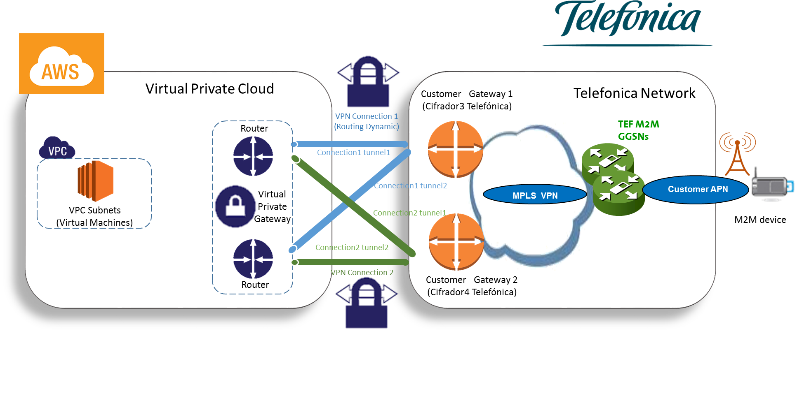
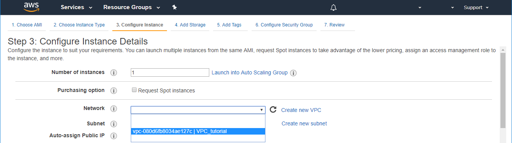
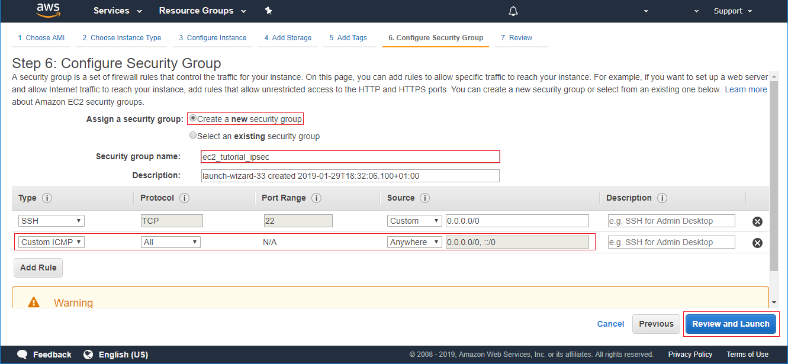
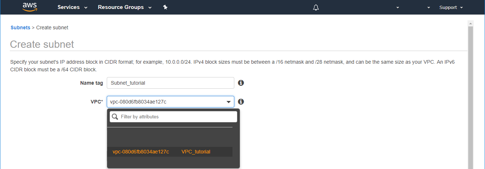
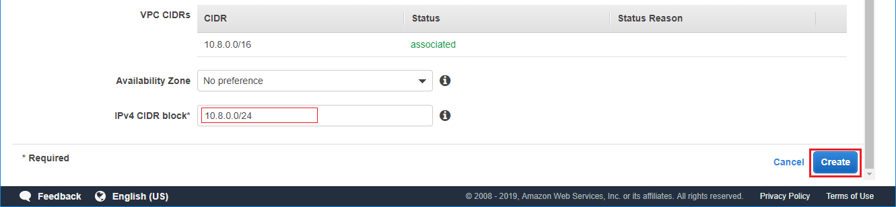
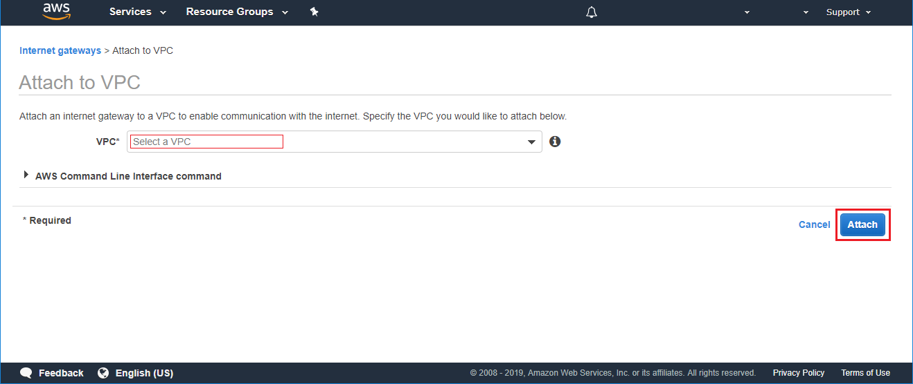
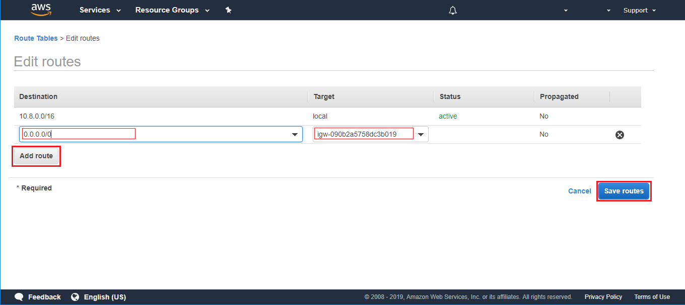

### Table of Contents

- [What is IPsec?](#what-is-ipsec)
  * [What will you need?](#what-will-you-need)
  * [What does it do?](#what-does-it-do)
- [How to make your own IPsec VPN!](#how-to-make-your-own-ipsec-vpn)
  * [Request private APN to Telefónica](#request-a-private-apn-to-telefónica)
  * [IPsec step by step in AWS](#table-of-contents-ipsec-in-aws)

# What is IPsec?

IPsec is one of the most important security protocols. It was created to provide security in network and in transport layer.
It guarantees the security using both TCP and UDP protocols.

IPsec protects data flows between two security gateways. It allows two networks to be connected.
It also includes a series of protocols to establish authentication between networks.

Its main purpose is to create a Private Networks (VPN).

## What will you need?

- Telefónica SIM with private APN (IPsec)
- A Cloud machine with IPsec tunnel

## What does it do?

When you request your SIMs from Telefónica, you can ask for a private APN. This APN includes your SIMs in a new network.
The goal is to establish a direct connection between the new network and your network.

The IPsec guarantee that two networks work as one. It provides a secure connection between them.

# How to make your own IPsec VPN!

We believe in the importance of your data, for this reason we want to provide you a secure network.

## Request a private APN to Telefónica

We assume that because you are following this tutorial with us, you are interested in connecting your devices through Telefónica's network.

It is important for you to know that when you request for new SIM's you can ask for the creation of your own APN (Access Point Name).

This new APN can be set to have its own IP's range. This range cannot correspond to your own network. 
An example of networks that you can request are the following:

- Class A: up to 16777215 devices xxx.0.0.0/8
- Class B: up to 65535 devices    xxx.xxx.0.0/16
- Class C: up to 255 devices      xxx.xxx.xxx.0/24

Where you can choose a desired range: **192.164.0.0/24** 

This range includes the IP address from 192.164.0.0 to 192.164.0.255 .

In addition to the range you must provide to Telefónica the internet gateways configuration.

This setting will depend on your public cloud:

  * [IPsec step by step in AWS](#table-of-contents-ipsec-in-aws)

Other clouds tutorials in development ...

## IPsec step by step in AWS

#### Table of Contents IPsec in AWS
- [Configure IPsec step by step in AWS](#configure-ipsec-step-by-step-in-aws)
  * [1. Create VPC](#1-create-vpc)
  * [2. Create VPG](#2-create-vpg)
    + [2.1. Attach VPG to VPC](#21-attach-vpg-to-vpc)
  * [3. Enable propagation of routes from VPG](#3-enable-propagation-of-routes-from-vpg)
    + [3.1. Edit Route Table](#31-edit-route-table)
  * [4. Create 2 Custom Gateway](#4-create-2-custom-gateway)
  * [5. Create 2 VPN Connection](#5-create-2-vpn-connection)
    + [5.1. Download Configuration](#51-download-configuration)
  * [6. Create an EC2 instance](#6-create-an-ec2-instance)
    + [6.1. Launch EC2 instance](#61-launch-ec2-instance)
    + [6.2. Enable Internet Connection EC2 instance](#62-enable-internet-connection-ec2-instance)

# Configure IPsec step by step in AWS

In the Amazon nomenclature the client servers are located in the virtual machines of the client's Virtual Private Cloud, 
while Telefónica's network will act as "Local Network".

On Amazon, IPsec tunnels are created using VPN Connections. When a VPN connection is created between the Virtual Private Gateway
and the Customer Gateway (Telefónica Encrypter)
automatically assigns two public IPs to its VPG which will be the peer IPsec on the Amazon side.

Amazon provide a redundant connection. In other words, you'll need create two gateways.

For more details see the following diagram

The following tutorial intends to be a simple guide to configure the IPsec between an EC2 machine and your pool of SIMs 
from the Telefónica's network.

## 1. Create VPC

**What Is Amazon VPC?**

Amazon Virtual Private Cloud (Amazon VPC) enables you to launch AWS resources into a virtual network.
This virtual network closely resembles a traditional network that you'd operate in your own data center.

Go to **VPC Dashboard / Virtual Private Cloud / Your VPCs /** Select: **Create VPC**

Fill in the fields:

**Name tag:** Select a name for identify your VPC in the next steps

**IPv4 CIDR block:** Select your network range. It must not match the range of your SIM pool

Click on create.

Now you can see the new VPC

## 2. Create VPG

Go to **VPC Dashboard / Virtual Private Network / Virtual Private Gateway /** Select: **Create Virtual Private Gateway**

**Name tag:** Select a name for identify your VPG in the next steps

Click on **create**.

Now you can see the new VP Gateway

Now you can check the VPG status and read in red **detached**

### 2.1. Attach VPG to VPC

On the previous screen 
**VPC Dashboard / Virtual Private Network / Virtual Private Gateway**

Select your VPG: 
**Actions** button / Select: **Attach to VPC**

Select your VPC **Name tag**

Click on **Yes, Attach**

Wait a moment until it appears **attached**

## 3. Enable propagation of routes from VPG

This means that in your VPC the routes to our local network automatically point to the Virtual Private Gateway:

### 3.1. Edit Route Table

To enable instances in your VPC to reach your customer gateway, you must configure your route table to include 
the routes used by your VPN connection. They have to point to your Virtual Private Gateway.
You can enable route propagation for your route table to automatically propagate
those routes to the table for you.

Go to **VPC Dashboard / Virtual Private Cloud / Route Tables**

Select the table with your VPC and in the bottom menu select the tab:

**Route Propagation / Edit route propagation**

A new window opens to activate it

Click on **Save**

Now you can see route propagate to **YES**

## 4. Create 2 Custom Gateway

To be able to connect to the Telefónica network it is necessary to establish 2 Gateway with the 2 Telefónica's encrypters.

Go to **VPC Dashboard / Virtual Private Network (VPN) / Customer Gateway /** Select: **Create Customer Gateway**

fill in the fields with the following information:

- **Encrypter3:**
  - Name: TEF_Cifra3
  - Routing: Dynamic
  - BGP ASN: 3352
  - IP Address: 213.0.185.6

- **Encrypter4:**
  - Name: TEF_Cifra4
  - Routing: Dynamic
  - BGP ASN: 3352
  - IP Address: 213.0.185.8

Once the Customers Gateway corresponding to the Telefónica's encrypters have been created, they appear as shown below:

## 5. Create 2 VPN Connection

You must create a VPN connection for each of the two customer gateways corresponding to Telefónica's two encryption devices.

Go to **VPC Dashboard / Virtual Private Network (VPN) / Site-to-Site VPN /** Select: **Create VPN Connection**

**Name tag:** Select a name for identify your VPC connection in the next steps

**VPG** Select your VPN Gateway attached to your VPC

**Customer Gateway** Existing

**Customer Gateway ID** Select each of the two Customers Gateway created

**Routing Options** Dynamic

- for the **first** VPN connection:

**Inside IP CIDR for Tunnel 1**  169.254.30.0/30

**Inside IP CIDR for Tunnel 2**  169.254.30.4/30

- and for the **second** VPN connection:

**Inside IP CIDR for Tunnel 1**  169.254.40.0/30

**Inside IP CIDR for Tunnel 2**  169.254.40.4/30

Click on **Create VPN Connection**

Now you can read in the tab **Tunnel Detail** the status in red **DOWN**

This will hold, until you contact to Telefónica and send them the configuration.

### 5.1. Download Configuration

Amazon offers you the possibility to download a configuration file for the Customer Gateway.
You will need provide this file to Telefónica.

Clicking on each encrypter, select the tab **Download Configuration** and fill like the following example

You keep these two files that they are necessary to configure the other tunnel end.

## 6. Create an EC2 instance

Amazon Elastic Compute Cloud (Amazon EC2) is a web service that provides secure, resizable compute capacity in the cloud. 
It is designed to make web-scale cloud computing easier for developers.

### 6.1. Launch EC2 instance

Go to EC2 Dashboard / Instances / Instances / Select: **Launch Instance**

**Step 1:** Choose the SO

Click **Next**

**Step 2:** Choose the machine size

Click **Next**

**Step 3:** Configure the machine connection

**Network** Select your VPC

**Subnet** Create a new Subnet (look like y the next step 6.1)

**Auto-assigns Public IP** Enable

Click **Next** until Step 6

**Step 6:** Open a Port to test the connection 

**Assign a security group** Create a new security group

**Security group name** Select a name for identify your Security group in the next steps

**Add Rule** Custom ICMP like the picture for enable the ping response

### 6.1.a Create Subnet

**Name tag** Select a name for identify your Subnet in the next steps

**VPC** Select your VPC

**IPv4 CIDR block** use the same IP range but choose a smaller mask

Click on **Create**

Now your machine is running, but it is connected to a virtual network. You must configurate an internet gateway

### 6.2. Enable Internet Connection EC2 instance

Go to VPC **Dashboard / Virtual Private Cloud / Internet Gateway /** Select: **Create internet gateway**

**Name tag** Select a name for identify your Subnet in the next steps

Click on **Create**

Now select the Internet Gateway and select **attach to VPC** on Actions tab

**VPC** Select the VPC

Click on **Attach**

Now you have access to an internet gateway, you only have to modify the rules of the gateway to allow traffic.

Go to **VPC Dashboard / Virtual Private Cloud / Route Table /** Select the route table of the VPC

On the tab **Routes** click on **Edit Routes**

Add a new route with the interface 0.0.0.0/0
and select the internet gateway like target.

