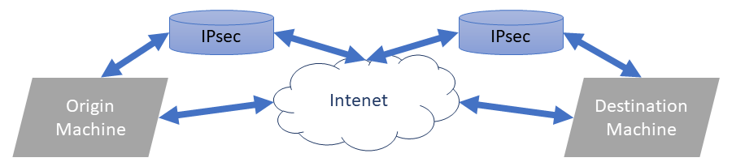

### Table of Contents

- [What is IPsec?](#what-is-ipsec)
- [Why we need IPsec?](#why-we-need-ipsec)
  * [How NAT works?](#how-nat-works)
  * [How to solve it?](#how-to-solve-it)
- [How to make your own IPsec VPN!](#how-to-make-your-own-ipsec-vpn)
  
  
# What is IPsec?

IPsec is one of the most important security protocols, being created to provide security in network and transport layer. I in both TCP and UDP protocols

It's main use is to create Private Networks (VPN).

# Why we need IPsec?

As you know every device connected to the internet needs an IP address, being necessary that this IP is unique for each device. 
And without many accounts it is easy to conclude that if this were true there would not be enough addresses for all devices in the world.

with a 32-bit for each address only 4,294,967,296 devices could be connected. A ridiculous number for the current size of the internet.

The NAT protocol (Network Address Translation) was created to find a solution.

## How NAT works?

When a packet leaves your device for the internet it has an IP address that belongs to a smaller network. 
So this address is translated to an IP valid for the Internet.

When the next machine receives this packet, it identifies the new IP as	 the packet origin.

## How to solve it?

The solution is to create a virtual network to which both the source and destination machines belong, 
so that both machines can identify each other using their IP address.
And as you have deduced this is possible thanks to the IPsec protocol.

# How to make your own IPsec VPN!

We believe in the importance of your data and the need to provide a safe network.
For this reason, we provide all the necessary steps for you to create your own network

## To start you need:

soon..

