### Table of Contents

- [This is KITE!](#this-is-kite)
- [Quick view to Kite Grafic Interface](#quick-view-to-kite-grafic-interface)
  * [Manage your SIMs](#manage-your-sims)
    + [SIM inventory](#sim-inventory)
      - [SIM inventory bottom menu](#sim-inventory-bottom-menu)
        * [Assign lines to subscription group](#assign-lines-to-subscription-group)
        * [Change life cycle state](#change-life-cycle-state)
        * [Activate data traffic](#activate-data-traffic)
    + [SIM details](#sim-details)
  * [Commercial Management](#commercial-management)
- [What is Kite Platform API?](#what-is-kite-platform-api)
  * [How to access Kite Platform API?](#how-to-access-kite-platform-api)
    + [Extract your credentials files](#extract-your-credentials-files)
    + [Access API using a command](#access-api-using-a-command)
- [How it's made!](#how-its-made)
    + [How Activate Location Service](#how-activate-location-service)

[](https://www.youtube.com/watch?v=Kr5aICVJxSA)


# This is KITE!
Kite Platform improves productivity globally in the M2M sphere, providing tools to
manage your devices connectivity.
Among these tools are:
- SIM card management, display and management of its parameters through the
inventory, activation and other administrative changes.
- Line assignment or migration to different commercial plans
- Pre-bill invoices inquiries
- Users and organizations management
- Alarms and reports management
Among the tools provided by Kite Platform, are a few APIs used for the integration of
the product functionalities in the Customer's systems. Those APIs description is
available in the Help menu in the web portal.


# Quick view to Kite Grafic Interface

The grafic interface of Kite is organized as shown in the following figure.


- 1 Configuration menu
- 2 Main menu
- 3 Work area


[](#table-of-contents)

## Manage your SIMs

### SIM inventory

you can use the search engine of the platform to locate a SIM by copying its ICC number in the bar

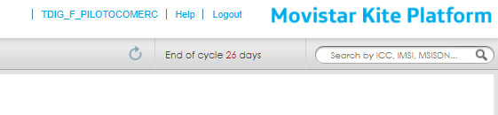

or you can access the SIM inventory, where you can locate and manage all your cards

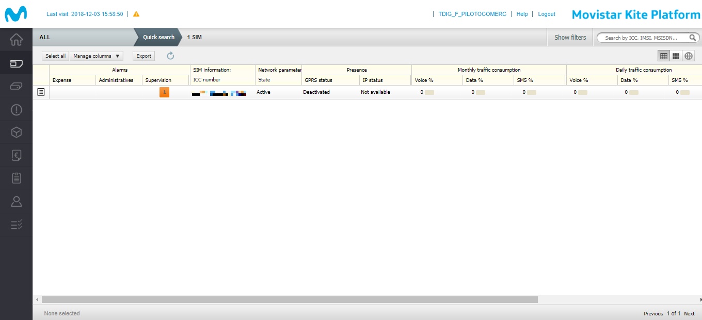

To see the details of each of the SIM, double click on each of them to view SIM details,
or simply select one or several to activate the bottom menu


In the image above you can check the current status of your SIMs within their life cycle.

Some of them may be deactivated, and you may need to change their status. In the next step we will show you how to check that a SIM is operational.

#### SIM inventory bottom menu


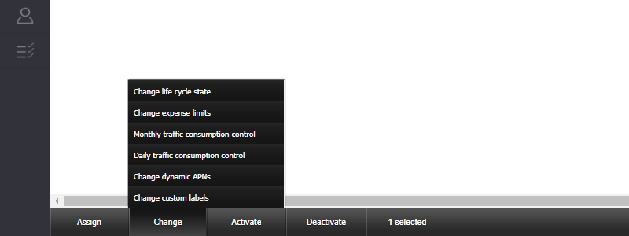
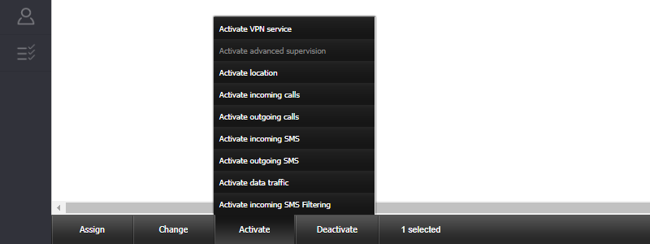


##### Assign lines to subscription group
First of all, your SIM must be assigned to a subscription group. 
If this is not the case you should contact your local SIM distributor.

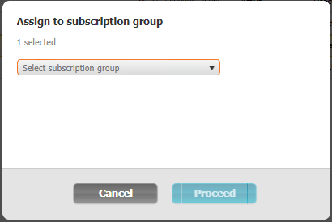

##### Change life cycle state
In order for a SIM to be operational, it must be activated.

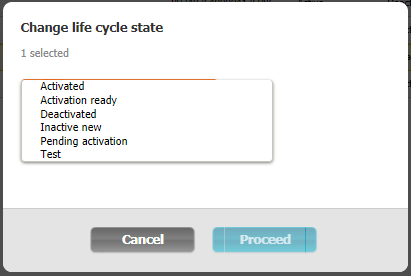


- Inactive new, initial state of any SIM card. The card will remain in this state until you 
assign a Subscription Group to it (including a commercial plan).

- Test, optional and available test for once the SIM card is assigned to a
Subscriptions group that takes into account that state in its commercial plan.
This state enables a limited traffic in order to prove the SIM card is functioning
correctly.

- Activation ready, previous state to Activated and state the SIM card changes to
once the time or the available traffic is consumed in the Test state.

- Pending activation, state similar to the previous one, but in this one the change
to the Activated state is done manually from Inventory.

- Activated, in this state the SIM card is fully operating, in condition of regular
traffic, and fees and service restrictions set up in the Subscriptions group through
the assigned commercial plan apply to it.

- Deactivated, state a SIM card can change to, typically when there is an anomaly
with the card. In this state, the SIM card does not have traffic but its permanence
can entail an associated fee. From this state, the card can be activated again
manually.

- Suspended, state a SIM card can be changed to, typically in cases of fraud or
unpaid, from any state it is in as long as it is not Retired. Leaving this state implies
returning to the state the SIM card was in before or to be Retired. Only the Service
Provider is authorized to perform manual transitions to and from this state.

- Retired, this shall always be the last state a SIM card shall be in before it is
retired. This state can only be reached if the card is suspended. Once in this state,
there is no going back to the previously defined states.

##### Activate data traffic
And lastly you must make sure that the SIM has the traffic activated.

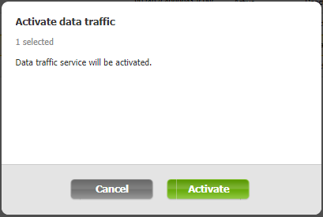

[](#table-of-contents)

### SIM details

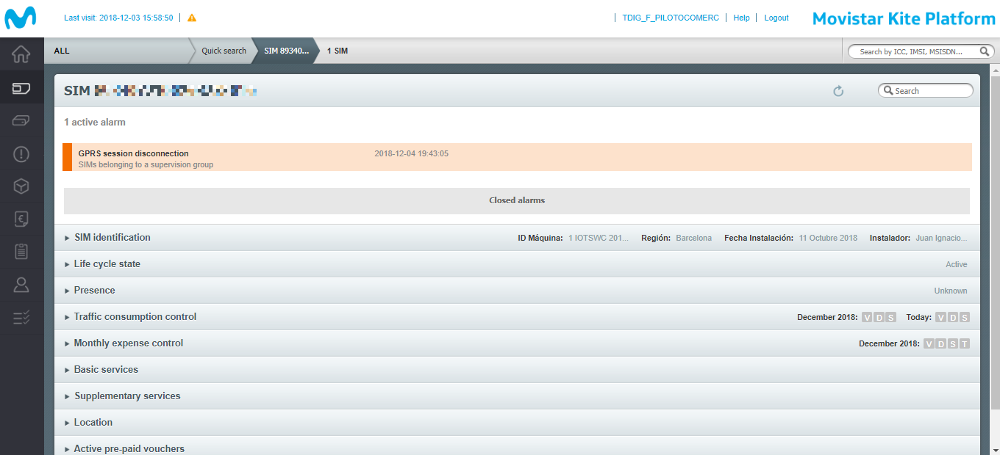

##### SIM identification
When the section opens, the detailed information on the SIM card is accessed. 
Some of these fields are editable with the **Edi**t button on the top right corner.

Here you can add both an identifying name to your SIM **Alias** 
and add and manage the content of your **custom fields**.

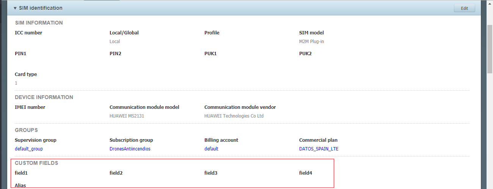

##### Life cycle state
It groups information related to the status changes in the life cycle of the SIM card.
It displays only the value of the current state.


##### Presence
It displays SIM information related to the connectivity. 
If you do not know the APN through which your SIM has to be connected, 
you can check it in this section.

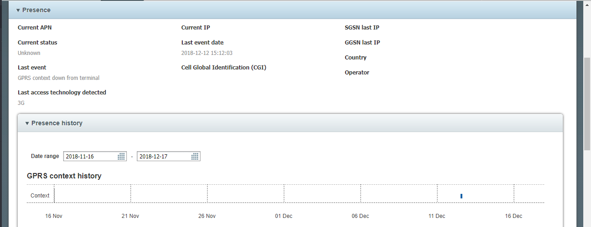

##### Traffic consumption control
Shows detailed or summary information on the SMS messages, data and traffic or
voice consumption of the SIM card during the current billing period.


##### Monthly expense control
Shows detailed or summary information on data, SMS messages and voice
expense incurred by the SIM card during the last months.


##### Basic services and Supplementary services
Includes data, SMS and voice traffic services for SIM M2M cards and. 
indicates whether they are activated


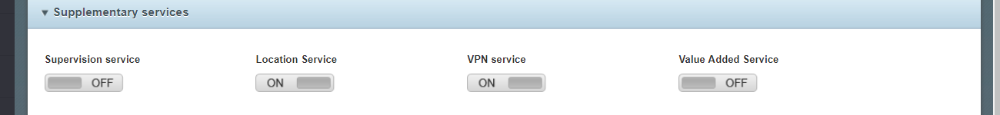

##### Location


[](#table-of-contents)

## Commercial Management

[](#table-of-contents)

# What is Kite Platform API?
The Kite Platform offers you an API that allows you to integrate it with all your systems. 
It allows you to access all your data your data offering you various functionalities

## How to access Kite Platform API?

The API is available on the Internet, in the address m2m-api.telefonica.com,
through port 8010. Therefore, the services this API exhibits can be used from any
system having access to the Internet. 

:heavy_exclamation_mark: 
All your API requests must use the HTTPS protocol. This guarantees the confidentiality of your data. 

To ensure your confidentiality, you will use the SSL (Secure Sockets Layer) protocol. 
This protocol allows you to establish a bidirectional communication between your systems and Kite.

This request is made through the use of a certificate and a private key for encryption,
these will be issued on demand and will be exclusive to you. Take good care of it! 
Remember that it is the gateway to all your SIM data.

### Extract your credentials files


If you have requested access to the Kite Platform API, the support team will have provided you with an encrypted file.pfx
containing both the key and the certificate for the SSL context of your connection. It will also provide you 
a password so that you can extract them.

It is important not to modify the name of the .pfx file until you extract the files.

1. Open a Linux Terminal and install openssl, if you do not have it installed.
This command allows you to decrypt your file
```
sudo apt-get install openssl
```
2. Extract the public key from Customer certificate **your_customer_certificate.pfx**
```
openssl pkcs12 -in your_customer_certificate.pfx -clcerts -nokeys -out your_customer_certificate.cer -password pass:xxxxxxx
```
You will need the password provided by the Kite Platform Support Team

3. Extract the private key from the Customer certificate
```
openssl pkcs12 -in your_customer_certificate.pfx -nocerts -nodes -out your_customer_certificate.key -password pass:xxxxxxxx
```
also you will need your password here.

:heavy_exclamation_mark:  Remember, keep these new files in a safe place!!

### Access API using a command

The Curl command is used to transfer files from a server, it supports various protocols such as HTTP, FTP ...

 There is an example about the access to the Commercial Plans API REST using the CURL command:
 
```
sudo curl --cert ./your_customer_certificate.cer --key ./your_customer_certificate.key https://m2m-api.telefonica.com:8010/services/REST/GlobalM2M/ServicePacks/v2/r12/servicePack
```

[](#table-of-contents)

# How it's made!

    + [How Activate Location Service](#how-activate-location-service)

### How Activate Location Service

First Go to **SIM Inventory** / **Select your SIM** / and Press **Activate** on the bottom-menu


find the opction **Activate Location** and click it.

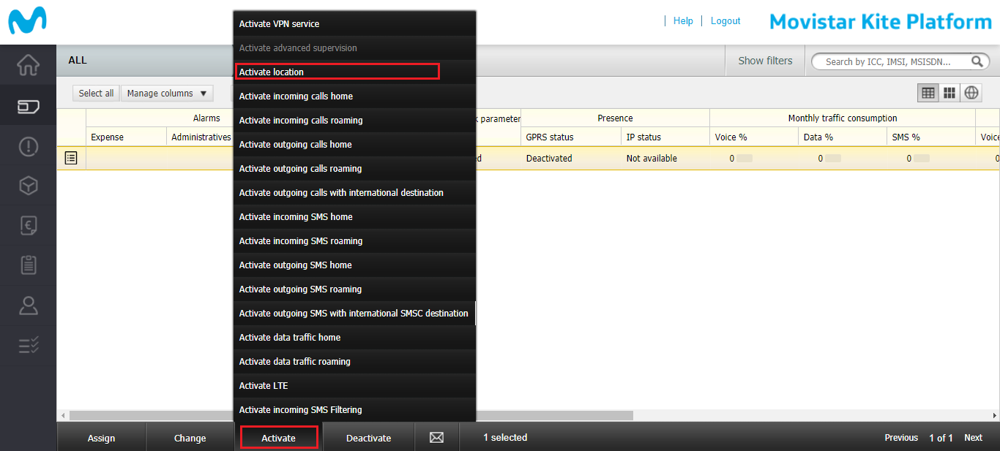

A new window is open! Click in **Activation**

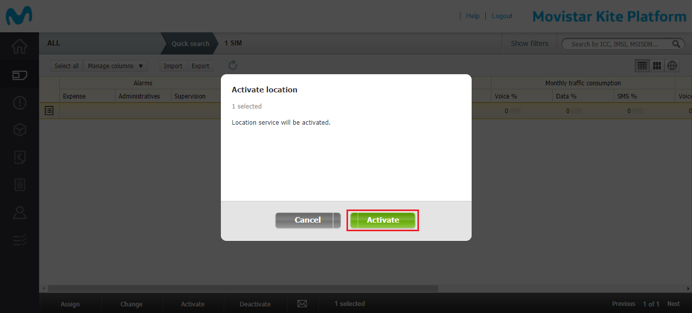

Now the service is activate click on **Finish**

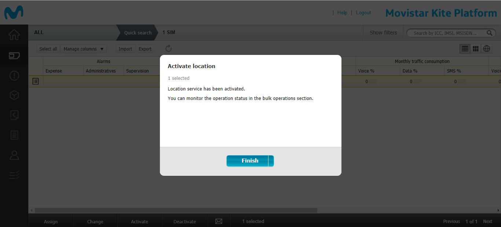

[](#how-its-made)