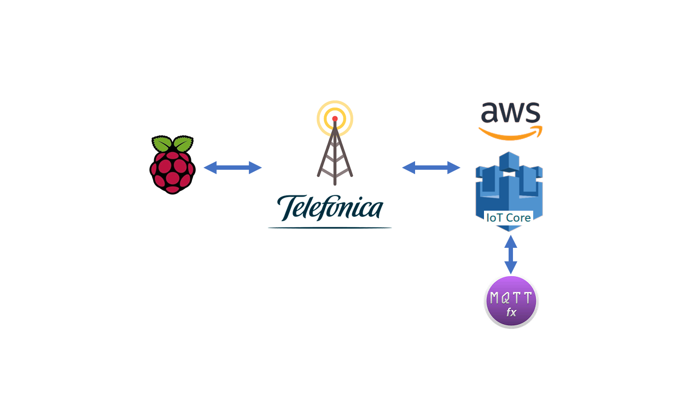
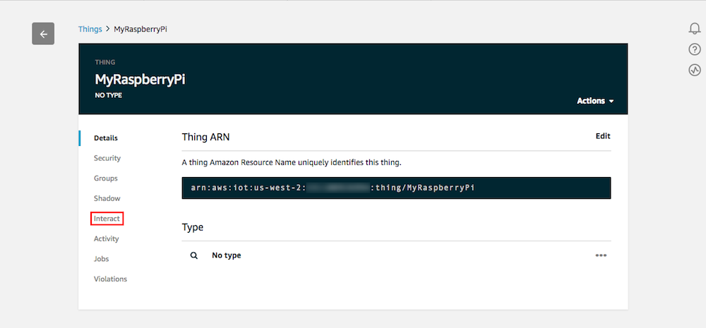
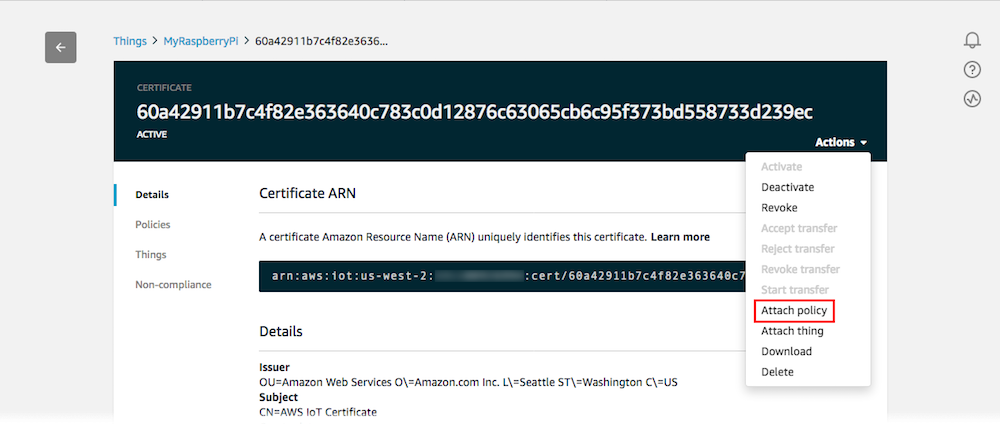

### Table of Contents

- [Raspsberry: Sense-HAT to AWS-IoT](#raspsberry-sense-hat-to-aws-iot)
  * [Getting started with the Sense HAT](#getting-started-with-the-sense-hat)
      - [What you will need](#what-you-will-need)
      - [What you will learn](#what-you-will-learn)
  * [Open an account at AWS-IoT](#open-an-account-at-aws-iot)
  * [Create Raspberry Pi thing in AWS-IoT](#create-raspberry-pi-thing-in-aws-iot)
  * [What is MQTT](#what-is-mqtt)
  * [Test your Certificates with MQTT.fx](#test-your-certificates-with-mqttfx)
  * [How to comunicate with AWS](#how-to-comunicate-with-aws)
- [How to Start with the project](#how-to-start-with-the-project)
  * [Execute the code in your Raspberry](#execute-the-code-in-your-raspberry)
  * [Send command from MQTT.fx](#send-command-from-mqttfx)
  * [Execute your project and enjoy!!](#execute-your-project-and-enjoy)
      - [Execute it](#execute-the-script)
      - [Check the Shadow](#check-the-shadow-state)
      - [LED screen](#watch-the-led-screen)
      - [Send a command](#send-a-command)


# Raspsberry: Sense-HAT to AWS-IoT
For this project, we will sample the different sensors on the board and publish them in AWS. 
You will also be able to send different commands from the MQTT.fx interface that will be received on your Raspberry.

The HAT sensor will take measurements of your sensors by publishing them in the shadow, 
showing them also in the LED display.

<p align="center">      
	  	  
</p>

## Getting started with the Sense HAT

The Sense HAT is an add-on board for the Raspberry Pi. 
The board allows you to make measurements of temperature, humidity, pressure, and orientation 
and to output information using the LED matrix.

Installing and using your Sense HAT is easy, 
just follow our tutorial below to get started!
<p align="center">
      
</p>

#### What you will need

- Complet succeesfully the Raspberry Pi Starterkit tutorial
- Raspberry Pi with Raspbian
- Raspberry Pi Sense HAT
- Keyboar and monitor or SSH connection
- AWS account

#### What you will learn

- Control the Sense HAT using Python
- Register a device on AWS
- Generate credentials for AWS
- Take measurements and display them in the LED matrix
- Establish a communication with AWS using MQTT
- Send commands to the device remotely

If you have successfully completed the Raspberry Starterkit tutorial, all the necessary software is already updated.

First of all, you should know that you are going to manage your Sense HAT using Python. 
If you have any questions about how to run your code, do not forget to visit our 
[tutorial](RaspberryPi_Python.md) for Raspberry or click on the image

<p align="center">
	<a href="RaspberryPi_Python.md">
		
	</a>
</p>


[](#table-of-contents)

## Open an account at AWS-IoT
(Soon ..)

[](#table-of-contents)

## Create Raspberry Pi thing in AWS-IoT

1. Sign in to the AWS Management Console, and then open the AWS IoT console at https://console.aws.amazon.com/iot
2. Go to the Monitor page. In the left navigation panel, choose Manage, and then choose Things.

3. You don't have any things yet page. Choose Register a thing.

4. On the Creating AWS IoT things page, choose Create a single thing.

5. Enter a name for the device, leave the default values for all the other fields, and then choose Next.

6. Now generates the certificates.

7. Download your public and private keys, certificate, and root certificate authority (CA) on your PC,
copy the content into a file and call it for example **AmazonRootCA1.pem**

8. For download your root certificate authority a new window is open for select a CA to download

9. Don't forget to save these files, you need them to establish the connection
10. Returns to the previous window and **Activate** 
11. Select **Attach a policy**

12. Close this window, before you need to create and attach a new policy to the certificate

13. Open the AWS IoT console again https://console.aws.amazon.com/iot
14. In the left navigation panel, choose **Secure**, and then choose **Policies**. 
15. Select **Create a Policy**

16. Enter a Name for the policy:
    - **Action**        enter **iot:***
    - **Resource ARN**  enter **\***
    - **Effect**        choose **Allow** 
Select Create. This policy allows your Raspberry Pi to publish messages to AWS IoT.

17. In the AWS IoT console, choose **Manage**, **Things**. On the Things page, choose your Thing

18. On the thing's **Details** page, in the left navigation panel, choose **Interact**.
Make a note of the REST API endpoint. You need it to connect to your device shadow.
It is the Broker Addres for MQTT connection.

19. Now select **Security**, and choose the certificate that you created earlier. 

20. In Actions, choose Attach policy

21. Select your new policy and then choose Attach 


[](#table-of-contents)

## What is MQTT
MQTT is a machine-to-machine (M2M)/"Internet of Things" connectivity protocol. 
It was designed as an extremely lightweight publish/subscribe messaging transport.

The first concept is the publish and subscribe system. 
A device can publish a message on a topic, 
or it can be subscribed to a topic to receive messages

AWS use this system to communicate with your devices

If you access to AWS Management Console.In the left navigation panel, choose Manage, and then choose Things.
When choose a thing you can find out the different topic that you can subscribe/publish 
Select ***Interact** to copy they.
Don't forget to copy also the Rest API, you will need it as a broker address.


At the moment, you only need to know three topics:
- Update to this thing shadow
```
$aws/things/MyRaspberryPi/shadow/update
```
- Update to this thing shadow was accepted
```
$aws/things/MyRaspberryPi/shadow/update/accepted
```
- Update to this thing shadow was rejected
```
$aws/things/MyRaspberryPi/shadow/update/rejected
```

[](#table-of-contents)

## Test your Certificates with MQTT.fx

One of the best ways to make sure that certificates have been created correctly is to try connecting via a 
MQTT client with graphical interface.

We recommend you download MQTT.fx from the following link https://mqttfx.jensd.de/

1. Open MQTT.fx and create a new connection.


2. Configure the broker as shown in the image below.
Remember to use the files you downloaded in the previous step. And configure the broker address associated to your device.


3. Now that you are connected to the broker, you need to subscribe to the topics to know the state of the shadow: 
accepted and rejected.

Every time a message is published in the topic to update the shadow, 
you can check in these topics if the message has been **accepted** or **rejected**.
```
$aws/things/MyRaspberryPi/shadow/update/accepted
$aws/things/MyRaspberryPi/shadow/update/rejected
```


4. To update the shadow of your device, only in necessary to publish in the topic the following **json file**, 
you can use the following link to validate it https://jsonlint.com/

```
{
    "state": {
        "reported" : { 
            "temp" : 22    
        }
    }
}
```
This file will simulate the publishing of a device to make temperature measurements.


5. Of course, you need to choose the topics in which you can update your shadow.
Be sure to select the service quality level as QoS 0, amazon doesn't allow a different police.
```
$aws/things/MyRaspberryPi/shadow/update
```


6. For delete the shadow's value publish the next **json file**
```
{
    "state": null
}
```

7. Play with this, sending different values until you understand how it works.
:thumbsup: Remember to check if your shipment has been accepted or rejected

[](#table-of-contents)


## How to comunicate with AWS

As you know, when you register a new device in AWS. A topics are created by default.
These topics are the way of communication. In them you can send data and receive information.

At the moment you only need to know two of them:

topic Update 
```
$aws/things/MyRaspberryPi/shadow/update
```
this topic is where you publish the status of the device,
in this tutorial this information is composed by the values of the sensors as the current color of the LED display.

topic Delta
```
$aws/things/MyRaspberryPi/shadow/update/delta
```
This is the channel that AWS uses to communicate the **desired** changes to the device.
In this case we use the MQTT.fx to communicate these changes to AWS and to report the change to the device.

All these changes are recorded in the **shadow** of the device. 
To see the current status just access the AWS core as you saw in the previous section.


```json
{
  "desired": {
    "command": {
      "val": "Caution",
      "colour": {
        "r": 0,
        "g": 255,
        "b": 255
      }
    }
  },
  "reported": {
    "command": {
      "colour": {
        "r": 0,
        "b": 255,
        "g": 255
      },
      "val": ""
    },
    "temp": {
      "colour": {
        "r": 143,
        "b": 0,
        "g": 0
      },
      "val": 35.861732482910156
    },
    "humidity": {
      "colour": {
        "r": 0,
        "b": 65,
        "g": 0
      },
      "val": 32.788143157958984
    }
  },
  "delta": {
    "command": {
      "val": "Caution"
    }
  }
}
```
As you can see in the previous file, there are three main indexes:
- "desired": Contains the desired state, sent from the MQTT.fx
- "reported": Contains the status information reported by the device
- "delta": contains the differences between the reported status and the desired status. 
This is the information that is published in the delta topic

[](#table-of-contents)

# How to Start with the project

Although we will explain it to you in detail how to execute it step by step, 
for this tutorial you need to be familiar with the following concepts

- Run a Python file on your raspberry (we recommend using the Desktop)
- Copy the credentials files to Raspberry
- Use MQTT.fx to post messages in a topic
- Review the shadow from AWS core

## Execute the code in your Raspberry

At this point your raspberry won't have any secrets for you. 
Nevertheless we will help you to continue so that you do not have any mishap.

Create a folder on your Raspberry's desktop called **Python** and copy into it the following 
[folder](../scripts/Python/Sense_HAT_AWS) and copy in the **CA** folder the device's certification files

Before, you need to edit the [script configuration file](../scripts/Python/Sense_HAT_AWS/config/Config_HAT.yaml).

```yaml
# selection to the AWS connection from the connection file
Connection: AWS

#takes a measurement every x seconds
sample : 30

#Sense HAT board configuration
Sense_HAT:
    temperature:
      active: ok        # enables/disables the taking of measurements
      msg: temperature  # text shown on the display
      max: 100          # value with maximum light intensity
      min: 0            # value with minimum light intensity
    humidity:
      active: ok
      msg: humidity
      max: 60
      min: 0
    pressure:
      active: no
      msg: pressure
      max: 0
      min: 0
    acceleration:
      active: no
      msg: accel
      max: 60
      min: 0
```
You also need to edit  [script configuration file](../scripts/Python/Sense_HAT_AWS/config/Config_Cloud.yaml).
Pay attention to configure your device and select for the connection to AWS as well as the topics and messages.

```yaml
connection:
  cloud: AWS  #select your broker and the thing
  things: "MyRaspberryPi"
  broker: "xxxxxxxxxxxx-ats.iot.xx-xxxx-x.amazonaws.com"
  port: 8883
  Certificate: # identify the name of your files and the path
    path: "CA/"
    ca: "AmazonRootCA1.pem"
    certificate: "xxxxxxxxxx-certificate.pem.crt"
    private_key: "xxxxxxxxxx-private.pem.key"
  topic:   # copy here the list of topics
    update: "$aws/things/MyRaspberryPi/shadow/update"
    delta: "$aws/things/MyRaspberryPi/shadow/update/delta"
    accepted: "$aws/things/MyRaspberryPi/shadow/update/accepted"
    rejected: "$aws/things/MyRaspberryPi/shadow/update/rejected"
```

:thumbsup: Depending on the version of Phyton's interpreter may conflict when accessing a library

install the libraries from your folder directory with the commands:

```
sudo pip install paho-mqtt -t ./
sudo pip install json -t ./
sudo pip install yaml -t ./
```

[](#table-of-contents)

## Send Command from MQTT.fx

The first thing you need to know is that MQTT is a powerful tool that allows you to both communicate 
with AWS and monitor all communications between AWS and the device.
Use it whenever you have a problem or simply verify the content of a post.

Connect withe the broker and configure it for publis in update and suscribe to delta.
```
$aws/things/MyRaspberryPi/shadow/update
$aws/things/MyRaspberryPi/shadow/update/accepted
$aws/things/MyRaspberryPi/shadow/update/rejected
$aws/things/MyRaspberryPi/shadow/delta
```
if you subscribe to delta, you can review the content that AWS sends to your Raspberry. 
as a tip you can subscribe to the topics **accepted** and **rejected** for check if the communication 
is established or rejected by the broker.

Publish the following json file to send a command to your Raspberry. 
When the broker receives it, it will update the shadow of the device. 
Generating a delta message that will be used by your raspberry to update his status. 
Showing the command and RGB color on the LED display. 

Play trying new messages and colors. This can be very useful!

```json
{
	"state": {
		"desired": {
			"command": {
				"val": "Warning",
				"colour": {
					"r": 250,
					"g": 150,
					"b": 0
				}
			}
		}
	}
}
```

[](#table-of-contents)


## Execute your project and enjoy!!

#### Execute the Script

Great! Now you can start running the script, with the following command:

```
sudo python Rasp_HAT_AWS.py
```

Another option is to configure your raspberry to run the script on power up

Open the cron Table with de command `crontab -e` and copy the next line in the file
```
@reboot ( sleep 60  ; /usr/bin/python2.7 /home/pi/Desktop/Rasp_HAT_AWS.py > /home/pi/Desktop/Rasp_HAT_AWS.log )
```

#### Check the Shadow state

Before starting the execution you will see how your shadow is empty. 
With this script you can make temperature and humidity measurements on the board.
This updated the shadow with each shipment of the device, showing the same values as shown on the screen.

####  watch the LED screen 

As you will be visualizing in your display, different messages are shown for the temperature and other 
sensor measurements varying the intensity of the luminosity according to the measured value, 
being able to modify even the message by the configuration file.

``` yaml
Sense_HAT:
    temperature:
      active: ok            
      msg: change-text-here   # text shown on the display
      max: 100          # value with maximum light intensity
      min: 0            # value with minimum light intensity
```

The display is able to show up to different states, temperature, humidity and a 
third state to visualize the received command. 

#### Send a command

To send a command to the device you must use the MQTT as explained in the previous section 
through the json that we provide. you can change both the message and the background color 
using an RGB encoding (Red, Green, Blue).

You can change this instruction as many times as needed.

[](#table-of-contents)

