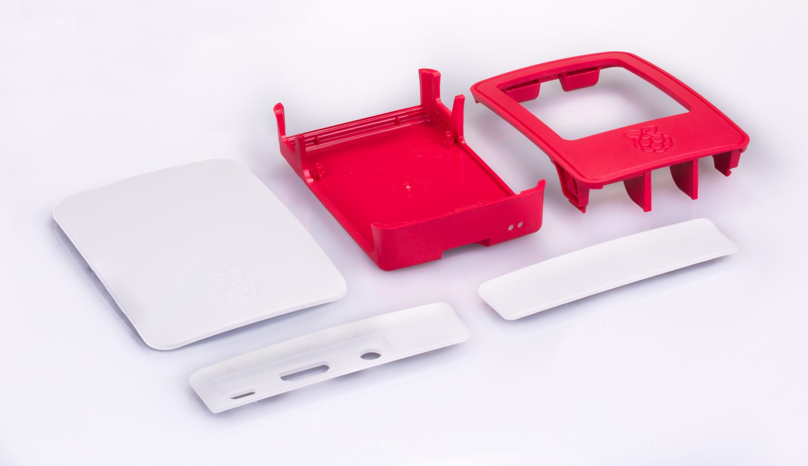
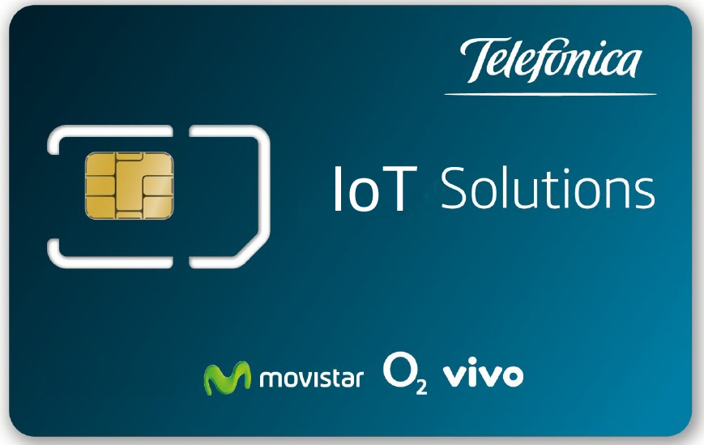

### Table of Contents

- [Raspberry Pi Starterkit for IoT-Activation](#raspberry-pi-starterkit-for-iot-activation)
    + [Raspberry Pi 3 B+](#raspberry-pi-3-b)
    + [MicroSD with pre-installer NOOBS (Raspberry-Pi OS)](#microsd-with-pre-installer-noobs-raspberry-pi-os)
      - [What is Raspbian?](#what-is-raspbian)
    + [Raspberry Pi Camera V2](#raspberry-pi-camera-v2)
    + [Raspberry Pi Sense HAT](#raspberry-pi-sense-hat)
    + [Huawei MS2131 USB Stick](#huawei-ms2131-usb-stick)
    + [Telefonica SIM Card](#telefonica-sim-card)
- [Getting started with your Raspberry](#getting-started-with-your-raspberry)
  * [Install SO (Raspbian)](#install-so-raspbian)
  * [Connect with your Wi-Fi](#connect-with-your-wi-fi-and-update-the-software)
  * [Tenefonica's Connection.](#tenefonicas-connection)        
  * [Use a remote access](#use-a-remote-access-enable-ssh-server-on-raspbian)      

# Raspberry Pi Starterkit for IoT-Activation

Your Raspberry kit is composed by:

### Raspberry Pi 3 B+
The Raspberry Pi is a small computer developed by the Raspberry Pi Foundation to promote teaching of basic computer science.

It is a Single Board Computer (SBC). All the necessary components are integrated in the same board.

<p align="center">
      
</p>

- **BCM2837**
This is the Broadcom chip used in the Raspberry Pi 3 with a quad-core ARM Cortex A53 (ARMv8) cluster

- **USB ports**
these allows you to connect USB peripherals like mouse, keyboard, USB drive, modem 3G ...

- **SD card slot**
You will install the Operating System in a microSD card that will be allocated here. This card also keep all your files save.

- **Ethernet, Wifi and BL**
Three diferent interfaces, to enables different connection ways.  

- **Audio jack**
You can connect headphones or speakers

- **HDMI port**
You can use the output for connect the Raspberry to a monitor. 

- **Micro USB power connector** 
This is where you connect the power supply 

- **GPIO ports**
These allow you to connect electronic components such as LEDs, buttons to the Raspberry.

[](#table-of-contents)

### Case for Raspberry
Removable side panels and lid for easy access to GPIO, camera and display connectors.
With light pipes for power and activity LEDs

<p align="center">
      
</p>

### MicroSD with pre-installer NOOBS (Raspberry-Pi OS)
Official 16GB MicroSD Card and Full-Size Adapter

##### NOOBS Operating System
Is an easy operating system installer which contains Raspbian 

#### What is Raspbian?
Raspbian is a free operating system based on Debian optimized for the Raspberry Pi hardware. 
An operating system is the set of basic programs and utilities that make your Raspberry Pi run. 
However, Raspbian provides pre-compiled software bundled in a nice format for easy installation.


### Raspberry Pi universal Power Supply 2.5A 5.1V
Interchangeable heads for different countries and 1.5m lead

Protection for: short circuit, over current and over voltage.

<p align="center">
      
</p>

### Raspberry Pi Camera V2
It allows you to record high-definition video and take pics.
The v2 Camera Module is provide with a Sony IMX219 8-megapixel sensor.

<p align="center">
      
</p>

### Raspberry Pi Sense HAT
It is a board that includes different devices and sensors
- 8x8 RGB LED matrix
- joystick (5 buttons: up, down, left, right and press)
- Gyroscope
- Accelerometer
- Magnetometer
- Temperature
- Barometric pressure
- Humidity

[Click](RaspberryPi_HAT.md) to learn how to use it

<p align="center">
	<a href="RaspberryPi_HAT.md" >
		
	</a>
</p>

:pill: Did you know that it was made especially for being launched to the International Space Station in December 2015?

### Huawei MS2131 USB Stick
The Huawei USB Modem MS2131i-8 is a robust USB stick designed for industrial.
Withstands high temperatures and humidity conditions.

The MS2131 is a quad-band HSPA+ modem with a transmission speed of up to 21 Mbps (D/L) and 5.76 Mbps (U/L).

Also has the possibility to be connected to an external antenna via his CRC9 connector.

<p align="center">
      
</p>

### Telefonica SIM Card
this little one makes you enjoy all the advantages of the Telefonica network. 
Take care of her, she will be your partner into the IoT world.

<p align="center">
      
</p>

[](#table-of-contents)

# Getting started with your Raspberry

## Install SO (Raspbian)

You will start the OS installation, prepare the following material:

- A Raspberry Pi
- MicroSD with pre-installer NOOBS
- Monitor with HDMI connector
- USB keyboard and mouse
- USB Power Supply

To begin, carefully follow the instructions below.

1. Connect the Raspberry to HDMI monitor.
2. Insert the microSD card into the slot on the Raspberry.
3. Plug a keyboard and mouse in the Raspberry's USB slot.
4. Connect the USB Power Supply using the correct head from your country. 
(Fot this step is necessary do previously the 2 first steps)
4. Select the Raspbian option in the window. 
5. Select your language, and the corresponding keyboard type
6. If you wish, you can now configure the wifi connection or wait for the next section. 
7. Press the install button.
8. Accepts the confirmation window and waits until the installation is complete .


Congrats!, You have just started at the IoT world.
We will continue setting up your network interfaces.

## Connect to your Wi-Fi network and Update the Software

First of all, you should update all the packages and software running on your board. This process can consume a huge amount of data, so we highly recommend you to start setting up wifi interfaces.

Set **Ctrl+Alt+T** to open a Terminal.


Sometimes some errors may occur because the system dates are not update. 
To avoid these errors you can update the Raspberry time with the following command.
```
sudo date -s "05/23/2018 12:00:00"
```

For connect with your Wi-Fi network, press on the top right corner in the LAN icon and select your network with your password if is necesary.

If  wifi is disabled, you have to access to the Raspberry configuration.

In this case open a terminal and type 
```
sudo raspi-config
```
This command will open a window like the one in the following image.
1. Select **Network Options**
2. Select **Wi-fi**
3. Select your country
4. Now the wifi is activate 
5. Enter your **SSID** (Name of your wifi network)
6. Enter your **password** if is necesary
7. Chose **FINISH** with the tab key


Sometimes some corporate networks require additional validation. 
In this case it will be necessary to proceed correctly or contact the network administrator.
 
:thumbsup:  If you dont want to run out of data please set up the wi-fi connection, before running al these commands!

Open a Terminal windows and update the repository with the command 
```
sudo apt-get update
```
Wait it finish

Then it is necessary install some packages.
We recommend you write the lines on the console one by one and wait for it to be installed 
to continue with the next.

```
sudo apt-get install network-manager
sudo apt-get install gedit	
sudo apt-get install python
sudo apt-get install sense-hat
sudo apt-get install nmap
sudo apt-get install crontab
sudo apt-get install realvnc-vnc-server realvnc-vnc-viewer
```

## Tenefonica's Connection.
Connect the USB modem MS2131 to the Raspberry's usb.

Once connected, you can check that your raspberry recognizes the device using the command `lsusb`.

This command lists all devices connected USB ports of your device, checks how when connecting and disconnecting 
the modem the device appears and disappears from the list.

Create the USB Stick connection in a command line
```
sudo nmcli con add type gsm ifname "*" con-name USBStick apn TelefonicaSIM_APN user telefonica password telefonica
```

:heavy_exclamation_mark:  The field **TelefonicaSIM_APN** must be replaced by the APN address of your Telefonica SIM card.
In this case, the APN of your SIM card will be provided by Telefonica. 
However, you will be able to identify it through access to [Kite.](Kite_Platform.md)

If your SIM uses a PIN code, add to the end of the command: `pin 0000`

Now the connection USB-Stick has been created.
Look at it with the command 
```
ifconfig ppp0
```


the inet adrress label shows your Raspberry's IP

##### How Test your new connection
:thumbsup: To make sure that the transmission is done through the USB modem, in this step we recommend disabling the wifi connection. 
To deactivate the wifi connection click on the network symbol in the upper right corner 
and press **Turn off Wi-fi**.

A easiest way of test your connectivity is make ping a website.
Use the next command
````
ping www.telefonica.com
````

Another way to test it, It is downloading a file from a server and read it.

```
wget https://jsonplaceholder.typicode.com/todos/1
````

to check the downloaded file you can use the cat command

```
cat 1
```

Now you should be able to read something close to this **json** example

```json
{
  "userId": 1,
  "id": 1,
  "title": "delectus aut autem",
  "completed": false
}
```
:thumbsup: To tidy up, 
we recommend you delete the test file with the following command.
```
rm 1
```
[](#table-of-contents)

If you have followed all these steps, there should be no problem. but if not, your SIM card may not be activated.

Luckily you have access to the Kite Platform and you can manage its status
check out our tutorial [here](Kite_Platform.md)


## Use a remote access. Enable SSH server on Raspbian. 

You can access to the command line and manage the Raspberry using your pc, 
but is necessary a SSH connection

Open a terminal window and enter
```
 sudo systemctl enable ssh
 sudo systemctl start ssh
```

Alternatively, you can enable the SSH connection using the configuration interface.
opens the menu with the following command.

```
sudo raspi-config
```

1. Select **Interfacing Options**
2. Select **SSH**
3. Select **YES**
4. Select **Ok**
5. Chose **FINISH** with the tab


If you reboot the device without changing the default user and password, 
with SSH connection enabled, a warning pop up message will appear showing risks involved.

##### Change user Password

When you installed the OS, a default user was been created.
````
default user     'pi'
default password 'raspberry' 
````
for security reasons is recommended set a new password

Type in the terminal window
```
 passwd 
```
1. Write the current-password ** 'raspberry' **
2. Enter the **new-password**
3. Re-enter the **new-password**
4. Your password has now been changed.

Now for connect with your Raspberry you need installer a SSH client on your computer. 

##### Set up your SSH client in Linux
from a terminal window:
```
ssh –p 22 pi@00.00.00.00 -> Raspberry IP
```
##### Set up your SSH client in Windows

There is a wide variety of SSH clients that you can use. Many of them are free!!

But if you know which one to choose, we can recommend download Putty from www.putty.org and install it

Open putty and write the Raspberry's IP in the Host Name box
Select SSH like Connection type and Port 22
use the Raspberry default user **pi** and the new-password selected on the previous chapter

<p align="center">
      
</p>


#### Control your raspberry with a network cable

If you prefer it is also possible to control your Raspberry pi connected to your pc via a network cable (Ethernet)

[How to connect via Ethernet](SSH_Ethernet.md)

[](#table-of-contents)

